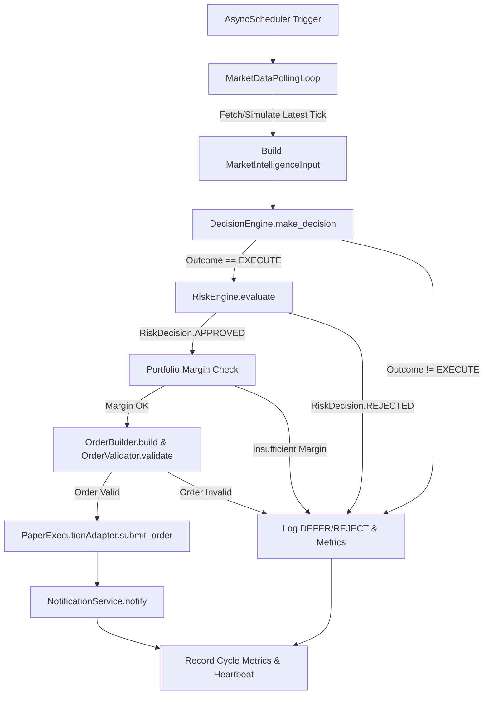

# EPIC-015 Sprint-4: Autonomous Trading Engine Worker & Scheduler Lifecycle
## Phase 0: Discovery & Gap Analysis

**Status:** IN PROGRESS  
**Date:** 2026-09-13  
**Repository:** `project-orion` on `main` branch (uncommitted)  
**Author:** Project ORION Engineering  

---

## 1. Executive Summary

In Sprints 1, 2, and 3, Project ORION established:
1. Production database ORM models, Alembic migrations, and async Redis client connection pooling.
2. The unified FastAPI ASGI runtime at `apps/trading-engine`, integrating `PaperExecutionAdapter` with deterministic execution and paper account balances.
3. Production hardening: `OrderValidator` integration, health checks, Prometheus metrics, structured logging, correlation IDs, non-root Docker packaging, and 639 passing tests (0 failures, 0 ruff errors, 0 strict mypy errors).

However, `apps/trading-engine` currently functions only as a passive, request-driven HTTP service. The platform lacks an **autonomous worker and scheduler lifecycle** to periodically poll market data, evaluate trading strategies, enforce risk boundaries, check portfolio capacity, execute paper trades, and dispatch event notifications in the background.

The objective of Sprint-4 is to construct a production-grade autonomous worker subsystem inside `apps/trading-engine/src/worker/` that seamlessly integrates into the FastAPI lifespan without modifying mature domain business logic or violating DDD/Clean Architecture boundaries.

---

## 2. Reusable Domain & Infrastructure Components

The repository already provides comprehensive domain contracts and infrastructure adapters:

| Component | Location | Reusable Capabilities |
|---|---|---|
| **Market Data Domain** | `libraries/domain/market/` & `libraries/domain/market_data/` | `MarketDataManager` normalization, `SymbolRegistry`, `MarketSnapshotProviderPort` (`latest`, `snapshot`), `Tick`, `MarketDataSnapshot` models. |
| **Trading Decision Engine** | `libraries/domain/trading/` | `DecisionEngine` composition root, `EngineConfig`, `MarketIntelligenceInput`, `TradeDecision`, `DecisionOutcome` (`EXECUTE`, `REJECT`, `DEFER`). |
| **Enterprise Risk Engine** | `libraries/domain/risk/` | `RiskEngine` final approval authority, `RiskEngineConfig`, `evaluate(decision) -> RiskResult`, `RiskDecision` (`APPROVED`, `REJECTED`, `DEFERRED`). Strict fail-safe semantics. |
| **Portfolio Manager** | `libraries/domain/portfolio/` | `PortfolioManager` facade: margin calculations (`can_open_position`, `calculate_required_margin`), position tracking, balance and equity tracking. |
| **Execution Pipeline** | `libraries/domain/execution/` & `libraries/infrastructure/` | `OrderBuilder`, `OrderValidator`, and `PaperExecutionAdapter` with thread-safe `asyncio.Lock` and deterministic fills. |
| **Notification Domain** | `libraries/domain/notification/` | `NotificationService` dispatching `NotificationRequest` across channels (`IN_APP`, `SLACK`, `TELEGRAM`, `WEBHOOK`, `EMAIL`) with severity grading. |
| **Observability & Health** | `libraries/observability/` & `libraries/infrastructure/health/` | `MetricsRegistry` (Prometheus counters, gauges, histograms), `HealthCheckRegistry`, structured JSON logger with correlation IDs. |

---

## 3. Gap Analysis

| Gap ID | Identified Gap | Severity | Technical Resolution |
|---|---|---|---|
| **GAP-01** | **No Autonomous Background Worker**<br>Trading engine only triggers trades via incoming HTTP requests to `/api/v1/paper-trade`. | HIGH | Build `WorkerLifecycle` managing explicit states (`STARTING`, `RUNNING`, `STOPPING`, `STOPPED`) with cooperative cancellation and task supervision. |
| **GAP-02** | **No Periodic Scheduler**<br>No cancellation-safe async scheduler exists in the application layer to trigger periodic cycles. | HIGH | Implement `PeriodicTask` and `AsyncScheduler` using native `asyncio.Task` with overlap protection, configurable intervals, and bounded backoff. |
| **GAP-03** | **No Autonomous Market Polling Loop**<br>No mechanism fetches tick updates or market snapshots for configured active symbols on interval. | HIGH | Implement `MarketDataPollingLoop` supporting configurable symbol universes, stale data detection, and error isolation. |
| **GAP-04** | **No Autonomous Strategy & Risk Pipeline**<br>Decision, Risk, Portfolio, Execution, and Notification domains are not chained in an automated loop. | CRITICAL | Implement `AutonomousTradingPipeline` orchestrating:<br>`Market Data -> DecisionEngine -> RiskEngine.evaluate() -> PortfolioManager.check() -> OrderBuilder.build() -> OrderValidator.validate() -> PaperExecutionAdapter.submit_order() -> NotificationService.notify()`. |
| **GAP-05** | **No Worker Health & Metrics Exposition**<br>`/health/ready` and `/metrics` do not report worker heartbeat, cycle counts, or execution performance. | MEDIUM | Register `WorkerHealthCheck` into `HealthCheckRegistry` and record `worker_cycles_total`, `worker_cycle_duration_seconds`, `worker_trades_executed_total`, etc., into `MetricsRegistry`. |
| **GAP-06** | **Missing Worker Configuration**<br>`AppSettings` lacks environment flags to enable/disable worker or tune polling frequencies and symbol universes. | MEDIUM | Add `ORION_WORKER_ENABLED`, `ORION_WORKER_INTERVAL_SECONDS`, `ORION_WORKER_SYMBOLS`, and `ORION_WORKER_STALE_THRESHOLD_SECONDS` to `AppSettings.from_env()`. |
| **GAP-07** | **Lifespan Startup/Shutdown Sequencing**<br>Worker must start after DB/Redis/Broker are initialized and stop gracefully before they are torn down. | HIGH | Wire `WorkerCoordinator` into `apps/trading-engine/src/lifespan.py` with strict startup and shutdown ordering. |

---

## 4. Architecture Design & Lifecycle Specification

### 4.1 State Machine
```
[STOPPED] ── start() ──> [STARTING] ── initialized ──> [RUNNING]
                            │                             │
                            │ (error)                     │ stop()
                            ▼                             ▼
                        [STOPPED] <── tasks drained ── [STOPPING]
```

### 4.2 Autonomous Execution Flow


### 4.3 Clean Architecture & DDD Invariants
- **Domain Purity:** Zero imports of `fastapi`, `sqlalchemy`, `redis`, or `uvicorn` in any domain library.
- **Pure Orchestration:** The worker is situated strictly in `apps/trading-engine/src/worker/` and acts as an orchestrator of domain interfaces.
- **Safety First:** Default to paper trading only. No live broker endpoints, credentials, or funds are utilized.
- **Precision:** All financial quantities, prices, pips, and balances are strictly `Decimal`.
