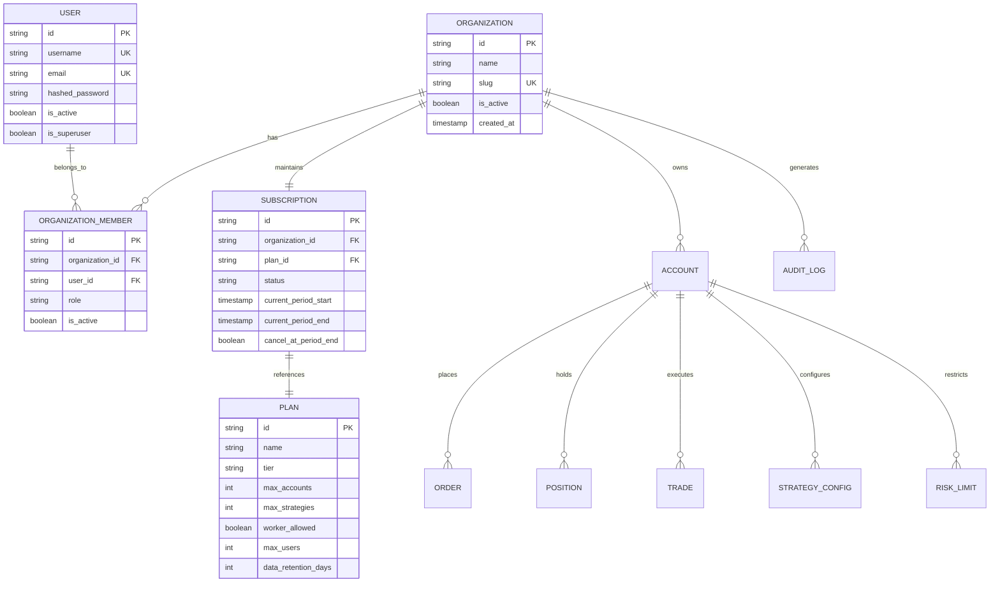

# Project ORION: Commercial SaaS & Multi-Tenant Architecture Specification

**Document**: `docs/EPIC-016-SAAS-ARCHITECTURE.md`  
**Epic**: EPIC-016 — Actual Cloud Deployment, Production Operations & Commercial SaaS Foundation  
**Classification**: Architectural Blueprint & Commercial Domain Model  
**Status**: DESIGN APPROVED & FOUNDATION ESTABLISHED  
**Trading Engine Safety**: PAPER TRADING ONLY (Zero real money / Zero live broker execution)

---

## 1. Executive Summary & SaaS Strategic Vision

Project ORION is designed as an institutional-grade Forex trading simulation and strategy platform. To transform the verified paper-trading backend into a commercial software-as-a-service (SaaS) product, the platform requires a robust, scalable, and secure commercial multi-tenant architecture.

This specification defines the commercial foundation covering:
1. **Multi-Tenancy Model**: Shared-database / logically isolated schema with strict row-level tenant boundary guards.
2. **Entity Hierarchy**:
   $$\text{User} \longrightarrow \text{Organization} \longrightarrow \text{Subscription} \longrightarrow \text{Trading Account} \longrightarrow \text{Orders/Positions/Trades}$$
3. **Role-Based Access Control (RBAC)**: Fine-grained institutional roles (Owner, Admin, Portfolio Manager, Risk Officer, Trader, Auditor, Viewer).
4. **Subscription & Entitlements Matrix**: Tiered plans (Free, Pro, Business, Enterprise) defining compute, account, worker, and data retention quotas.
5. **Customer Onboarding Workflow**: Frictionless institutional onboarding from sign-up through initial paper equity allocation.
6. **Production Administrative Governance**: Secure superuser controls for platform operations without destructive backdoors.
7. **Architectural Isolation**: Complete decoupling between commercial billing metadata and low-latency paper trading execution.

---

## 2. Tenancy Model Analysis & Decision

### 2.1 Evaluated Tenancy Paradigms

| Paradigm | Architectural Description | Scalability & Cost | Isolation Level | Decision |
|---|---|---|---|---|
| **A. Database-per-Tenant** | Dedicated PostgreSQL database per organization. | High resource overhead, costly connection pooling, complex migration orchestration. | Physical isolation | Rejected for initial SaaS tier (reserved for bespoke on-premise Enterprise). |
| **B. Schema-per-Tenant** | Single PostgreSQL database, separate PostgreSQL schema per organization. | High table count limit risks, connection pool contention with async SQLAlchemy. | Logical schema isolation | Evaluated; introduces migration overhead across hundreds of tenants. |
| **C. Logically Partitioned Multi-Tenant (Row-Level)** | Shared PostgreSQL database, `organization_id` foreign keys indexed across all tenant-scoped tables, enforced by application-layer dependency injection and query scoping. | Highly scalable, optimal connection pool reuse, instant tenant provisioning, low hosting cost. | Enforced by tested IDOR security and tenant scoping dependencies. | **SELECTED FOR PRODUCTION SAAS** |

### 2.2 Tenant Scoping Contract

Every institutional entity belongs to an `Organization`.
All SQL queries executed by the application must resolve `organization_id` from the authenticated user's session context:
```sql
SELECT * FROM accounts WHERE organization_id = :org_id AND id = :account_id;
SELECT * FROM orders WHERE organization_id = :org_id AND account_id = :account_id;
```
Direct queries lacking an `organization_id` filter are forbidden outside of administrative superuser diagnostic routines.

---

## 3. Commercial Entity Architecture



---

## 4. Role-Based Access Control (RBAC)

Institutional trading desks require separation of duties. Project ORION defines 7 standard roles:

| Role | Scope | Permissions & Capabilities |
|---|---|---|
| **Owner** | Organization | Full administrative authority: manage billing, invite/remove users, assign roles, delete organization. |
| **Administrator** | Organization | Operational administration: manage accounts, configure platform integrations, inspect audit logs. |
| **Portfolio Manager** | Organization / Accounts | Strategic oversight: allocate paper capital across accounts, approve strategy configurations, view consolidated P&L. |
| **Risk Officer** | Organization | Immutable risk governance: configure pre-trade risk limits, inspect breach logs, trigger emergency circuit breakers. Read-only on trading execution. |
| **Trader** | Assigned Accounts | Execution: place manual paper market/limit orders, close positions, cancel orders, toggle assigned strategies. |
| **Auditor** | Organization | Read-only compliance: export trade journal, audit logs, risk limit change history. No operational mutation capability. |
| **Viewer** | Assigned Accounts | Read-only analytics: view live dashboard, open positions, chart telemetry, and historical equity curve. |

---

## 5. Subscription & Entitlements Matrix

Commercial plans govern platform resource allocation without altering core financial mathematics:

| Feature / Entitlement | **FREE (Sandbox)** | **PRO (Individual)** | **BUSINESS (Fund)** | **ENTERPRISE (Institutional)** |
|---|---|---|---|---|
| **Target Audience** | Retail Forex learners | Professional quant traders | Boutique hedge funds & proprietary firms | Tier-1 banks, brokers, prop firms |
| **Max Paper Accounts** | 1 Account | 3 Accounts | 10 Accounts | Unlimited |
| **Starting Paper Capital** | \$10,000 – \$100,000 | Configurable up to \$1,000,000 | Configurable up to \$50,000,000 | Custom unlimited |
| **Autonomous Worker** | ❌ Manual orders only | ✅ 1 Worker process (2 pairs) | ✅ Dedicated worker (all 9 pairs) | ✅ Multi-worker clustered scheduler |
| **Trading Strategies** | 2 standard (Trend Following, Breakout) | All 9 catalogued strategies | All 9 + custom parameter overrides | Custom proprietary algorithm upload |
| **Concurrent Positions** | Max 3 open | Max 10 open | Max 50 open | Unlimited |
| **API Access** | ❌ Web dashboard only | ✅ REST API (60 req/min) | ✅ REST + WebSocket (300 req/min) | ✅ Dedicated low-latency gateway |
| **Data Retention** | 7 days trade history | 90 days trade history | 1 year trade history | Immutable multi-year audit archive |
| **Seats per Organization**| 1 user | 1 user | Up to 10 users | Unlimited SSO / SAML 2.0 |
| **Audit Logs** | ❌ Basic session logs | ❌ Basic | ✅ Full compliance audit trail | ✅ Exportable WORM compliance logs |
| **Support SLA** | Community | Email (48h) | Priority Slack/Email (12h) | 24/7 Dedicated technical account manager |

---

## 6. Customer Onboarding Workflow

The institutional onboarding funnel ensures immediate time-to-value while enforcing zero financial risk:

```
[1. User Registration]
   - Email, Username, Secure Password
   - Email verification token sent

[2. Verification & Session Activation]
   - Click magic link / input token
   - User account marked `is_active = True`

[3. Organization Workspace Inception]
   - Name trading desk (e.g. "Apex Alpha Capital")
   - Auto-assigned role: `Owner`
   - Default Plan assigned: `FREE` (or trial `PRO`)

[4. Paper Account Initialization]
   - Auto-provision default Paper Trading Account
   - Starting balance: $100,000.00 USD
   - Default risk limits seeded (5% max drawdown, 10:1 leverage)

[5. Strategy & Pair Discovery]
   - Interactive wizard guides through Trend Following vs Scalping
   - Select base FX pairs (EUR/USD, GBP/USD, USD/JPY)

[6. Live Dashboard Arrival]
   - Redirect to authenticated dashboard (`/dashboard`)
   - Prominent "PAPER TRADING ONLY" banner displayed
   - Ready for immediate order placement or worker simulation
```

---

## 7. Production Administrative Controls & Safety

Platform operators (Superusers) require diagnostic oversight without compromising institutional client confidentiality:

1. **Explicit Role Gate**: Superuser endpoints are guarded by `Depends(get_current_superuser)`. Non-superusers receive immediate `403 Forbidden`.
2. **Organization Suspension**: Superusers can suspend abusive organizations (`is_active = False`), immediately invalidating all associated JWT sessions.
3. **Audit Log Inspection**: Superusers can search platform-wide audit logs by actor, event type, or timestamp range.
4. **Zero Live Trading Override**: Superusers have **zero capability** to route orders to live brokers or convert paper accounts to live capital. The platform code maintains no live broker adapters.
5. **No Password Visibility**: Passwords remain hashed via `bcrypt` (12 rounds). Admin views return zero credential data.

---

## 8. Architectural Decoupling: Billing vs. Trading Engine

To preserve deterministic execution latency and prevent billing subsystem outages from blocking paper trading:
- **Billing Boundary**: Payment processing (Stripe / Paddle) communicates with the platform asynchronously via Webhooks.
- **Entitlement Cache**: Organization entitlement quotas (e.g. `max_accounts`, `worker_enabled`) are cached in Redis (`org:{id}:entitlements`) with a 1-hour TTL.
- **Fail-Open for Paper Safety**: If an external payment webhook fails or billing provider is degraded, ongoing paper simulations and open position risk monitoring are **never disrupted**.
- **Audit Logging**: Every subscription state change (`subscription.created`, `subscription.upgraded`, `subscription.cancelled`) creates an immutable record in `audit_logs`.
