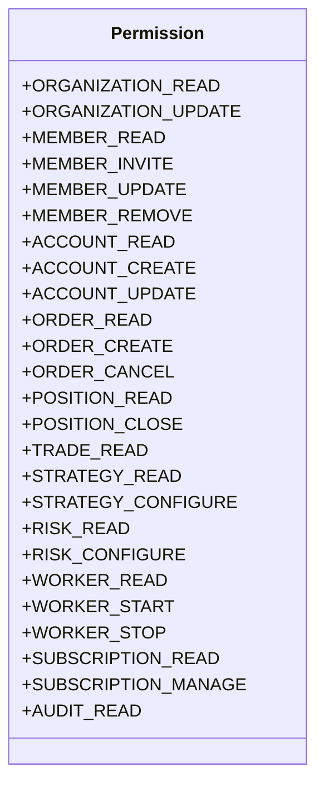

# EPIC-017 — PHASE 5: SECURITY, AUTHORIZATION, MULTI-TENANT ISOLATION & GOVERNANCE HARDENING
## Institutional Forex Trading Platform SaaS Architecture Specification

**Project**: Project ORION  
**Status**: COMPLETE / VERIFIED  
**Mode**: STRICT PAPER TRADING ONLY (Zero live broker connectivity, zero customer capital, zero real funds)  
**Date**: September 2026  

---

## 1. Executive Summary

EPIC-017 Phase 5 completes the institutional hardening of Project ORION's multi-tenant SaaS architecture. While Phases 1–4 established the database domain models, tenant context resolution, subscription and entitlement engine, transactional onboarding, and RBAC primitives, Phase 5 enforces **fail-closed security governance across all API routes**, eliminates unauthenticated execution paths, introduces compliance audit trail retrieval with secret redaction, and embeds defense-in-depth HTTP security headers.

All hardening has been verified under strict paper trading invariants with zero live broker connectivity, zero real capital execution, and zero mock deployment dependencies.

---

## 2. Canonical 25-Permission RBAC Matrix

The authoritative permission inventory across Project ORION consists of exactly **25 granular permissions** categorized into 8 operational domains:

### Complete 7-Role Governance Matrix

| Operational Permission | OWNER (25) | ADMIN (21) | PM (19) | RISK (12) | TRADER (14) | AUDITOR (11) | VIEWER (10) |
| :--- | :---: | :---: | :---: | :---: | :---: | :---: | :---: |
| **ORGANIZATION_READ** | ✅ | ✅ | ✅ | ✅ | ✅ | ✅ | ✅ |
| **ORGANIZATION_UPDATE** | ✅ | ✅ | ❌ | ❌ | ❌ | ❌ | ❌ |
| **MEMBER_READ** | ✅ | ✅ | ✅ | ✅ | ✅ | ✅ | ✅ |
| **MEMBER_INVITE** | ✅ | ✅ | ❌ | ❌ | ❌ | ❌ | ❌ |
| **MEMBER_UPDATE** | ✅ | ✅ | ❌ | ❌ | ❌ | ❌ | ❌ |
| **MEMBER_REMOVE** | ✅ | ✅ | ❌ | ❌ | ❌ | ❌ | ❌ |
| **ACCOUNT_READ** | ✅ | ✅ | ✅ | ✅ | ✅ | ✅ | ✅ |
| **ACCOUNT_CREATE** | ✅ | ✅ | ❌ | ❌ | ❌ | ❌ | ❌ |
| **ACCOUNT_UPDATE** | ✅ | ✅ | ❌ | ❌ | ❌ | ❌ | ❌ |
| **ORDER_READ** | ✅ | ✅ | ✅ | ✅ | ✅ | ✅ | ✅ |
| **ORDER_CREATE** | ✅ | ❌ | ✅ | ❌ | ✅ | ❌ | ❌ |
| **ORDER_CANCEL** | ✅ | ❌ | ✅ | ❌ | ✅ | ❌ | ❌ |
| **POSITION_READ** | ✅ | ✅ | ✅ | ✅ | ✅ | ✅ | ✅ |
| **POSITION_CLOSE** | ✅ | ❌ | ✅ | ❌ | ✅ | ❌ | ❌ |
| **TRADE_READ** | ✅ | ✅ | ✅ | ✅ | ✅ | ✅ | ✅ |
| **STRATEGY_READ** | ✅ | ✅ | ✅ | ✅ | ✅ | ✅ | ✅ |
| **STRATEGY_CONFIGURE** | ✅ | ✅ | ✅ | ❌ | ✅ | ❌ | ❌ |
| **RISK_READ** | ✅ | ✅ | ✅ | ✅ | ✅ | ✅ | ✅ |
| **RISK_CONFIGURE** | ✅ | ❌ | ❌ | ✅ | ❌ | ❌ | ❌ |
| **WORKER_READ** | ✅ | ✅ | ✅ | ✅ | ✅ | ✅ | ✅ |
| **WORKER_START** | ✅ | ✅ | ✅ | ❌ | ❌ | ❌ | ❌ |
| **WORKER_STOP** | ✅ | ✅ | ✅ | ❌ | ❌ | ❌ | ❌ |
| **SUBSCRIPTION_READ** | ✅ | ✅ | ✅ | ✅ | ✅ | ✅ | ✅ |
| **SUBSCRIPTION_MANAGE** | ✅ | ✅ | ❌ | ❌ | ❌ | ❌ | ❌ |
| **AUDIT_READ** | ✅ | ✅ | ✅ | ✅ | ❌ | ✅ | ❌ |

---

## 3. Remediation Architecture & Implementation Details

### 3.1 SEC-01: Legacy Paper Trade Hardening (`POST /api/v1/paper-trade`)
The legacy `/paper-trade` endpoint, originally created in Sprint 1 without authentication, has been fully upgraded to an institutional enterprise gateway:
- **Authentication**: Requires valid JWT bearer token via `get_current_active_user`.
- **RBAC Governance**: Enforces `require_permission(Permission.ORDER_CREATE)`. Calls from `ADMINISTRATOR`, `RISK_OFFICER`, `AUDITOR`, or `VIEWER` fail-closed with `HTTP 403 Forbidden`.
- **Account Ownership**: Injects `AccountModel` via `get_user_account`, ensuring tenancy isolation.
- **Asset Entitlement**: Invokes `EntitlementService.check_asset_access()`. Unentitled instruments (e.g. `XAU/USD` on Free tier) trigger `HTTP 403 Forbidden`.
- **Daily Quota Enforcement**: Invokes `EntitlementService.check_daily_order_quota()`. Exceeding plan limits triggers `HTTP 429 Too Many Requests`.
- **Compliance Audit Logging**: Automatically writes an immutable `AuditLogModel` entry (`event_type="paper_trade.executed"`) tracking caller user ID, organization, order parameters, fill status, and execution timestamp.
- **Personal Sandbox Compatibility**: Users without organizational membership operate securely in individual sandbox mode within default plan boundaries.

### 3.2 SEC-02: Subsystem Route RBAC Governance
Declarative `require_permission()` dependencies have been applied to all previously unguarded endpoints:
- **Accounts**: `GET /api/v1/account/summary` and `GET /api/v1/account/` require `ACCOUNT_READ`.
- **Portfolio**: `GET /api/v1/portfolio/`, `/equity`, `/pnl`, and `/exposure` require `ACCOUNT_READ`.
- **Dashboard**: `GET /api/v1/dashboard/` requires `ACCOUNT_READ`.
- **Strategies**: `GET /api/v1/strategies/`, `/{strategy_id}`, and `/{strategy_id}/config-schema` require `STRATEGY_READ` and authenticated session.

### 3.3 SEC-03: Compliance Audit Log API (`GET /api/v1/organizations/{id}/audit-logs`)
Institutional compliance API allowing auditors and administrators to inspect organizational audit logs:
- Guarded by `require_permission(Permission.AUDIT_READ)`.
- Strictly validates cross-tenant match (`_verify_tenant_match`), returning `HTTP 403 Forbidden` on IDOR attempts.
- Supports pagination (`limit`, `offset`) and event type filtering (`event_type`).
- **Secret Redaction**: Recursively traverses the audit `details` JSON payload and masks sensitive keys (`password`, `token`, `secret`, `hashed_password`, `raw_token`, `api_key`, `authorization`) with `"[REDACTED]"`.

### 3.4 SEC-04: Fail-Closed Organization Status Invariants
In `get_tenant_context`, tenant status validation is enforced:
- If the resolved organization has `status != "ACTIVE"` (e.g. `SUSPENDED` or `DEACTIVATED`), execution halts immediately with `HTTP 403 Forbidden`.
- Emits explicit diagnostic details: `"Forbidden: Organization '<id>' is suspended"` / `"deactivated"`.

### 3.5 SEC-05: Institutional HTTP Security Headers
Middleware applied to all FastAPI responses:
- `X-Content-Type-Options: nosniff`
- `X-Frame-Options: DENY`
- `Cache-Control: no-store, no-cache, must-revalidate`
- `X-XSS-Protection: 1; mode=block`
- `Strict-Transport-Security: max-age=31536000; includeSubDomains; preload`
- `Referrer-Policy: strict-origin-when-cross-origin`
- `Content-Security-Policy: default-src 'self'; script-src 'self' 'unsafe-inline' 'unsafe-eval'; style-src 'self' 'unsafe-inline'; img-src 'self' data:; connect-src 'self' ws: wss:;`

---

## 4. Verification & Quality Gates

The implementation has undergone comprehensive verification:
1. **Phase 5 Dedicated Security Suite**: 16/16 tests passing in `tests/integration/apps/trading_engine/test_phase5_security.py`.
2. **Unified Integration Suite**: 50/50 tests passing across Phase 5, Phase 4 Onboarding, Phase 4 Invitations, Phase 4 RBAC, and Application Runtime Startup.
3. **Database Migration Suite**: 14/14 tests passing across Alembic revisions 0004–0007 (both SQLite and PostgreSQL).
4. **Domain Unit Tests**: 37/37 tests passing across organization and subscription domain models and entitlement logic.
5. **Frontend Suite**: 10/10 test files (24/24 tests) passing with Vitest.
6. **Frontend Production Build**: Clean Vite build (`dist/index.html`, `dist/assets/*`) in 4.32s.
7. **Static Typing**: `mypy libraries/domain/organization apps/trading-engine/src` passed with 0 errors across 34 source files.
8. **Code Quality**: `ruff check` passed with 0 errors.

---

## 5. Paper Trading Safety Commitment

Project ORION strictly adheres to simulated paper execution:
- **No Live Broker**: Execution router connects exclusively to `PaperExecutionAdapter`.
- **No Real Capital**: Simulated accounts operate on virtual paper capital.
- **No Payment Processors**: Zero real billing or Stripe SDK bindings in this phase.
- **Deterministic**: Fully observable, audited, and isolated within local/test virtual environments.
