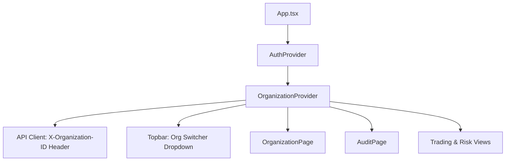

# PROJECT ORION — EPIC-020 DASHBOARD 2.0 ARCHITECTURE SPECIFICATION
## Institutional Multi-Tenant UX & Frontend Design System

**Date:** September 21, 2026  
**Repository:** `Project-ORION` (`project-orion/`)  
**Epic:** EPIC-020 — Product UX / Dashboard 2.0  
**Status:** COMPLETED — SPECIFICATION & ARCHITECTURE  
**Target Platform:** React 18, TypeScript (Strict), Tailwind CSS, Vite, Lucide Icons  

---

## 1. Architectural Vision & Scope

The objective of **EPIC-020: Product UX / Dashboard 2.0** is to transform Project ORION's functional frontend prototype into an institutional-grade SaaS multi-tenant web application. The platform provides tier-1 hedge funds and proprietary trading institutions with secure, audited, and responsive paper-trading intelligence while strictly upholding non-negotiable safety invariants.

### 1.1 Non-Negotiable Safety & Compliance Invariants
1. **Strict Paper-Trading Only:**
   - Capital at risk: **$0.00**.
   - Live broker connections: **0**.
   - Persistent banner across all authenticated layouts displaying: `"ENVIRONMENT: PAPER TRADING ONLY (SIMULATION) — NO REAL CAPITAL AT RISK"`.
   - Every metric, trade order, and portfolio display reinforces the paper simulation context.
2. **Autonomous Worker Disabled:**
   - Worker state is strictly `ORION_WORKER_ENABLED=false`.
   - Zero UI controls, buttons, or workflows exist to trigger or activate autonomous trading.
3. **Stripe Test Mode Isolation:**
   - Any commercial billing flows operate exclusively with Stripe Test Mode keys (`sk_test_...` / `pk_test_...`).
   - Zero real cardholder data (PAN/CVV) is accepted, processed, or transmitted by the frontend.
4. **Tenant Isolation & RBAC Governance:**
   - Multi-tenant boundary enforced via `X-Organization-ID` header injection on every authenticated API call.
   - 7 canonical RBAC roles (`OWNER`, `ADMINISTRATOR`, `PORTFOLIO_MANAGER`, `RISK_OFFICER`, `TRADER`, `AUDITOR`, `VIEWER`) and 25 granular permissions evaluated client-side to enforce least-privilege interface rendering.

---

## 2. Design System Architecture

The design system is constructed from atomic, accessible, and theme-consistent React components built with strict TypeScript types and Tailwind CSS utilities.

### 2.1 Color Palette & Typography
- **Backgrounds:** Slate-950 (`#020617`), Slate-900 (`#0f172a`), Slate-800 (`#1e293b`).
- **Borders:** Slate-800 (`#1e293b`), Slate-700 (`#334155`).
- **Accents:**
  - Sky (`#0284c7` / `#38bdf8`): Primary actions, active navigation states.
  - Emerald (`#059669` / `#34d399`): Positive P&L, healthy status, confirmed actions.
  - Rose (`#e11d48` / `#f43f5e`): Negative P&L, errors, critical risk thresholds.
  - Amber (`#d97706` / `#fbbf24`): Warnings, simulation badges, role highlights.
  - Indigo/Purple (`#6366f1` / `#a855f7`): Administrative badges, audit identifiers.
- **Typography:**
  - Standard text: `Inter`, system-ui sans-serif.
  - Telemetry & Financial Values: `JetBrains Mono`, `ui-monospace` for tabular numeric alignment.

### 2.2 Reusable Core Component Inventory
- `MetricCard.tsx`: Standardized card displaying metric title, formatted financial value, trend indicator (up/down/neutral), percentage delta, helper subtitle, and loading skeleton states.
- `PageHeader.tsx`: Canonical page title banner featuring page title, subtitle, breadcrumbs, action button slots, and the mandatory institutional Paper Trading Badge.
- `Breadcrumbs.tsx`: Accessible navigational hierarchy generator linking back to the dashboard root.
- `Skeleton.tsx`: Content placeholder skeletons (`Skeleton`, `CardSkeleton`, `TableSkeleton`) providing smooth, flicker-free loading states.
- `EmptyState.tsx`: Meaningful empty container view featuring iconography, explanatory text, and optional call-to-action buttons.
- `ErrorState.tsx`: Actionable error container providing diagnostic context and a prominent "Retry" callback button.
- `ConfirmationDialog.tsx`: Modal dialog requiring affirmative user confirmation before executing potentially destructive actions (order cancellation, member removal, position closure).
- `Dropdown.tsx`: Accessible, keyboard-navigable popup menu supporting item icons, badges, dividers, and disabled states.
- `Tabs.tsx`: Tabbed navigation control with clean active border transitions and ARIA accessibility roles.
- `Modal.tsx`: Accessible modal dialogue upgraded with flexible sizing (`sm`, `md`, `lg`, `xl`, `full`) and backdrop click-to-close safeguards.

---

## 3. Information Architecture & Navigation

The navigation is restructured into four logical institutional functional groups in `Sidebar.tsx`:

```
┌──────────────────────────────────────────────────────────┐
│                   SIDEBAR NAVIGATION                     │
├──────────────────────────┬───────────────────────────────┤
│ GROUP                    │ DESTINATIONS                  │
├──────────────────────────┼───────────────────────────────┤
│ Overview & Analytics     │ • Dashboard (/dashboard)      │
│                          │ • Portfolio (/portfolio)      │
├──────────────────────────┼───────────────────────────────┤
│ Execution & Trading      │ • Orders (/orders)            │
│                          │ • Positions (/positions)      │
│                          │ • Trades (/trades)            │
│                          │ • Strategies (/strategies)    │
├──────────────────────────┼───────────────────────────────┤
│ Risk & Governance        │ • Risk Management (/risk)     │
│                          │ • Audit Trail (/audit)        │
├──────────────────────────┼───────────────────────────────┤
│ Administration           │ • Organization (/organization)│
│                          │ • Billing & Plans (/billing)  │
└──────────────────────────┴───────────────────────────────┘
```

### 3.1 Role-Based Access Control (RBAC) Filtering
Each menu item is bound to a specific required `Permission`. The sidebar checks `hasPermission(currentRole, item.permission)`:
- `Audit Trail`: Requires `audit:read` (Auditors, Admins, Owners).
- `Organization`: Requires `org:read` (All active members).
- `Billing & Plans`: Requires `billing:read` or `org:billing` (Admins, Owners).

---

## 4. Multi-Tenant Organization Context (`OrganizationContext.tsx`)

The multi-tenant architecture dynamically manages organization state across all views:



### 4.1 Tenant Invariant Flow
1. Upon user authentication, `OrganizationProvider` invokes `organizationApi.list()` to fetch all organizations associated with the user.
2. The active tenant is stored in `localStorage` (`orion_active_org_id`) and held in React Context.
3. Every outgoing HTTP request executed through `api/client.ts` intercepts the request and injects:
   ```typescript
   const orgId = getStoredOrgId();
   if (orgId) {
     headers['X-Organization-ID'] = orgId;
   }
   ```
4. When a user switches organizations in the Topbar dropdown, the stored ID updates, all active queries refresh, and the client-side role is recomputed to mirror the tenant's membership record.

---

## 5. View Specifications

### 5.1 Organization Management View (`/organization`)
- **Header:** Organization profile name, unique slug, creation timestamp, and active role badge.
- **Profile Edit Modal:** Allows users with `org:update` permissions to rename the organization.
- **Team Members Table:** Displays user IDs, roles, and membership dates with inline actions to modify role (`org:members:update`) or remove member (`org:members:remove`).
- **Invite Member Flow:** Secure modal allowing administrators (`org:invite:create`) to specify a corporate email and role. Displays single-use cryptographic invitation tokens with one-click clipboard copying.

### 5.2 Compliance Audit Log View (`/audit`)
- **Header:** Regulatory audit ledger with real-time UTC timestamping and read-only status indicators.
- **Event Filter:** Dropdown to filter records across event families (`ALL`, `ORG`, `MEMBER`, `INVITATION`, `STRATEGY`, `ORDER`, `BILLING`, `AUTH`).
- **Audit Table:** Displays event timestamp, actor identifier, IP address, event type, component name, and status badge.
- **Payload Inspection Modal:** Secure inspection dialogue formatting JSON payloads and redacting sensitive authentication hashes or secret tokens before display.

---

## 6. Verification & Quality Gates

The implementation adheres to strict verification gates:
- **Zero TypeScript Errors:** Verified via `tsc --noEmit`.
- **Complete Test Coverage:** 14 test suites, 37 component and page tests passing with 100% success rate in Vitest.
- **Cloud API Compatibility:** Seamless integration with existing backend REST routes without requiring new endpoints or DB migrations.
