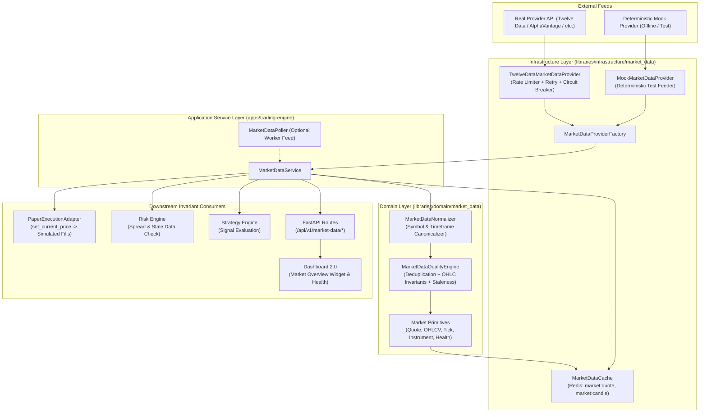

# PROJECT ORION — EPIC-021 IMPLEMENTATION PLAN
## Real Market Data Platform: Architecture, Ingestion, Normalization & Quality Governance

**Date:** September 21, 2026  
**Repository:** `Project-ORION` (`project-orion/`)  
**Epic:** EPIC-021 — Real Market Data Platform  
**Target:** Institutional Market Data Layer, Quality Engine, Provider Adapters, Redis Cache, Downstream Integration  
**Classification Target:** **B — MARKET DATA READY WITH EXTERNAL PROVIDER VERIFICATION PENDING** (or **A** if live API key available)  

---

## 1. Executive Summary & Architectural Invariants

The primary objective of **EPIC-021** is to build an institutional-grade, broker-independent **Real Market Data Platform** for Project ORION. The platform consumes external market data (both real and deterministic test feeds), normalizes disparate provider representations into canonical ORION market primitives, executes rigorous quality filtering and staleness detection, and exposes high-integrity market state to Downstream Consumers (Indicators, Strategies, Risk, Backtesting, Paper Trading, and Dashboard 2.0).

### Non-Negotiable Safety & Architectural Invariants:
1. **Real Market Data != Live Trading:**
   - Real market data feeds are read-only price and volume observations.
   - Downstream execution remains strictly **PAPER TRADING ONLY** with **$0.00 capital at risk**.
   - Zero live broker connectors, zero live broker credentials, zero live execution endpoints (`is_paper=True`).
   - Autonomous worker disabled state strictly preserved (`ORION_WORKER_ENABLED=false`).
2. **Domain Agnosticism & DDD Integrity:**
   - Domain layer (`libraries/domain/market_data/` and `libraries/domain/market/`) must contain zero references to specific vendor SDKs, proprietary protocols, or external endpoints.
   - Provider communication is isolated in infrastructure adapters implementing Protocol ports.
3. **Financial Precision & Temporal Integrity:**
   - All prices, volumes, and spreads represented as `Decimal`. Never use binary floating-point as the authoritative financial representation.
   - All timestamps must be timezone-aware UTC (`datetime.now(timezone.utc)`).
4. **Data Quality & Failure Containment:**
   - Ingested data is subjected to deterministic validation: OHLC invariants ($low \le open \le high$, $low \le close \le high$), positive volume, positive prices, bid $\le$ ask.
   - Deduplication and out-of-order rejection prevent time-series corruption.
   - Staleness detection marks data as `STALE` when age exceeds configured threshold; downstream consumers (Risk Engine) are immediately notified.
5. **Credential & Network Security:**
   - Provider API keys sourced exclusively via environment variables (`ORION_MARKET_DATA_API_KEY`, `ORION_MARKET_DATA_PROVIDER`).
   - Zero credentials in Git, logs, or client-facing frontend bundles.
   - Strict SSRF protection: external provider URLs must be strictly allowlisted; no user-supplied URLs accepted.
6. **Zero Destructive Database Changes:**
   - No table drops or schema regressions. Market data caching utilizes existing Redis infrastructure with configured TTLs.

---

## 2. Gap Analysis Matrix

| Capability | Existing Implementation | Missing Gaps | Required Changes | Layer |
| :--- | :--- | :--- | :--- | :--- |
| **Market Data Domain Primitives** | `models.py` in `market_data/` has `Tick`, `Quote`, `Bar`, `OHLCV`, `BarType`. | Lacks `DataQuality`, `MarketDataHealth`, `ProviderStatus`, `Instrument`. | Add `DataQuality` enum, `MarketDataHealth`, `Instrument`, `ProviderStatus`. | Domain (`market_data/models.py`) |
| **Market Data Quality Engine** | Basic price/symbol bounds in `validation.py`. | No OHLC relationship validation, spread sanity checks, staleness calculation, or deduplication ledger. | Create `quality_engine.py` with `MarketDataQualityEngine` handling OHLC checks, deduplication, and staleness detection. | Domain (`market_data/quality_engine.py`, `validation.py`) |
| **Canonical Normalization** | Symbol separator stripping in `domain/market/normalization.py`. | No unified multi-pair canonical FX mapping (`EURUSD`, `EUR_USD` -> `EUR/USD`) or timeframe mapping (`1m`, `60`, `M1` -> `BarType.M1`). | Create `normalizer.py` implementing comprehensive symbol and timeframe normalization. | Domain (`market_data/normalization.py`) |
| **Provider Ports & Abstractions** | `interfaces.py` has `TickDataProviderPort`, `HistoricalDataProviderPort`, `MarketSnapshotProviderPort`. | Ports require unified health probing, quote streaming, and status metadata. | Refine ports to include `health_check()` and provider metadata. | Domain (`market_data/interfaces.py`) |
| **Infrastructure Provider Adapters** | Early socket connector spike in `infrastructure/broker_connectors/`. No market-data adapters. | Missing real HTTP/REST provider adapter, deterministic test provider, rate limiting, and circuit breaker. | Create `libraries/infrastructure/market_data/`: `TwelveDataMarketDataProvider`, `MockMarketDataProvider`, `RateLimiter`, `CircuitBreaker`. | Infrastructure (`infrastructure/market_data/`) |
| **Market Data Caching** | Generic `RedisClient` exists in `infrastructure/caching/`. | No market data cache key patterns, serialization, or TTL eviction policy. | Implement `MarketDataCache` with keys `market:quote:{symbol}`, `market:candle:{symbol}:{tf}:{ts}`, `market:health`. | Infrastructure (`infrastructure/market_data/cache.py`) |
| **Application Service** | `MarketDataPoller` in worker produces static simulated mid-prices. | No centralized `MarketDataService` orchestrating provider, cache, quality engine, and paper adapter. | Implement `MarketDataService` coordinating provider queries, cache-aside, quality validation, and paper-price feeding. | Service (`apps/trading-engine/src/services/market_data_service.py`) |
| **FastAPI REST Endpoints** | No market data routes in `apps/trading-engine/src/routes/`. | Missing endpoints for instruments, quotes, historical candles, and feed health. | Implement `GET /api/v1/market-data/instruments`, `/quotes/{symbol}`, `/candles`, `/health` with auth and tenant guards. | Routes (`apps/trading-engine/src/routes/market_data.py`) |
| **Paper Trading Integration** | `PaperExecutionAdapter` uses static `1.20000` default price unless updated via `set_current_price()`. | Not automatically fed by validated market data ticks/quotes. | Wire `MarketDataService` to update `PaperExecutionAdapter.set_current_price()` upon fresh quote arrival. | Service / Lifespan |
| **Strategy & Risk Integration** | `StrategyContext` and `RiskContext` accept `spread_pips`, `volatility`, `provider_health`, `market_open`. | Contexts populated with hardcoded defaults in tests. | Connect validated market quotes and quality metrics into strategy and risk evaluation contexts. | Domain / Service |
| **Frontend UI (Dashboard 2.0)** | High-level account metrics and paper badge exist. | No real-time market overview widget, quote cards, or feed health status indicator. | Add `marketDataApi` client, Market Overview widget with quote cards, spread display, and data freshness indicator. | Frontend (`apps/dashboard/`) |

---

## 3. Detailed Architectural Blueprint

---

## 4. Phase-by-Phase Implementation Specifications

### Phase 1 — Domain Primitives & Models Enhancement
- **Target File:** `libraries/domain/market_data/models.py`
- Add:
  - `DataQuality(StrEnum)`: `EXCELLENT = "excellent"`, `GOOD = "good"`, `DEGRADED = "degraded"`, `STALE = "stale"`, `INVALID = "invalid"`.
  - `ProviderStatus(StrEnum)`: `HEALTHY = "healthy"`, `DEGRADED = "degraded"`, `DISCONNECTED = "disconnected"`, `ERROR = "error"`.
  - `Instrument(frozen=True, slots=True)`: `symbol: str`, `base_currency: str`, `quote_currency: str`, `pip_size: Decimal`, `tick_size: Decimal`, `display_name: str`, `is_active: bool = True`.
  - `MarketDataHealth(frozen=True, slots=True)`: `provider: str`, `status: ProviderStatus`, `data_quality: DataQuality`, `last_update_utc: datetime`, `symbols_active: tuple[str, ...]`, `latency_ms: float = 0.0`, `stale_count: int = 0`, `is_paper_feed: bool = True`.

### Phase 2 — Quality Validation & Governance Engine
- **Target Files:**
  - `libraries/domain/market_data/validation.py` (Enriched validators)
  - `libraries/domain/market_data/quality_engine.py` (New quality orchestrator)
- **Validators:**
  - `validate_ohlc(open: Decimal, high: Decimal, low: Decimal, close: Decimal, volume: Decimal)`: Enforces $low \le open \le high$, $low \le close \le high$, $low \le high$, $volume \ge 0$, all $> 0$.
  - `validate_quote(bid: Decimal, ask: Decimal, timestamp: datetime)`: Enforces $bid > 0$, $ask > 0$, $ask \ge bid$, timestamp is timezone-aware UTC and not $> 60s$ into the future.
  - `check_staleness(timestamp: datetime, max_age_seconds: float) -> bool`: Computes $age = now_{utc} - timestamp_{utc}$; returns `True` if $age > max\_age$.
- **Quality Engine (`MarketDataQualityEngine`):**
  - Deduplication: Maintains bounded rolling ring-buffer of tick/bar signatures `(symbol, timestamp, price)`. Drops exact duplicates safely.
  - Sequencing / Out-of-Order: Tracks monotonically non-decreasing timestamps per symbol. Rejects or flags ticks arriving earlier than the last processed timestamp.
  - Quality Rating: Computes `DataQuality` score based on spread normalcy, timeliness, and completeness.

### Phase 3 — Canonical Normalizer
- **Target File:** `libraries/domain/market_data/normalization.py` (New file)
- **Functions:**
  - `normalize_symbol(raw: str) -> str`: Normalizes `EURUSD`, `EUR_USD`, `EUR-USD`, `eur/usd` into canonical `EUR/USD`. Fails safely with `SymbolNotFoundError` on unrecognized or malformed symbols.
  - `canonical_instruments() -> dict[str, Instrument]`: Registry of institutional Forex majors (`EUR/USD`, `GBP/USD`, `USD/JPY`, `USD/CHF`, `AUD/USD`, `USD/CAD`, `NZD/USD`, `XAU/USD`).
  - `normalize_timeframe(raw: str) -> BarType`: Canonicalizes `1m`, `M1`, `60` $\rightarrow$ `BarType.M1`; `5m`, `M5`, `300` $\rightarrow$ `BarType.M5`; `1h`, `H1`, `3600` $\rightarrow$ `BarType.H1`; `1d`, `D1` $\rightarrow$ `BarType.D1`.

### Phase 4 — Provider Ports Refinement
- **Target File:** `libraries/domain/market_data/interfaces.py`
- Ensure protocols runtime-checkable:
  - `MarketDataProviderPort(Protocol)`: `get_quote(symbol: str) -> Quote`, `get_candles(symbol: str, timeframe: BarType, start: datetime, end: datetime, limit: int) -> list[OHLCV]`, `health_check() -> dict[str, Any]`, `is_connected() -> bool`.

### Phase 5 — Infrastructure Provider Adapters & Resilience
- **Target Directory:** `libraries/infrastructure/market_data/`
  - `config.py`: `MarketDataConfig` with `provider_name` (`"twelvedata"`, `"mock"`), `api_key`, `base_url`, `timeout_seconds = 10.0`, `max_retries = 3`, `backoff_factor = 1.5`, `rate_limit_per_minute = 60`, `stale_threshold_seconds = 30.0`.
  - `rate_limiter.py`: Async token bucket rate limiter preventing provider threshold violations.
  - `circuit_breaker.py`: Fault-tolerance circuit breaker (`CLOSED` $\rightarrow$ `OPEN` on 5 consecutive failures $\rightarrow$ `HALF-OPEN` after 30s probe window).
  - `mock_provider.py`: `MockMarketDataProvider` producing deterministic, realistic Forex quotes and historical bars without external network calls. Supports error injection (timeout, disconnect, malformed, stale) for test suites.
  - `twelve_data_provider.py`: Real provider adapter communicating with Twelve Data API (`https://api.twelvedata.com/quote`, `/time_series`) via async `httpx.AsyncClient`. Slices responses safely and maps through `MarketDataNormalizer`.
  - `factory.py`: `create_market_data_provider(config)` factory.

### Phase 6 — Redis Market Data Caching
- **Target File:** `libraries/infrastructure/market_data/cache.py`
- Implements `MarketDataCache`:
  - `get_quote(symbol: str) -> Quote | None`
  - `set_quote(quote: Quote, ttl_seconds: int = 15)`
  - `get_candles(symbol: str, timeframe: str) -> list[OHLCV] | None`
  - `set_candles(symbol: str, timeframe: str, candles: list[OHLCV], ttl_seconds: int = 300)`
  - `set_health(health: MarketDataHealth, ttl_seconds: int = 30)`

### Phase 7 — Application Market Data Service
- **Target File:** `apps/trading-engine/src/services/market_data_service.py`
- Implements `MarketDataService`:
  - `get_instruments() -> list[Instrument]`
  - `get_quote(symbol: str) -> Quote`: Cache-aside pattern (Redis $\rightarrow$ Provider $\rightarrow$ Quality Validate $\rightarrow$ Cache $\rightarrow$ Update Paper Execution Price).
  - `get_candles(symbol: str, timeframe: str, start: datetime | None, end: datetime | None, limit: int = 100) -> list[OHLCV]`.
  - `get_health() -> MarketDataHealth`.
  - Wire to `PaperExecutionAdapter`: Automatically calls `await paper_adapter.set_current_price(quote.symbol, quote.mid)` so paper executions track live market quotes.

### Phase 8 — FastAPI REST Routes
- **Target File:** `apps/trading-engine/src/routes/market_data.py`
- Endpoints:
  - `GET /api/v1/market-data/instruments`
  - `GET /api/v1/market-data/quotes/{symbol}`
  - `GET /api/v1/market-data/candles?symbol=EUR/USD&timeframe=1h&limit=100`
  - `GET /api/v1/market-data/health`
- Security & Validation:
  - Requires JWT authentication (`get_current_active_user`).
  - Injects tenant context header (`X-Organization-ID`).
  - Bounded pagination/limit parameters ($1 \le limit \le 1000$).
  - Strict input sanitization via Pydantic schemas in `apps/trading-engine/src/schemas.py`.

### Phase 9 — Lifespan & Dependency Wiring
- **Target Files:**
  - `apps/trading-engine/src/config.py`: Add market data settings (`ORION_MARKET_DATA_PROVIDER`, `ORION_MARKET_DATA_API_KEY`).
  - `apps/trading-engine/src/lifespan.py`: Initialize provider adapter, cache, and `MarketDataService` on `app.state.market_data_service`. Register `MarketDataHealthCheck` in `HealthCheckRegistry`.
  - `apps/trading-engine/src/dependencies.py`: Add `get_market_data_service` dependency provider.
  - `apps/trading-engine/src/main.py`: Mount `market_data.router`.

### Phase 10 — Frontend Dashboard 2.0 Integration
- **Target Files:**
  - `apps/dashboard/src/api/types.ts`: Add `MarketInstrumentResponse`, `MarketQuoteResponse`, `MarketCandleResponse`, `MarketDataHealthResponse`.
  - `apps/dashboard/src/api/endpoints.ts`: Add `marketDataApi`.
  - `apps/dashboard/src/pages/DashboardPage.tsx`: Add Institutional "Market Overview" section displaying major FX pairs (EUR/USD, GBP/USD, USD/JPY), live bid/ask, spread in pips, timestamp, data freshness badge (`FRESH` / `STALE`), and provider status.

---

## 5. Comprehensive Verification & Quality Gates

### 5.1 Automated Unit & Integration Testing
- `tests/unit/domain/market_data/`:
  - Test models immutability, slot usage, and Decimal precision.
  - Test OHLC invariant validation ($low \le open \le high$, etc.).
  - Test quote spread and timestamp validation.
  - Test staleness detection thresholds.
  - Test deduplication and out-of-order rejection.
  - Test symbol and timeframe normalization.
- `tests/unit/infrastructure/market_data/`:
  - Test `MockMarketDataProvider` deterministic responses.
  - Test token bucket rate limiting.
  - Test circuit breaker state transitions (`CLOSED` $\rightarrow$ `OPEN` $\rightarrow$ `HALF-OPEN`).
  - Test `TwelveDataMarketDataProvider` mapping and error handling with mock HTTP transport.
  - Test `MarketDataCache` serialization and TTL expiration.
- `tests/unit/apps/trading_engine/`:
  - Test `MarketDataService` cache-aside flow and paper adapter price sync.
  - Test all REST endpoints (`/instruments`, `/quotes/{symbol}`, `/candles`, `/health`).
  - Test authentication, parameter bounding, and error handling.
- `apps/dashboard/tests/`:
  - Test `marketDataApi` integration and Market Overview component rendering.
  - Ensure all existing 37 frontend tests pass without regression.

### 5.2 Release Gate Classification Criteria
- **A — REAL MARKET DATA PRODUCTION VERIFIED:** Real external provider credentials legitimately provisioned in production, verified via live read-only requests.
- **B — MARKET DATA READY WITH EXTERNAL PROVIDER VERIFICATION PENDING:** All architecture, domain contracts, normalizers, quality engine, adapters, mock test providers, Redis caching, REST routes, paper execution sync, frontend widgets, and regression tests 100% complete and verified locally and in CI. Real external provider keys remain externally pending.

---

## 6. Execution Safety & Plan Authorization

Implementation will proceed strictly according to this approved architecture plan only after formal audit completion.
