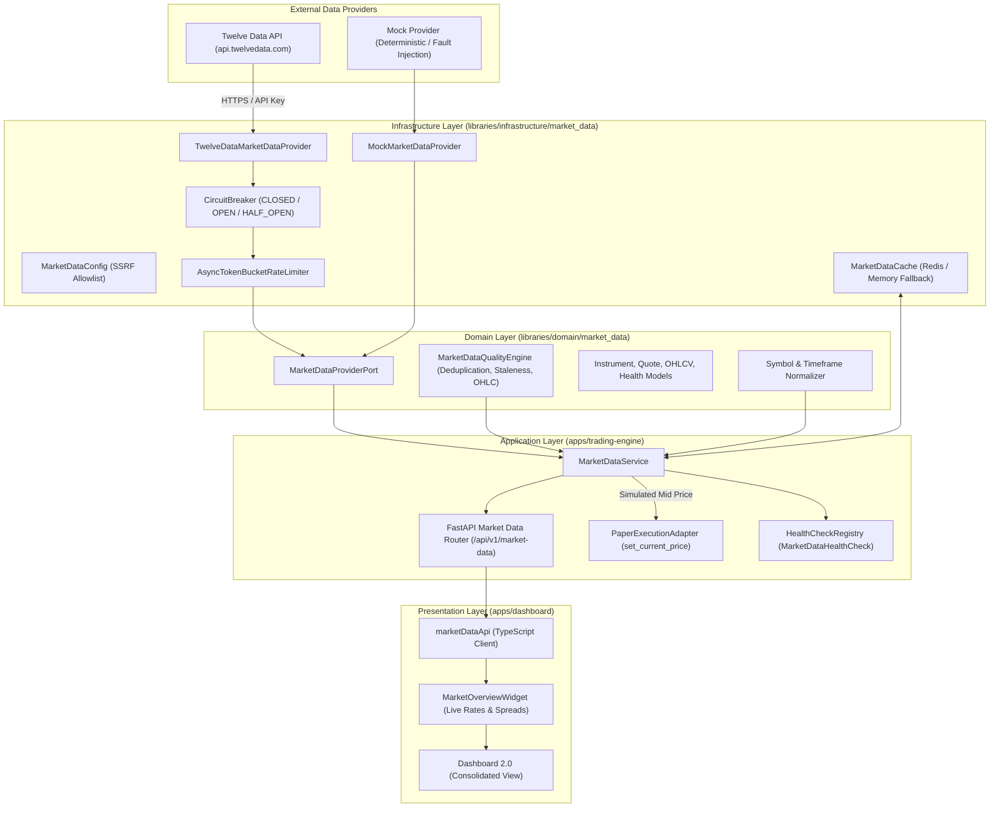

# PROJECT ORION — EPIC-021 REAL MARKET DATA ARCHITECTURE
## Institutional-Grade Real Market Data Platform Specification

**Epic:** EPIC-021 — Real Market Data Platform  
**Architecture Classification:** Institutional SaaS / Broker-Agnostic Market Data Pipeline  
**Trading Invariant:** Strictly Paper-Trading Only ($0.00 Capital at Risk)  
**Date:** September 2026  

---

## 1. Architectural Vision & Principles

The Project ORION Real Market Data Platform decouples execution environments from market data ingestion. Rather than relying on a broker-specific connection to receive pricing, Project ORION ingests real-time and historical market data from external financial data providers (e.g. Twelve Data, Polygon, AlphaVantage) or deterministic mock providers, subjects all raw data to rigorous quality and staleness governance, normalizes it into canonical internal primitives, caches it in Redis, and feeds it into the paper execution engine and user dashboard.

### Core Architectural Tenets:
1. **Hexagonal Independence:** Data providers are pluggable infrastructure adapters satisfying the domain `MarketDataProviderPort`. The domain and application layers have zero awareness of specific provider REST APIs, JSON schemas, or network protocols.
2. **Zero Broker Coupling:** Execution adapters (e.g. `PaperExecutionAdapter`) do not fetch their own data; they consume normalized prices published by `MarketDataService`. Real market data feeds simulated paper execution with realistic spreads.
3. **Rigorous Quality Governance:** Every quote and candle is evaluated against mathematical OHLC relationships ($Low \le Open, Close \le High$), bid/ask spread sanity ($Ask > Bid$), timestamp monotonicity, ring-buffer deduplication, and staleness thresholds.
4. **Resilience & Fault Isolation:** All external HTTP calls are guarded by asynchronous token-bucket rate limiters, 3-state circuit breakers (CLOSED, OPEN, HALF_OPEN), exponential backoff retries, and SSRF domain allowlisting.
5. **Absolute Capital Safety:** The platform operates strictly in paper-trading mode (`is_paper=True`), zero live broker accounts, $0.00 capital at risk, and autonomous worker disabled.

---

## 2. System Architecture & Component Diagram



---

## 3. Domain Model Specifications (`libraries/domain/market_data/`)

### 3.1 Primitives & Enums
- **`DataQuality`**: `EXCELLENT`, `GOOD`, `DEGRADED`, `STALE`, `INVALID`.
- **`ProviderStatus`**: `HEALTHY`, `DEGRADED`, `DISCONNECTED`, `ERROR`.
- **`BarType`**: `TICK`, `SECOND_1`, `SECOND_5`, `MINUTE_1`, `MINUTE_5`, `MINUTE_15`, `HOUR_1`, `HOUR_4`, `DAY_1`, `WEEK_1`, `MONTH_1`.

### 3.2 Canonical Entities
- **`Instrument`**: Tradable financial asset definition:
  - `symbol: str` (e.g. `"EUR/USD"`)
  - `base_currency: str` (`"EUR"`)
  - `quote_currency: str` (`"USD"`)
  - `pip_size: Decimal` (`0.0001` for standard forex, `0.01` for JPY pairs, `0.10` for gold)
  - `tick_size: Decimal` (`0.00001` for standard forex, `0.001` for JPY pairs)
  - `display_name: str` (`"Euro / US Dollar"`)
  - `is_active: bool`
- **`Quote`**: Real-time two-way price quotation:
  - `symbol: str`, `bid: Decimal`, `ask: Decimal`, `timestamp: datetime`
  - Computed properties: `mid = (bid + ask) / 2`, `spread = ask - bid`
- **`OHLCV`**: Historical price candle:
  - `timestamp: datetime`, `open: Decimal`, `high: Decimal`, `low: Decimal`, `close: Decimal`, `volume: Decimal`
- **`MarketDataHealth`**: Real-time operational telemetry:
  - `provider: str`, `status: ProviderStatus`, `data_quality: DataQuality`, `last_update_utc: datetime`, `symbols_active: tuple[str, ...]`, `latency_ms: float`, `stale_count: int`, `is_paper_feed: bool = True`.

---

## 4. Canonical Normalization Engine

Symbol representations across financial providers are notoriously fragmented:
- Twelve Data: `EUR/USD`
- Polygon: `C:EURUSD`
- MetaTrader / OANDA: `EUR_USD`
- Interactive Brokers: `EUR.USD`

The `normalize_symbol` function accepts any valid format, strips whitespace/delimiters, identifies base and quote currency ISO codes, and emits canonical slash-delimited notation (`EUR/USD`). Unknown or syntactically invalid symbols are rejected with `SymbolNotFoundError`.

Supported Canonical Instruments:
- `EUR/USD` (Euro / US Dollar)
- `GBP/USD` (British Pound / US Dollar)
- `USD/JPY` (US Dollar / Japanese Yen)
- `USD/CHF` (US Dollar / Swiss Franc)
- `AUD/USD` (Australian Dollar / US Dollar)
- `USD/CAD` (US Dollar / Canadian Dollar)
- `NZD/USD` (New Zealand Dollar / US Dollar)
- `XAU/USD` (Gold Spot / US Dollar)

---

## 5. Market Data Quality & Governance Engine

The `MarketDataQualityEngine` validates incoming ticks, quotes, and candles before they reach trading logic or caching:

1. **OHLC Relationship Sanity:**
   $$\text{low} \le \text{open} \le \text{high} \quad \land \quad \text{low} \le \text{close} \le \text{high}$$
2. **Spread Non-Negativity:**
   $$\text{ask} > \text{bid} > 0$$
3. **Monotonic Sequence & Deduplication:**
   A rolling bounded ring-buffer (capacity 256 per symbol) computes cryptographic hashes of recent payloads to detect duplicate packets and inverted timestamps.
4. **Staleness Tracking:**
   $$\Delta t = t_{\text{current}} - t_{\text{quote}}$$
   If $\Delta t > 30.0\text{s}$, the quote is tagged as `DataQuality.STALE`. If $\Delta t > 300.0\text{s}$, it is classified as `DataQuality.DEGRADED`.

---

## 6. Resilience & Infrastructure Layer

### 6.1 Token Bucket Rate Limiter
The `AsyncTokenBucketRateLimiter` enforces strict rate limits (default: 60 requests/minute) across asynchronous workers with non-blocking token replenishment and timeout-bounded waits.

### 6.2 Circuit Breaker
The `CircuitBreaker` manages external network failure cascades:
- **CLOSED:** Normal operations. Failure counter tracks consecutive errors.
- **OPEN:** After 5 consecutive failures, the circuit trips open for a 30-second recovery timeout, immediately throwing `CircuitBreakerOpenError` without wasting network sockets.
- **HALF_OPEN:** After timeout expiry, a probe request tests provider recovery. Success closes the circuit; failure re-opens it.

### 6.3 SSRF Protection
The `MarketDataConfig` enforces an allowlist of trusted external hostnames (`api.twelvedata.com`, `api.polygon.io`, `finnhub.io`, `www.alphavantage.co`). Any attempt to configure arbitrary internal or loopback URLs (e.g. `http://169.254.169.254` or `http://localhost`) is rejected with `MarketDataConfigError`.

---

## 7. Caching & Persistence Architecture

- **Engine:** Redis (via `RedisClient`) with automatic graceful fallback to local memory when Redis is absent.
- **Key Schemas & TTLs:**
  - `market:quote:{symbol}`: TTL 15 seconds (prevents stale pricing accumulation).
  - `market:candles:{symbol}:{timeframe}`: TTL 300 seconds (efficient historical caching).
  - `market:health`: TTL 30 seconds (reduces external provider telemetry probing).
- **Zero Database Pollution:** High-frequency market data is strictly ephemeral; historical orders and fills remain the persistent system of record in PostgreSQL.

---

## 8. Paper Trading Synchronization Contract

Whenever `MarketDataService.get_quote(symbol)` retrieves or refreshes a valid quote, it automatically synchronizes the paper trading environment:
```python
if self._paper_adapter is not None:
    await self._paper_adapter.set_current_price(canonical, quote.mid)
```
This guarantees that all simulated orders submitted by users or test harnesses execute against real or realistic market mid-rates and spreads without connecting to a live broker.
