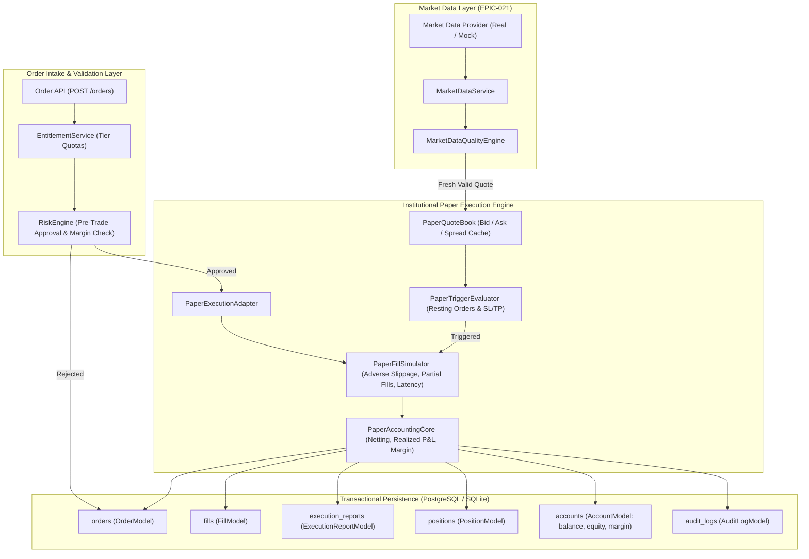

# PROJECT ORION — EPIC-022 IMPLEMENTATION PLAN
## Advanced Institutional Paper Trading Engine: Architecture, Microstructure Simulation, Risk, Portfolio Accounting & QA

**Date:** September 21, 2026  
**Repository:** `Project-ORION` (`project-orion/`)  
**Epic:** EPIC-022 — Advanced Institutional Paper Trading Engine  
**Classification Target:** **B — ADVANCED PAPER TRADING ENGINE READY WITH EXTERNAL LIVE BROKER CERTIFICATION PENDING**  
**Safety Status:** **PAPER TRADING ONLY — $0.00 CAPITAL AT RISK — LIVE BROKERS DISABLED (0)**  

---

## 1. Executive Summary & Non-Negotiable Safety Invariants

The primary objective of **EPIC-022** is to build a deterministic, institutional-grade **Advanced Paper Trading Engine** for Project ORION. The engine simulates realistic market microstructure and order execution without touching live broker endpoints or exposing real capital to risk.

The engine integrates seamlessly with the Real Market Data Platform (EPIC-021), utilizing live bid/ask quotes and spreads when available, and deterministic mock market data in automated test suites and offline environments.

### Non-Negotiable Safety Invariants:
1. **Strict Paper Trading Only:**
   - Capital at risk: strictly **$0.00**.
   - Zero live broker connections, zero live broker credentials, zero live execution endpoints (`is_paper=True` universally enforced).
   - Autonomous trading worker remains strictly disabled by default (`ORION_WORKER_ENABLED=false`).
   - Absolute prohibition against live trading toggles, "Go Live" buttons, or automated broker routing.
2. **Authoritative Financial Arithmetic:**
   - Authoritative financial arithmetic (prices, quantities, balances, equity, margin, P&L, commissions, swaps) strictly utilizes `Decimal`.
   - Never use binary floating-point (`float`) for authoritative financial balances or ledger transactions.
3. **Temporal Consistency:**
   - All timestamps must be timezone-aware UTC (`datetime.now(timezone.utc)`).
4. **Deterministic Simulation & Microstructure Correctness:**
   - **Bid/Ask Separation:** BUY orders execute against Ask (`ask + adverse slippage`); SELL orders execute against Bid (`bid - adverse slippage`).
   - **Adverse Slippage Sign:** Slippage is strictly adverse to the trader (increases fill price for BUYs, decreases fill price for SELLs).
   - **Deterministic Mode:** Configurable flag (`deterministic=True`) fixes slippage, latency, and fills for 100% reproducible testing.
5. **Architectural Integrity & DDD Alignment:**
   - Preserve existing Domain-Driven Design boundaries (`libraries/domain/execution/`, `libraries/domain/portfolio/`, `libraries/domain/risk/`, `libraries/domain/market_data/`).
   - Do NOT duplicate domain concepts or create a second parallel execution engine.
   - Pre-trade risk validation (`RiskEngine`) remains the final approval authority before order intake.
6. **Multi-Tenant Isolation & Transactional Integrity:**
   - All orders, fills, positions, and ledger entries are strictly partitioned by `account_id` and `organization_id`.
   - Concurrent execution operations are guarded by asynchronous per-account locks to prevent state corruption.
   - Database updates execute within atomic transaction boundaries.

---

## 2. Gap Analysis Matrix (Phase 1)

| Capability | Existing Implementation | Missing / Defect | Required Change | Layer |
| :--- | :--- | :--- | :--- | :--- |
| **Bid/Ask & Spread Execution** | Synthesizes spread around a single `current_price`. | Does not use real bid/ask from `MarketDataService`. BUY uses `mid + spread/2`; SELL uses `mid - spread/2`. | Update `PaperExecutionAdapter` to receive full `Quote` (bid, ask, spread). Execute BUY at Ask, SELL at Bid. | Infrastructure / Domain |
| **Slippage Modeling** | `fill_price = current_price - spread/2 + slippage` for SELL. | **BUG:** Adding positive slippage to SELL rewards the seller with a higher execution price. | Correct sign: SELL fill price = `bid - slippage`. Bound slippage. Support deterministic mode. | Infrastructure |
| **Resting Order Triggers** | `_place_limit_order` & `_place_stop_order` only record order as `submitted`. | Resting limit/stop orders never trigger on subsequent price ticks. Remain pending forever. | Implement `PaperTriggerEvaluator` that checks pending orders against incoming quotes and triggers fills. | Infrastructure / Service |
| **Partial Fills Tracking** | Simulates partial fill in `PaperExecutionAdapter` if random < prob. | Position tracking in adapter only updates `if is_full_fill:`. Partially filled orders are ignored in positions! | Update position tracker to handle partial fills and maintain remaining unfilled quantities. | Infrastructure / Domain |
| **Position Netting & Reduction** | `OrderService.create_order` unconditionally creates a new `PositionModel` on any fill > 0. | No position netting, reduction, or direction matching. BUY 1 then SELL 1 creates 2 open positions instead of 0. | Implement position netting logic: opposite side reduces/closes existing position, calculates realized P&L; same side accumulates with weighted average price. | Service / Domain |
| **SL / TP / Trailing Stop** | Columns exist in `OrderModel` and `PositionModel`. | No tick evaluator actively triggers SL (market exit on breach) or TP or dynamic trailing stop adjustment. | Implement background/tick-driven SL/TP evaluation in adapter and sync closed positions with DB. | Infrastructure / Service |
| **Margin & Leverage Accounting** | `AccountModel` has margin columns; `MarginManager` exists in domain. | `OrderService` does not check or reserve margin prior to execution. Balance/equity not updated on fills/fees. | Integrate `MarginManager` and `RiskEngine` pre-trade checks in `OrderService`. Atomically update `AccountModel` balance, equity, and margin. | Service / Domain |
| **Commission & Financing** | Hardcoded flat rates in `PaperExecutionConfig`. | No lot-based forex commission calculation or overnight swap deduction routine. | Support explicit configurable commission ($7/lot or BPS) and financing swap calculator. | Infrastructure |
| **Execution Latency** | `asyncio.sleep` with Gaussian random. | Not bypassed during deterministic unit tests, slowing down test runs. | Add `deterministic: bool = False` flag to bypass sleep in tests while keeping realistic simulation in dev/prod. | Infrastructure |
| **Simulation Control & Reset** | No reset API or dynamic simulation reconfiguration. | Users cannot reset paper balance back to initial capital or adjust simulation slippage/spread settings. | Add `POST /api/v1/trading/paper/reset` and `GET/PATCH /api/v1/trading/paper/config`. | Routes / Service |

---

## 3. Detailed Execution Engine Architecture (Phase 2)

---

## 4. Phase-by-Phase Implementation Blueprint (Phases 3 to 45)

### Phase 3: Order Type Matrix
- **Supported Types:**
  - `MARKET BUY`: Fills immediately against current `Ask + Slippage`.
  - `MARKET SELL`: Fills immediately against current `Bid - Slippage`.
  - `LIMIT BUY`: Resting until market `Ask <= limit_price`; fills at `min(Ask, limit_price)`.
  - `LIMIT SELL`: Resting until market `Bid >= limit_price`; fills at `max(Bid, limit_price)`.
  - `STOP BUY`: Resting until market `Ask >= stop_price`; triggers market buy at Ask.
  - `STOP SELL`: Resting until market `Bid <= stop_price`; triggers market sell at Bid.
  - `TRAILING STOP`: Dynamic stop loss tracking favorable price moves by `trailing_distance_pips`.

### Phase 4: Order Lifecycle State Machine
- States: `NEW` $\rightarrow$ `VALIDATED` $\rightarrow$ `SUBMITTED` $\rightarrow$ (`TRIGGERED`) $\rightarrow$ `PARTIALLY_FILLED` $\rightarrow$ `FILLED`.
- Terminal / Failure States: `REJECTED` (failed risk/validation), `CANCELLED` (user cancelled), `EXPIRED` (TTL expired).
- Guard conditions on state transitions preventing illegal transitions (e.g. `FILLED` cannot become `CANCELLED`).

### Phase 5: Fill Engine
- Deterministic generation of immutable `Fill` domain objects.
- Attributes: `fill_id`, `order_id`, `broker_fill_id`, `symbol`, `side`, `quantity`, `price`, `commission`, `timestamp`.
- Linked execution report with latency and slippage tracking.

### Phase 6: Bid / Ask / Spread Microstructure
- Integration with `Quote` domain object from EPIC-021:
  - BUY fills at `Ask = Mid + Spread / 2` (or explicit `Quote.ask`).
  - SELL fills at `Bid = Mid - Spread / 2` (or explicit `Quote.bid`).
- In dynamic mode: use real spread from quote.
- In fixed/fallback mode: use configurable spread (default: 1.0 pip = 0.00010 on EURUSD).

### Phase 7: Deterministic Slippage Model
- Adverse slippage sign:
  - $\text{Price}_{\text{BUY}} = \text{Ask} + |\text{Slippage}|$
  - $\text{Price}_{\text{SELL}} = \text{Bid} - |\text{Slippage}|$
- Configurable Gaussian or bounded uniform distribution.
- When `deterministic=True`, slippage is exactly 0.0 or a fixed specified pip fraction.

### Phase 8: Liquidity & Partial Fill Model
- Configurable partial fill probability (`partial_fill_probability`) and minimum fill ratio (`min_fill_ratio`).
- If partial fill occurs, remaining unfilled quantity is kept in `PaperOrder.quantity - filled_quantity` with status `PARTIALLY_FILLED`.
- Position and accounting update immediately for the filled portion.

### Phase 9: Execution Latency
- Simulated network & matching latency (`latency_ms_mean`, `latency_ms_std`).
- When running in test environments or with `deterministic=True`, latency is set to 0.0 ms.

### Phase 10: Commission & Fee Model
- Standard institutional forex commission: $7.00 per standard lot (100,000 units) = $0.00007 per unit.
- Total commission: $\text{quantity} \times \text{rate}$.
- Deducted immediately from cash balance upon fill.

### Phase 11: Swap & Overnight Financing
- Calculation of overnight swap charges based on symbol swap rates (`swap_long`, `swap_short`).
- Deducted when positions cross rollover (00:00 UTC).

### Phase 12: Leverage
- Leverage configured on `AccountModel` (default: 1:100).
- Position notional exposure: $\text{quantity} \times \text{price}$.

### Phase 13: Margin Engine
- Required Margin: $\frac{\text{notional}}{\text{leverage}}$.
- Free Margin: $\text{Equity} - \text{Used Margin}$.
- Margin Level: $\frac{\text{Equity}}{\text{Used Margin}} \times 100\%$.
- Stop-Out Level: 50% (auto-liquidation of open positions if equity falls below 50% of margin).
- Pre-trade check: order rejected if $\text{Required Margin} > \text{Free Margin}$.

### Phase 14: Position Accounting & Netting
- Automatic position netting per symbol and account:
  - **No Open Position:** Create new open position.
  - **Same Direction:** Increase existing position size; update weighted average open price:
    $$\bar{P}_{\text{new}} = \frac{Q_1 P_1 + Q_2 P_2}{Q_1 + Q_2}$$
  - **Opposite Direction (Reduction):** Calculate realized P&L on closed portion; reduce position quantity.
  - **Opposite Direction (Full Close):** Realize P&L; mark position closed (`is_open=False`).
  - **Opposite Direction (Reverse):** Close existing position, realize P&L, open new position with residual quantity.

### Phase 15: P&L Engine
- **Unrealized P&L (Long):** $(\text{Bid} - \text{Open Price}) \times \text{Quantity} - \text{Commission} - \text{Swap}$.
- **Unrealized P&L (Short):** $(\text{Open Price} - \text{Ask}) \times \text{Quantity} - \text{Commission} - \text{Swap}$.
- **Realized P&L:** Locked in upon position reduction or closure; credited directly to `account.balance`.

### Phase 16: Stop Loss (SL) Engine
- Monitored on incoming market ticks:
  - Long position: triggers when $\text{Bid} \le \text{stop\_loss}$. Closes position at Bid.
  - Short position: triggers when $\text{Ask} \ge \text{stop\_loss}$. Closes position at Ask.

### Phase 17: Take Profit (TP) Engine
- Monitored on incoming market ticks:
  - Long position: triggers when $\text{Bid} \ge \text{take\_profit}$. Closes position at Bid.
  - Short position: triggers when $\text{Ask} \le \text{take\_profit}$. Closes position at Ask.

### Phase 18: Trailing Stop Engine
- Tracks peak favorable price (High Water Mark for Long, Low Water Mark for Short).
- Updates effective stop loss to $\text{Peak} - \text{Distance}$ (for Long) or $\text{Peak} + \text{Distance}$ (for Short).

### Phase 19: Risk Engine Integration
- Invokes `RiskEngine.evaluate()` before order submission.
- Rejects order if daily drawdown limit exceeded, max exposure breached, or free margin insufficient.

### Phase 20: Market Data Quality Integration
- Integrates with `MarketDataQualityEngine` from EPIC-021.
- Orders rejected or executions deferred if quote is stale or has invalid spread.

### Phase 21: Order Cancellation & Expiration
- Supports cancelling pending Limit and Stop orders.
- Time-In-Force: Good-Til-Cancelled (GTC), Immediate-Or-Cancel (IOC), Fill-Or-Kill (FOK).

### Phase 22: Idempotency
- Idempotency key header (`X-Idempotency-Key`) prevents double-submission of orders.

### Phase 23: Concurrency Control
- Account-level `asyncio.Lock` ensures atomic order processing, margin reservation, and position updates.

### Phase 24: Transactional Accounting
- Atomic database transactions ensure order, fills, position update, and account balance update succeed or fail together.

### Phase 25: Reconciliation
- Periodic / on-demand reconciliation checking consistency between:
  - Sum of position margins vs. `account.margin`.
  - Cash balance + sum of position unrealized P&L vs. `account.equity`.

### Phase 26: Account Reset & Simulation Controls
- `POST /api/v1/trading/paper/reset`: Resets account balance to initial capital ($100,000), closes all positions, cancels all pending orders.
- `GET /api/v1/trading/paper/config`: Fetches current simulation parameters.
- `PATCH /api/v1/trading/paper/config`: Updates simulation parameters (spread, slippage, latency, partial fill).

### Phase 27 & 28: Multi-Tenant Isolation & RBAC
- Strictly enforces `organization_id` and `account_id` filtering on all operations.
- Verifies role permissions: `ORDER_CREATE`, `ORDER_CANCEL`, `POSITION_CLOSE`, `ACCOUNT_READ`.

### Phase 29: API Contracts
- Standardized REST endpoints in `apps/trading-engine/src/routes/`:
  - `POST /api/v1/orders`
  - `GET /api/v1/orders`
  - `DELETE /api/v1/orders/{id}`
  - `GET /api/v1/positions`
  - `POST /api/v1/positions/{id}/close`
  - `POST /api/v1/trading/paper/reset`
  - `GET /api/v1/trading/paper/config`
  - `PATCH /api/v1/trading/paper/config`

### Phase 30: Execution Configuration
- Environment variables:
  - `ORION_PAPER_DEFAULT_SPREAD_PIPS` (default: 1.0)
  - `ORION_PAPER_SLIPPAGE_BPS` (default: 0.5)
  - `ORION_PAPER_LATENCY_MS` (default: 20.0)
  - `ORION_PAPER_DETERMINISTIC` (default: false in prod, true in test)

### Phase 31 & 32: Observability & Audit Logging
- Prometheus metrics: `orion_paper_orders_total`, `orion_paper_fills_total`, `orion_paper_slippage_pips`, `orion_paper_execution_latency_seconds`.
- Structured audit logs for all order events and position closures.

### Phase 33: Dashboard Integration
- Paper trading execution analytics widget in Dashboard 2.0.
- Displays slippage, spread, execution latency, and pending order triggers.
- Retains prominent PAPER TRADING banner.

### Phase 34 to 45: Testing, Safety & Release
- Phase 34: Deterministic market feed provider for test suite.
- Phase 35: Invariant / property-based tests for financial conservation laws.
- Phase 36: Full end-to-end integration tests.
- Phase 37: Sub-millisecond in-memory matching performance.
- Phase 38: Database migration safety (additive only).
- Phase 39: Redis resilience and caching fallback.
- Phase 40: Security and IDOR audit.
- Phase 41: Full test regression suite (backend pytest + frontend vitest).
- Phase 42: Cloud deployment verification.
- Phase 43: Documentation (`EPIC-022-PAPER-TRADING-ARCHITECTURE.md`, reports).
- Phase 44: Final release classification.
- Phase 45: Git safety and commit standards.

---

## 5. Verification & Quality Gates

1. **Automated Testing Suite:**
   - 100% pass rate on all paper execution unit tests.
   - Comprehensive test coverage for market, limit, stop, trailing stop orders.
   - Full regression pass on all prior epic test suites (EPIC-014 through EPIC-021).
2. **Microstructure Invariants:**
   - BUY executes at Ask + slippage $\ge$ Mid.
   - SELL executes at Bid - slippage $\le$ Mid.
   - Position netting conservation: $(\text{BUY } Q) + (\text{SELL } Q) = \text{Net } 0$.
3. **Safety Verification:**
   - Capital at risk remains strictly **$0.00**.
   - Zero live broker connections.
   - `ORION_WORKER_ENABLED=false`.
