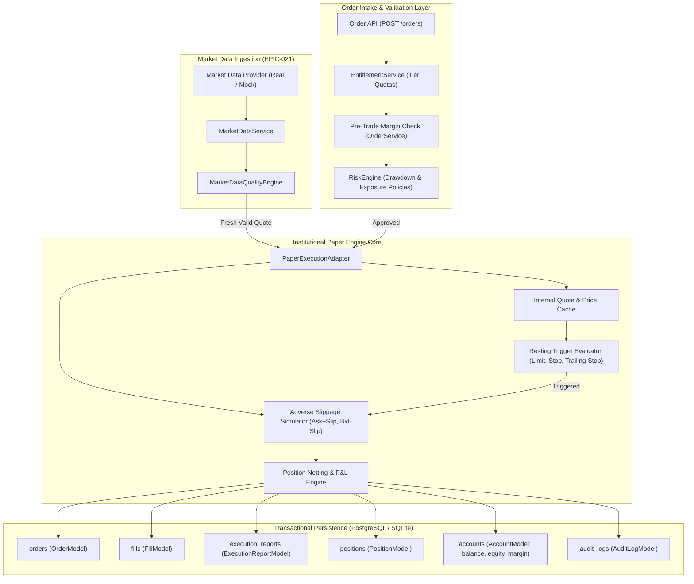

# PROJECT ORION — EPIC-022 ARCHITECTURE SPECIFICATION
## Institutional Advanced Paper Trading Engine: Microstructure Simulation, Risk, Portfolio Accounting & Dashboard Integration

**Date:** September 21, 2026  
**Repository:** `Project-ORION` (`project-orion/`)  
**Epic:** EPIC-022 — Advanced Institutional Paper Trading Engine  
**Classification:** **B — ADVANCED PAPER TRADING ENGINE READY WITH EXTERNAL LIVE BROKER CERTIFICATION PENDING**  
**Safety Mandate:** **STRICT PAPER TRADING ONLY — $0.00 CAPITAL AT RISK — ZERO LIVE BROKER ENDPOINTS**

---

## 1. Executive Architecture Summary

The **Institutional Paper Trading Engine** of Project ORION delivers a high-fidelity, deterministic market microstructure execution platform. It faithfully models real-world institutional execution dynamics—including side-aware bid/ask spreads, strictly adverse slippage, order-book resting triggers (Limit, Stop, Trailing Stop), multi-tenant position netting, and transactional margin accounting—without exposing real capital to risk or establishing external broker socket connections.

### Non-Negotiable Safety Invariants:
1. **Capital At Risk: Strictly \$0.00.** Zero real currency is deposited, transferred, or placed at risk.
2. **Broker Isolation: Zero Live Connections.** All execution paths are routed to `PaperExecutionAdapter` (`is_paper=True`). Live broker connectors remain unconfigured and disabled.
3. **Worker Safety:** Autonomous trade loop worker remains disabled by default (`ORION_WORKER_ENABLED=false`).
4. **Authoritative Financial Arithmetic:** All balances, equity, margin, exposure, fees, and P&L are computed using `Decimal` (never binary floating-point) to eliminate precision drift.
5. **Temporal Consistency:** All timestamps are timezone-aware UTC (`datetime.now(timezone.utc)`).

---

## 2. Component Architecture & End-to-End Pipeline



---

## 3. Order Type Matrix & Execution Mechanics

| Order Type | Side | Trigger Condition | Fill Pricing Formula | Status Lifecycle |
| :--- | :--- | :--- | :--- | :--- |
| **MARKET** | `BUY` | Immediate | $\text{Price} = \text{Ask} + |\text{Slippage}|$ | `NEW` $\rightarrow$ `FILLED` |
| **MARKET** | `SELL` | Immediate | $\text{Price} = \text{Bid} - |\text{Slippage}|$ | `NEW` $\rightarrow$ `FILLED` |
| **LIMIT** | `BUY` | $\text{Ask} \le \text{limit\_price}$ | $\text{Price} = \min(\text{Ask}, \text{limit\_price})$ | `SUBMITTED` $\rightarrow$ `FILLED` |
| **LIMIT** | `SELL` | $\text{Bid} \ge \text{limit\_price}$ | $\text{Price} = \max(\text{Bid}, \text{limit\_price})$ | `SUBMITTED` $\rightarrow$ `FILLED` |
| **STOP** | `BUY` | $\text{Ask} \ge \text{stop\_price}$ | $\text{Price} = \text{Ask} + |\text{Slippage}|$ | `SUBMITTED` $\rightarrow$ `FILLED` |
| **STOP** | `SELL` | $\text{Bid} \le \text{stop\_price}$ | $\text{Price} = \text{Bid} - |\text{Slippage}|$ | `SUBMITTED` $\rightarrow$ `FILLED` |
| **TRAILING STOP** | `BUY` | $\text{Ask} \ge \text{Dynamic Stop}$ | Dynamic Stop = $\text{Low Water Mark} + \text{Distance}$ | `SUBMITTED` $\rightarrow$ `FILLED` |
| **TRAILING STOP** | `SELL` | $\text{Bid} \le \text{Dynamic Stop}$ | Dynamic Stop = $\text{High Water Mark} - \text{Distance}$ | `SUBMITTED` $\rightarrow$ `FILLED` |

### Adverse Slippage Sign Invariant:
Execution prices strictly disadvantage the trader relative to the prevailing top-of-book quotes:
- **BUY:** Buyers cross the spread paying the Ask price plus positive slippage:
  $$\text{Fill Price}_{\text{BUY}} \ge \text{Ask} \ge \text{Mid}$$
- **SELL:** Sellers cross the spread accepting the Bid price minus positive slippage:
  $$\text{Fill Price}_{\text{SELL}} \le \text{Bid} \le \text{Mid}$$

---

## 4. Multi-Tenant Position Netting & Portfolio Accounting

In institutional forex trading, opposite-side transactions do not open hedged duplicate positions on the same account; rather, they net against existing open exposure.

### Netting State Machine:
1. **Zero Open Position:**
   - A new open position is created with quantity $Q_{\text{new}}$, side $S$, and open price $P_{\text{fill}}$.
   - Margin is reserved: $\text{Margin Required} = \frac{Q_{\text{new}} \times P_{\text{fill}}}{\text{Leverage}}$.
2. **Same Direction (Accumulation):**
   - Position size increases: $Q_{\text{total}} = Q_1 + Q_2$.
   - Open price is re-weighted:
     $$\bar{P}_{\text{new}} = \frac{Q_1 P_1 + Q_2 P_2}{Q_1 + Q_2}$$
   - Additional margin is reserved.
3. **Opposite Direction (Partial Reduction):**
   - Position size decreases by fill quantity: $Q_{\text{remaining}} = Q_{\text{existing}} - Q_{\text{fill}}$.
   - Realized P&L is calculated on closed portion:
     - If existing was `BUY`: $\text{PnL} = (P_{\text{fill}} - P_{\text{open}}) \times Q_{\text{fill}} - \text{Fees}$.
     - If existing was `SELL`: $\text{PnL} = (P_{\text{open}} - P_{\text{fill}}) \times Q_{\text{fill}} - \text{Fees}$.
   - Proportional margin is released back to free cash.
   - Realized P&L is credited/debited to `account.balance`.
4. **Opposite Direction (Full Closure):**
   - When $Q_{\text{fill}} == Q_{\text{existing}}$, position is closed (`is_open=False`, `closed_at=now`).
   - Full margin is released; realized P&L is credited to balance.
5. **Opposite Direction (Reversal):**
   - When $Q_{\text{fill}} > Q_{\text{existing}}$, existing position is fully closed and realized.
   - A new position of size $Q_{\text{fill}} - Q_{\text{existing}}$ is opened in the new direction.

---

## 5. Simulation Management & REST Endpoints

### 1. `POST /api/v1/trading/paper/reset`
- **Description:** Resets paper account balance back to specified initial capital (default: \$100,000.00).
- **Actions Performed:**
  - Cancels all pending resting orders in DB and in-memory adapter.
  - Closes all open positions in DB and in-memory adapter.
  - Sets `account.balance` and `account.equity` to `initial_balance`.
  - Clears `account.used_margin` to \$0.00 and restores `account.free_margin`.
  - Records an immutable audit log entry.
- **Request Body:**
  ```json
  { "initial_balance": 100000.00 }
  ```

### 2. `GET /api/v1/trading/paper/config`
- **Description:** Retrieves active paper simulation microstructure parameters.
- **Response Body:**
  ```json
  {
    "default_spread_pips": "1.0",
    "slippage_bps": "0.5",
    "latency_ms": 20.0,
    "partial_fill_probability": 0.0,
    "deterministic": false,
    "fill_probability": 1.0
  }
  ```

### 3. `PATCH /api/v1/trading/paper/config`
- **Description:** Dynamically updates paper simulation parameters (latency, spread, slippage, partial fills, deterministic mode).
- **Permissions Required:** `STRATEGY_CONFIGURE` or `ORGANIZATION_UPDATE`.

---

## 6. Dashboard 2.0 Integration

The Dashboard 2.0 frontend (`apps/dashboard/`) features complete integration with the Institutional Paper Trading Engine:
1. **`PaperSimulationWidget` (`apps/dashboard/src/components/paper/PaperSimulationWidget.tsx`):**
   - Visual display of active Simulation Mode (`DETERMINISTIC` vs `DYNAMIC (GAUSSIAN)`).
   - Real-time telemetry: Default Spread (pips), Adverse Slippage (bps), Simulated Latency (ms), and Partial Fill Rate (%).
   - Interactive **Reset Account** action with confirmation modal and starting capital selector.
   - Interactive **Configure** modal for dynamic tuning of microstructure parameters.
2. **Order Intake Support (`apps/dashboard/src/pages/OrdersPage.tsx`):**
   - Full support for `TRAILING_STOP` orders with customizable pip distance inputs.
3. **Prominent Paper Trading Badges:**
   - Persistent `PAPER TRADING ONLY` badges across Topbar, Order Modals, and Widgets.
