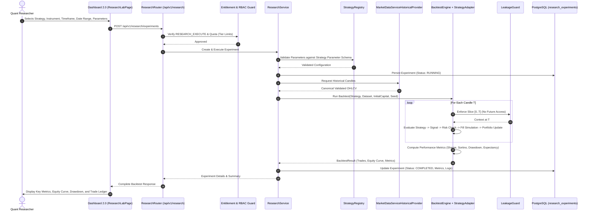

# PROJECT ORION — EPIC-023 IMPLEMENTATION PLAN
## Institutional Strategy Lab + Backtesting & Research Platform: Architecture, Execution, Risk & QA

**Date:** September 21, 2026  
**Repository:** `Project-ORION` (`project-orion/`)  
**Epic:** EPIC-023 — Institutional Strategy Lab + Backtesting & Research Platform  
**Target Classification:** **B — STRATEGY LAB & BACKTESTING READY WITH EXTERNAL CLOUD VERIFICATION PENDING**  
**Safety Mandate:** **STRICTLY PAPER / RESEARCH ONLY — $0.00 CAPITAL AT RISK — ZERO LIVE BROKER CALLS**  

---

## 1. Executive Summary & Non-Negotiable Safety Invariants

The primary objective of **EPIC-023** is to provide an institutional-grade **Strategy Lab and Research Platform** for Project ORION. It integrates the existing Strategy, Backtesting, Market Data, Risk, and Portfolio domains into a cohesive laboratory where users discover registered strategies, configure validated parameters, select canonical historical data, execute high-speed deterministic backtests, inspect comprehensive quant analytics, compare experiments, and export findings.

### Non-Negotiable Safety Invariants:
1. **Strictly Paper / Research Only:**
   - Real capital at risk: strictly **$0.00**.
   - Live broker connections: **0**. Live broker credentials: **0**.
   - Autonomous trading worker remains strictly disabled by default (`ORION_WORKER_ENABLED=false`).
   - Absolute prohibition against converting backtest signals into live orders or routing research orders to live brokers.
2. **Quant Safety & Data Leakage Prevention:**
   - **Zero Look-Ahead Bias:** At simulation step $T$, indicators, strategies, and execution simulators can only observe data up to $T$. Future candle access, future spread leakage, and future signal leakage are strictly prevented and verified by automated tests.
3. **No Arbitrary Python Code Execution:**
   - Users cannot submit raw Python code, scripts, or expressions. Strategies are loaded exclusively from the registered catalogue of deterministic classes.
4. **Authoritative Financial Arithmetic:**
   - All balance, equity, margin, P&L, fee, and price calculations strictly use Python `Decimal`. Binary floating-point (`float`) is forbidden for ledger calculations and permitted only for final charting JSON serialization.
5. **Deterministic Simulation:**
   - Given the same strategy, parameters, dataset, initial balance, and seed, backtest runs must produce bit-for-bit identical trades, equity curves, and performance metrics.
6. **Multi-Tenant Isolation & Institutional RBAC:**
   - All research experiments, parameter sets, results, and exports are strictly isolated by `organization_id`. Cross-tenant access attempts return HTTP 403 Forbidden.
7. **Architectural Integrity & DDD Alignment:**
   - Maximum reuse of existing production components (`libraries/domain/strategy/`, `libraries/domain/backtesting/`, `libraries/domain/market_data/`, `libraries/domain/risk/`, `libraries/domain/portfolio/`). No duplicate or parallel engines.

---

## 2. Gap Analysis & Existing Component Reuse Matrix

| Capability | Existing Baseline | Required Change in EPIC-023 | Target Component |
| :--- | :--- | :--- | :--- |
| **Strategy Abstraction** | `BaseStrategy`, concrete strategies (`TrendFollowing`, `MeanReversion`, `Breakout`, `Momentum`). | Create `StrategyRegistry` to discover, instantiate, and validate strategy instances by ID. | `libraries/domain/strategy/registry.py` |
| **Backtest Strategy Evaluation** | `BacktestEngine.on_candle()` currently lacks automatic strategy evaluation. | Implement `StrategyBacktestAdapter` bridging `BaseStrategy` to `BacktestEngine`, evaluating signals per bar. | `libraries/domain/backtesting/strategy_adapter.py` |
| **Replay Performance** | `ReplayEngine.play()` sleeps `0.001 / speed` per step. | Add `instant_replay: bool = True` to bypass sleep for sub-second deterministic backtests. | `libraries/domain/backtesting/replay_engine.py` |
| **Historical Data Bridge** | `HistoricalDataProvider` has `CsvProvider`; `MarketDataService` has candles. | Implement `MarketDataServiceHistoricalProvider` feeding canonical validated bars from `MarketDataService`. | `libraries/domain/backtesting/historical_data.py` |
| **Data Leakage Guard** | Basic chronological candle replay. | Implement formal `LeakageGuard` that strictly enforces slice $[0..T]$ and tests against future data access. | `libraries/domain/backtesting/leakage_guard.py` |
| **Research Persistence** | Database stores `StrategyConfigModel`, but no experiment records. | Add `ResearchExperimentModel` via migration `0009_research_experiments.py` storing runs, metrics, and logs. | `libraries/infrastructure/persistence/models/research.py` |
| **Research RBAC** | Organization permissions lack research controls. | Add `RESEARCH_READ`, `RESEARCH_EXECUTE`, `RESEARCH_CANCEL`, `RESEARCH_EXPORT` to permissions matrix. | `libraries/domain/organization/permissions.py` |
| **Entitlement Quotas** | `EntitlementService` checks account/order/worker limits. | Add `check_research_quota()` limiting daily experiment runs by tier (Free: 10, Pro: 50, Business: 200, Enterprise: inf). | `apps/trading-engine/src/services/entitlement_service.py` |
| **Research Service & API** | No `/api/v1/research` router. | Implement `ResearchService` and FastAPI router `/api/v1/research/` with full CRUD, run, cancel, compare, export. | `apps/trading-engine/src/services/research_service.py`, `src/routes/research.py` |
| **Frontend Strategy Lab** | Dashboard 2.0 has `StrategiesPage` for live paper configs only. | Create `ResearchLabPage` with Strategy Lab, Backtest History, Results View (Equity Curve, Drawdown, Trades), Comparison Grid. | `apps/dashboard/src/pages/ResearchLabPage.tsx` |

---

## 3. End-to-End Architectural Data Flow

---

## 4. Phase-by-Phase Technical Specification (Phases 0 through 45)

### Phase 0: Complete Architectural Audit
- Audit existing Strategy, Backtesting, Market Data, Risk, and Persistence domains.
- Map reusable components, gaps, and technical risks.
- Document in `docs/EPIC-023-PHASE-0-AUDIT.md`.

### Phase 1: Strategy Lab Architecture
- Define core domain models in `libraries/domain/research/models.py`:
  - `ResearchExperiment` (experiment_id, organization_id, created_by, strategy_id, strategy_version, symbol, timeframe, start_date, end_date, initial_capital, parameters, simulation_config, status, created_at, completed_at).
  - `ResearchExperimentStatus`: `CREATED`, `VALIDATING`, `RUNNING`, `COMPLETED`, `FAILED`, `CANCELLED`.
  - `ResearchResult`: Immutable container for performance metrics, trade summaries, and equity curve samples.
  - Strict typing, immutable dataclasses, UTC datetimes, `Decimal` for all currency amounts.

### Phase 2: Strategy Catalogue
- Create `StrategyRegistry` in `libraries/domain/strategy/registry.py`:
  - Catalogues concrete strategy classes: `TrendFollowingStrategy`, `MeanReversionStrategy`, `BreakoutStrategy`, `MomentumStrategy`.
  - Exposes metadata: ID, name, description, category, supported symbols, timeframes, version, parameter schema with types, defaults, and min/max bounds.
  - Factory method `create_strategy(strategy_id, parameters)` instantiating validated strategy instances.
  - Rejects unknown strategy IDs with `UnknownStrategyError`.

### Phase 3: Strategy Configuration & Parameter Validation
- Implement strict schema validation in `StrategyRegistry` and `ResearchService`:
  - Reject `NaN`, `Infinity`, out-of-bounds numbers, invalid enum options, and unpermitted keys.
  - Validate symbol against canonical instruments (`canonical_instruments()`).
  - Validate timeframe against canonical timeframes (`Timeframe`).
  - Enforce reproducible parameter hashing (SHA-256) for experiment deduplication and tracking.

### Phase 4: Historical Market Data Bridge
- Implement `MarketDataServiceHistoricalProvider` in `libraries/domain/backtesting/historical_data.py`:
  - Implements `HistoricalDataProvider` protocol.
  - Delegates candle retrieval to `MarketDataService.get_candles()`.
  - Passes each candle through `MarketDataQualityEngine` checking OHLC integrity, strictly positive prices, and non-negative volume.
  - Sorts candles chronologically ascending; deduplicates timestamps.

### Phase 5: Data Leakage Prevention (Look-Ahead Bias Protection)
- Implement `LeakageGuard` in `libraries/domain/backtesting/leakage_guard.py`:
  - Guarantees that at simulation time $T_k$, the strategy context only contains historical bars $\{T_0, T_1, \dots, T_k\}$.
  - Strictly prevents access to future close prices, future high/low bars, future spreads, and future signals.
  - Throws `DataLeakageDetectedError` if any component attempts forward indexing.
  - Includes dedicated unit test asserting no bar with timestamp $> T_k$ is present in the context.

### Phase 6: Backtest Engine Integration
- Extend `libraries/domain/backtesting/engine.py`:
  - Add `run_strategy(strategy: BaseStrategy, symbol: str, timeframe: Timeframe, start: datetime, end: datetime)` method.
  - During candle replay, construct `StrategyContext` using historical slice up to current bar.
  - Call `await strategy.evaluate(context)`; if signal generated, pass intent to execution simulator.
  - Support instant replay bypass (`instant_replay=True`) in `ReplayEngine` so tests and research run without `asyncio.sleep` overhead.

### Phase 7: Execution Simulation in Backtesting
- Leverage `ExecutionSimulator` (`libraries/domain/backtesting/execution_simulator.py`):
  - BUY orders fill against Ask (`ask + slippage`); SELL orders fill against Bid (`bid - slippage`).
  - Adverse slippage model penalizes the trader.
  - Standard institutional commission deduction: $7/lot ($0.00007 per unit).
  - Configurable execution latency and partial fill logic.

### Phase 8: Portfolio Accounting
- Leverage `PortfolioSimulator` (`libraries/domain/backtesting/portfolio_simulator.py`):
  - Authoritative `Decimal` arithmetic for:
    - Cash balance
    - Unrealized P&L marked to market against latest Bid/Ask
    - Realized P&L upon position close/netting
    - Used margin and free margin
    - Total equity = balance + unrealized P&L
  - Enforce zero negative balance violations unless configured for stop-out.

### Phase 9: Performance Metrics Engine
- Implement comprehensive quant metrics in `libraries/domain/backtesting/performance.py`:
  - Total Return (% and absolute `Decimal`)
  - Gross Profit, Gross Loss, Net Profit
  - Win Rate, Loss Rate, Win/Loss Ratio
  - Profit Factor: $\frac{\text{Gross Profit}}{\text{Gross Loss}}$ (handled safely when Gross Loss = 0)
  - Expectancy: $(\text{Win Rate} \times \text{Avg Win}) - (\text{Loss Rate} \times \text{Avg Loss})$
  - Sharpe Ratio (annualized based on bar timeframe returns)
  - Sortino Ratio (annualized downside deviation)
  - Maximum Drawdown (% and absolute) & Drawdown Duration
  - Recovery Factor: $\frac{\text{Net Profit}}{\text{Max Drawdown}}$
  - Total Trade Count, Average Trade P&L, Largest Win, Largest Loss
  - Strictly defined edge case behaviors (division by zero returns 0.0 or specified sentinel).

### Phase 10: Equity Curve & Drawdown Time Series
- Generate chart-ready time series in `BacktestResult`:
  - Cumulative balance series: `[(timestamp, balance), ...]`
  - Cumulative equity series: `[(timestamp, equity), ...]`
  - Drawdown series (% from peak equity): `[(timestamp, dd_pct), ...]`
  - Automatic downsampling algorithm: If series exceeds 500 points, downsample using Largest Triangle Three Buckets (LTTB) or min/max preservation to keep REST payload under 50KB.

### Phase 11: Trade Analytics & Trade Ledger
- Structured trade ledger recording each closed trade:
  - `trade_id`, `symbol`, `side` (`BUY`/`SELL`), `entry_time`, `exit_time`, `entry_price`, `exit_price`, `quantity`, `gross_pnl`, `fees`, `net_pnl`, `duration_seconds`, `exit_reason` (`SIGNAL`, `STOP_LOSS`, `TAKE_PROFIT`).
  - Paged trade retrieval with filters: side, win/loss status, date range.

### Phase 12: Research Experiments Lifecycle & Persistence
- Add `ResearchExperimentModel` in `libraries/infrastructure/persistence/models/research.py`:
  - Columns: `id`, `organization_id`, `created_by`, `strategy_id`, `strategy_version`, `symbol`, `timeframe`, `start_date`, `end_date`, `initial_capital`, `parameters` (JSON), `simulation_config` (JSON), `status`, `execution_time_seconds`, `metrics` (JSON), `equity_curve` (JSON), `error_message`, `created_at`, `completed_at`.
  - Composite indexes on `(organization_id, created_at)` and `(organization_id, status)`.

### Phase 13: Experiment Reproducibility
- Guarantee determinism:
  - Stored parameters + fixed random seed + historical candle cache must produce identical output hash.
  - Reproducibility test: Re-running experiment with identical configuration produces matching final equity, trade count, and Sharpe ratio.

### Phase 14: Strategy Comparison
- Comparison logic in `ResearchService`:
  - Accepts list of `experiment_ids` (within caller's tenant).
  - Returns side-by-side metric comparison matrix: Return, Net P&L, Sharpe, Sortino, Max Drawdown, Profit Factor, Win Rate, Trade Count, Expectancy.
  - Compares overlapping equity curves normalized to percentage growth ($100 \times \frac{\text{Equity}_t - \text{Initial}}{\text{Initial}}$).
  - Purely technical comparison; zero subjective or promotional claims.

### Phase 15: Parameter Research & Bounded Sensitivity
- Parameter batch runner:
  - Evaluates discrete parameter sets (e.g. fast MA $\in [10, 20]$, slow MA $\in [50, 100]$).
  - Hard limit of max 5 parameter variations per batch request to prevent CPU exhaustion.
  - Enforces overall daily tenant experiment quota.

### Phase 16: Walk-Forward & Out-of-Sample Split
- Partitioning support:
  - Configuration supports `train_ratio` (e.g. 0.70 in-sample, 0.30 out-of-sample).
  - Generates distinct in-sample metrics and out-of-sample metrics.
  - Strictly prevents combining in-sample and out-of-sample metrics into a single deceptive result.

### Phase 17: Overfitting Safeguards & Quant Warnings
- Advisory warnings engine in `OverfittingGuard`:
  - `WARNING_SMALL_SAMPLE_SIZE`: Total trades < 30 (statistically insignificant).
  - `WARNING_EXCESSIVE_PERFORMANCE`: Sharpe ratio > 4.0 or win rate > 85% (likely overfit or look-ahead anomaly).
  - `WARNING_HIGH_DRAWDOWN`: Max drawdown > 30% of capital.
  - `WARNING_SHORT_HISTORY`: Historical test duration < 30 calendar days.
  - Factual explanations provided with each warning.

### Phase 18: Research REST API (`/api/v1/research/`)
- Endpoints:
  - `GET /api/v1/research/strategies`: List registered strategies with parameter schemas and bounds.
  - `GET /api/v1/research/strategies/{id}`: Detailed strategy specification.
  - `POST /api/v1/research/experiments`: Create and trigger a research backtest experiment.
  - `GET /api/v1/research/experiments`: List tenant experiments with status, strategy, and date filters.
  - `GET /api/v1/research/experiments/{id}`: Full experiment details, parameters, and status.
  - `POST /api/v1/research/experiments/{id}/cancel`: Cancel a pending or running experiment.
  - `GET /api/v1/research/experiments/{id}/results`: Performance metrics and summary statistics.
  - `GET /api/v1/research/experiments/{id}/equity`: Downsampled equity, balance, and drawdown curves.
  - `GET /api/v1/research/experiments/{id}/trades`: Paged trade ledger with win/loss and side filters.
  - `POST /api/v1/research/experiments/compare`: Side-by-side comparison of 2-5 experiments.
  - `GET /api/v1/research/experiments/{id}/export`: Export experiment data in CSV or JSON format.

### Phase 19: Authorization & Multi-Tenant RBAC
- Security guards on all research routes:
  - `require_permission(Permission.RESEARCH_READ)`: View catalogue, list experiments, view results.
  - `require_permission(Permission.RESEARCH_EXECUTE)`: Create and run experiments.
  - `require_permission(Permission.RESEARCH_CANCEL)`: Cancel running experiments.
  - `require_permission(Permission.RESEARCH_EXPORT)`: Download experiment CSV/JSON exports.
  - Strict tenant boundary: All database lookups verify `organization_id == caller.organization_id`. IDOR attempts return 403 Forbidden.

### Phase 20: Subscription Entitlements Integration
- Entitlement checks in `EntitlementService.check_research_quota()`:
  - Free Tier: Max 10 backtests/day, max 30-day historical window, max 1 concurrent run.
  - Pro Tier: Max 50 backtests/day, max 180-day historical window, max 2 concurrent runs.
  - Business Tier: Max 200 backtests/day, max 365-day historical window, max 5 concurrent runs.
  - Enterprise Tier: Unlimited backtests, full historical data access.
  - Fail-closed behavior: Rejection throws `DailyResearchQuotaExceededError`.

### Phase 21: Research Queue & Asynchronous Execution
- Background task execution:
  - Experiments run asynchronously via FastAPI `BackgroundTasks` or bounded async tasks.
  - Status updates: `CREATED` $\to$ `RUNNING` $\to$ `COMPLETED` (or `FAILED` / `CANCELLED`).
  - Strict execution timeout (default: 60 seconds) prevents infinite loops.

### Phase 22: Cancellation & Resource Safety
- Safe cancellation token:
  - Cooperative cancellation checked between replay iterations.
  - On cancellation: Replay stops immediately, status marked `CANCELLED`, partial resources cleanly deallocated.
  - Zero orphan records or inconsistent states.

### Phase 23: Research Data Storage & Retention
- Efficient storage strategy:
  - Summary metrics, equity curves (downsampled), and trade ledgers stored as JSON in `ResearchExperimentModel`.
  - Raw tick/candle data is never duplicated in experiment records; references canonical market data cache.
  - Tenant cascade delete cleans up all experiments if an organization is deleted.

### Phase 24: Research Export (CSV / JSON)
- Exporter module:
  - CSV export formatted for institutional spreadsheet and statistical tools (Pandas / R).
  - JSON export formatted with full metadata, parameter hashes, and ISO-8601 timestamps.
  - Enforces `RESEARCH_EXPORT` permission and tenant scoping.

### Phase 25: Frontend Strategy Lab Navigation
- Integrate into Dashboard 2.0 sidebar / header:
  - New navigation item: "Strategy Lab" (`/research`).
  - Persistent paper trading safety banner maintained across all research views.
  - Sub-tabs: Strategy Lab (Builder), History (Experiments), Results, Comparison.

### Phase 26: Strategy Lab Builder UI
- Configuration form in `apps/dashboard/src/pages/ResearchLabPage.tsx`:
  - Strategy dropdown dynamically populated from `/api/v1/research/strategies`.
  - Dynamic parameter inputs (number with min/max, select for enums, checkboxes for booleans).
  - Symbol and timeframe selectors.
  - Date range picker (start date, end date) with tier-aware range indicators.
  - Initial capital input ($1,000 – $1,000,000).
  - "Run Backtest" action button with client-side validation and remaining daily quota display.

### Phase 27: Backtest Results UI
- Results dashboard:
  - Top metric cards: Total Return, Net P&L, Sharpe Ratio, Sortino Ratio, Max Drawdown, Win Rate, Profit Factor, Trade Count.
  - Interactive SVG Equity Curve chart with balance, equity, and peak water mark.
  - Underwater Drawdown curve chart.
  - Status badges (`COMPLETED`, `RUNNING`, `FAILED`, `CANCELLED`).

### Phase 28: Trade Analysis UI
- Paged trade table:
  - Columns: Trade #, Side, Entry Time, Exit Time, Entry Price, Exit Price, Size, Net P&L, Fees, Exit Reason.
  - Visual profit/loss coloring (emerald for profit, rose for loss).
  - Filters: All, Winning, Losing, Long, Short.

### Phase 29: Experiment Comparison UI
- Side-by-side comparison modal / view:
  - Multi-select completed experiments.
  - Comparative metric table.
  - Normalized overlaid equity curves for performance divergence analysis.

### Phase 30: Research Warnings UI
- Visual quant safety alerts:
  - Amber warning banners for small sample size (< 30 trades).
  - Cyan warning banners for extreme Sharpe (> 4.0) with overfitting advisory.
  - Explanatory tooltips explaining the statistical risks.

### Phase 31: Compliance Audit Logging
- Audit events recorded:
  - `RESEARCH_EXPERIMENT_CREATED`
  - `RESEARCH_EXPERIMENT_RUN`
  - `RESEARCH_EXPERIMENT_COMPLETED`
  - `RESEARCH_EXPERIMENT_CANCELLED`
  - `RESEARCH_EXPERIMENT_EXPORTED`
  - Zero sensitive credentials or tokens in payload logs.

### Phase 32: Security Audit & Hardening
- Security verifications:
  - Complete prohibition of arbitrary code execution (no `eval`, `exec`, or dynamic module loading).
  - IDOR testing across all `/api/v1/research/*` endpoints.
  - Input sanitization (parameter bounds, non-negative numbers, regex checks).
  - Request size limits preventing payload memory exhaustion.

### Phase 33: Performance & Scalability
- Benchmark targets:
  - 10,000 candle backtest completed in < 1,500ms in-memory.
  - REST response for downsampled equity curve < 50KB.
  - Database queries fully indexed on `(organization_id, created_at)`.

### Phase 34: Deterministic Reproduction Suite
- Automated determinism test:
  - Executes identical strategy, configuration, dataset, and initial capital twice.
  - Asserts identical trade list, P&L, Sharpe ratio, and drawdown down to the exact `Decimal` cent.

### Phase 35: Property & Invariant Testing
- Invariant tests:
  - Conservation of money: $\text{Final Balance} = \text{Initial Balance} + \sum \text{Realized P&L} - \sum \text{Fees}$.
  - Drawdown non-positivity: Max drawdown $\le 0.0$.
  - Monotonic timestamps: All candle and trade timestamps strictly ascending.
  - Zero future data access verified mathematically.

### Phase 36: Database Migration (`0009_research_experiments.py`)
- Additive Alembic migration creating `research_experiments` table.
- Complete `upgrade()` and `downgrade()` lifecycles tested against SQLite and PostgreSQL.

### Phase 37: API Contract Test Suite
- Comprehensive tests covering:
  - Valid experiment creation, run, and retrieval.
  - Invalid parameters (out-of-bounds, invalid enum, NaN).
  - Unauthorized (401) and forbidden (403) access.
  - Cross-tenant IDOR denial (403).
  - Daily quota exceeded (429 or 403).
  - Experiment cancellation.

### Phase 38: Full End-to-End Test
- Deterministic E2E workflow:
  1. User registers and logs in.
  2. Discovers strategy catalogue.
  3. Configures parameters.
  4. Runs backtest experiment.
  5. Inspects metrics, equity curve, and trades.
  6. Exports results to CSV.
  7. Cross-tenant user attempts unauthorized retrieval and is rejected with 403.
  8. Confirms zero live broker interactions and $0.00 capital at risk.

### Phase 39: Full Platform Regression
- Verify all 4,708 existing backend tests pass without regression.
- Verify all 41 existing frontend vitest tests pass.
- Zero broken contracts across EPIC-014 through EPIC-022.

### Phase 40: Static Quality Gates
- Code formatting and linting: `ruff check .`
- Strict typecheck: `mypy` and `tsc --noEmit`.
- Zero forbidden suppressions (`noqa`, `type: ignore`) without justification.

### Phase 41: Cloud Verification (Render)
- Test health endpoints on Render production:
  - `https://orion-api-68u2.onrender.com/health/live`
  - `https://orion-dashboard-6d3z.onrender.com/`
- Verify non-destructive cloud readiness.

### Phase 42: Production Safety Verification
- Final safety checklist:
  - `ORION_WORKER_ENABLED=false` confirmed.
  - Live broker connections: 0.
  - Live trading credentials: 0.
  - Capital at risk: $0.00.

### Phase 43: Comprehensive Documentation
- Generate:
  - `docs/EPIC-023-STRATEGY-LAB-ARCHITECTURE.md`
  - `docs/EPIC-023-IMPLEMENTATION-REPORT.md`
  - `docs/EPIC-023-SECURITY.md`
  - `docs/EPIC-023-RESEARCH-METHODOLOGY.md`
  - `docs/EPIC-023-FINAL-REPORT.md`

### Phase 44: Final Release Gate
- Evaluate criteria for release classification:
  - Target: **B — STRATEGY LAB & BACKTESTING READY WITH EXTERNAL CLOUD VERIFICATION PENDING**.

### Phase 45: Final Report & Git Safety
- Complete 24-point report.
- Verify clean git status, git diff, commit with message:
  `feat(research): implement EPIC-023 strategy lab and backtesting platform`
- Push normally to `origin/main`.

---

## 5. Verification & Test Plan

1. **Unit Tests:**
   - Strategy catalogue discovery and parameter validation.
   - Leakage guard: zero future candle visibility.
   - Performance metrics accuracy and zero-division handling.
   - Overfitting warning generation.
2. **Integration Tests:**
   - Market data provider bridge feeding backtest engine.
   - Replay engine running in instant mode.
   - Database persistence of experiments and metrics.
   - Entitlement quota enforcement and RBAC checks.
3. **Property / Determinism Tests:**
   - Balance conservation invariant.
   - Exact numerical reproducibility across duplicate runs.
4. **API & Security Tests:**
   - REST contract testing across `/api/v1/research/*`.
   - Cross-tenant IDOR attack rejection.
5. **Frontend Tests:**
   - Vitest tests for `ResearchLabPage`, strategy selection, parameter inputs, and chart rendering.
