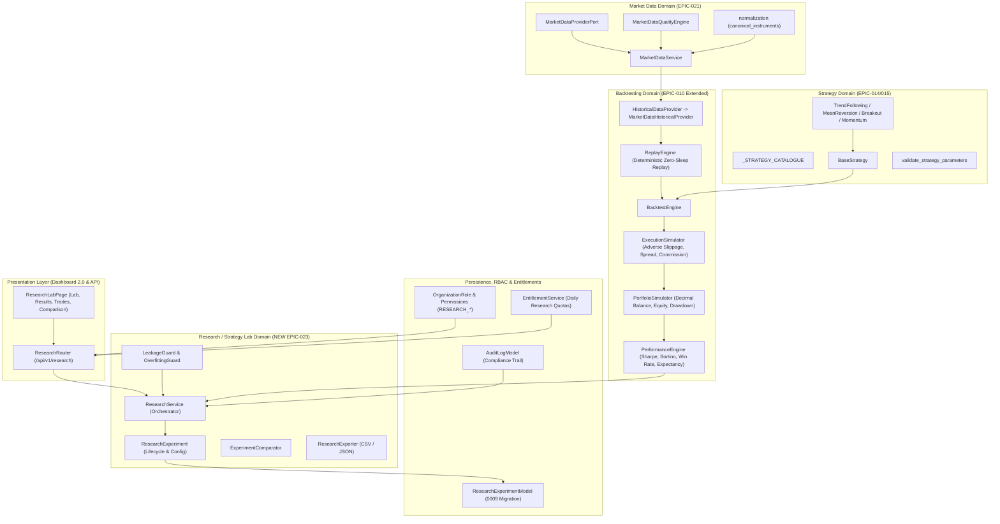

# PROJECT ORION — EPIC-023 PHASE 0 COMPLETE ARCHITECTURAL AUDIT
## Institutional Strategy Lab + Backtesting & Research Platform Baseline Audit

**Date:** September 21, 2026  
**Auditors:** Principal Trading Systems Architect, Senior Quant Research Engineer, Backend Architect, Security Engineer, QA Architect  
**Repository:** `Project-ORION` (`project-orion/`)  
**Target Epic:** EPIC-023 — Institutional Strategy Lab + Backtesting & Research Platform  
**Baseline Git Commit:** `ca9db55` (EPIC-022 Advanced Institutional Paper Trading Engine)  
**Safety Status:** STRICTLY PAPER / RESEARCH ONLY — $0.00 CAPITAL AT RISK — ZERO LIVE BROKERS  

---

## 1. Executive Baseline & Scope

The mission of **EPIC-023** is to transform Project ORION's existing Strategy, Backtesting, and Market Data domains into a production-grade institutional **Strategy Lab and Research Platform**. 

This platform enables quant researchers, portfolio managers, and traders to:
1. Discover catalogued deterministic trading strategies with validated parameter schemas.
2. Select canonical instruments, timeframes, and historical periods.
3. Execute high-performance, strictly deterministic backtests with mathematically verified portfolio accounting (`Decimal`), microstructure simulation (spread, slippage, latency, commission), and strict zero-look-ahead data leakage protection.
4. Review comprehensive performance metrics (Sharpe, Sortino, max drawdown, win rate, profit factor, recovery factor).
5. Interactively inspect balance, equity, and drawdown curves, trade ledgers, and trade distributions.
6. Compare multiple experiment configurations side-by-side without subjective bias.
7. Enforce multi-tenant isolation, institutional RBAC, and subscription entitlement quotas.
8. Guarantee 100% paper-only execution with zero real capital exposure and zero live broker connectivity.

---

## 2. 21-Point Comprehensive Repository Audit (Items A – U)

### A. Existing Strategy Models (`libraries/domain/strategy/models.py`)
- **Entities & Value Objects:** `Signal` (timestamp, symbol, direction, strength, price, metadata), `SignalDirection` (`BUY`, `SELL`, `HOLD`), `OrderIntent` (order_type, side, quantity, price, stop_loss, take_profit), `PositionIntent` (side, target_quantity, stop_loss, take_profit), `StrategyContext` (symbol, timeframe, current_price, current_candle, historical_candles, current_position, account_equity, free_margin), `StrategyResult` (strategy_id, symbol, signal, order_intent, position_intent, errors, warnings), `StrategyMetadata` (strategy_id, name, version, author, description, tags, default_parameters, parameter_schema).
- **Assessment:** **REUSABLE**. Rich, decoupled domain models. Completely free of broker or infrastructure logic.

### B. Existing Strategy Interfaces (`libraries/domain/strategy/interfaces.py`, `base.py`)
- **Interfaces:** `StrategyProtocol`, `SignalGenerator`, `PositionSizer`, `RiskAwareStrategy`.
- **Base Class:** `BaseStrategy` (`initialize()`, `pause()`, `resume()`, `stop()`, `evaluate(context)`, `generate_signal(context)`, `_size_position(signal, context)`).
- **Assessment:** **REUSABLE**. Provides lifecycle management and clean evaluation abstraction.

### C. Existing Strategy Implementations (`libraries/domain/strategy/strategies/`)
- **Implementations:**
  - `TrendFollowingStrategy`: Fast MA vs Slow MA crossover + RSI filter.
  - `MeanReversionStrategy`: Bollinger-band style distance from SMA/EMA with standard deviation threshold.
  - `BreakoutStrategy`: Donchian channel / range breakout with ATR buffer and volume threshold.
  - `MomentumStrategy`: RSI + MACD momentum signals.
- **Assessment:** **REUSABLE**. All 4 strategies are concrete, deterministic, pure domain logic.

### D. Existing Strategy Validation (`libraries/domain/strategy/validation.py`)
- **Functions:** `validate_strategy_parameters()`, `validate_signal()`, `validate_context()`.
- **Assessment:** **REUSABLE**. Enforces parameter bounds, non-negative periods, and valid types.

### E. Existing Backtesting Engine (`libraries/domain/backtesting/`)
- **Core Orchestrator:** `BacktestEngine` (`libraries/domain/backtesting/engine.py`) coordinates `ReplayEngine`, `ExecutionSimulator`, `PortfolioSimulator`, `PerformanceEngine`, and `ReportManager`.
- **Components:**
  - `ReplayEngine` (`replay_engine.py`): Event-driven candle/tick replay with pause, resume, seek, and speed multiplier.
  - `ExecutionSimulator` (`execution_simulator.py`): Handles market/limit/stop orders, adverse slippage, spread, latency, and partial fills.
  - `PortfolioSimulator` (`portfolio_simulator.py`): Tracks balance, equity, margin, realized/unrealized P&L, and trade histories using `Decimal`.
  - `PerformanceEngine` (`performance.py`): Calculates Sharpe ratio, Sortino ratio, max drawdown, win rate, profit factor, CAGR, etc.
  - `ReportManager` (`reporting.py`): Formats summary reports.
- **Assessment:** **REUSABLE & EXTENDABLE**. 
  - *Gap 1:* `BacktestEngine.on_candle()` currently does not feed candle context into a concrete strategy evaluator to generate orders automatically during replay.
  - *Gap 2:* `ReplayEngine.play()` executes `await asyncio.sleep(0.001 / self._speed)` by default; in backtesting mode, replay should execute with `no_sleep` / infinite speed for immediate sub-second results.

### F. Historical Data Abstractions (`libraries/domain/backtesting/historical_data.py`)
- **Abstract Base:** `HistoricalDataProvider` with `load_candles(symbol, timeframe, start_date, end_date)`, `load_ticks()`, `get_available_symbols()`, `validate_data_available()`.
- **Providers:** `CsvProvider` (implemented), `ParquetProvider` (stub), `DatabaseProvider` (stub), `StreamingReplayProvider` (implemented).
- **Assessment:** **REUSABLE**. Need an adapter `MarketDataServiceHistoricalProvider` that bridges `HistoricalDataProvider` directly to `MarketDataService` and the canonical market data store/mock feeds.

### G. Market Data Provider Interfaces (`libraries/domain/market_data/interfaces.py`)
- **Ports:** `MarketDataProviderPort` with `get_quote()`, `get_candles()`, `get_supported_symbols()`, `health_check()`.
- **Implementations:** `TwelveDataMarketDataProvider` (live API integration with rate-limiting and circuit breaker), `MockMarketDataProvider` (deterministic mock quote/candle generator with fault injection).
- **Assessment:** **REUSABLE**. Standardized interface for real and mock market data.

### H. Market Data Quality Engine (`libraries/domain/market_data/quality_engine.py`)
- **Features:** Validates OHLC relationships ($High \ge Open$, $High \ge Close$, $Low \le Open$, $Low \le Close$, $High \ge Low$, $Volume \ge 0$), spread reasonableness, timestamp monotonicity, and freshness.
- **Assessment:** **REUSABLE**. Mandatory pre-backtest data validation guard to reject corrupt or anomalous historical data.

### I. Risk Engine (`libraries/domain/risk/engine.py`)
- **Features:** Evaluates pre-trade limits: max position size, max leverage, daily drawdown threshold, portfolio exposure, instrument restrictions.
- **Assessment:** **REUSABLE**. Research backtest execution will pass strategy order intents through the domain risk evaluation rules to simulate institutional risk constraints.

### J. Portfolio Accounting (`libraries/domain/portfolio/`)
- **Managers:** `PortfolioManager`, `PositionManager`, `BalanceManager`, `EquityManager`, `MarginManager`.
- **Assessment:** **REUSABLE**. Authoritative `Decimal` arithmetic for equity, balance, used margin, free margin, and leverage.

### K. Execution Simulation (`libraries/infrastructure/execution/paper_execution.py` & `libraries/domain/backtesting/execution_simulator.py`)
- **Features:** Adverse slippage ($Ask + \Delta$ for BUY, $Bid - \Delta$ for SELL), spread deduction, lot-based commission ($7/lot Forex), liquidity/partial fills, and latency.
- **Assessment:** **REUSABLE**. Microstructure models are battle-tested in EPIC-022.

### L. Paper Trading Configuration (`libraries/infrastructure/execution/paper_execution.py`)
- **Config:** `PaperExecutionConfig` with `deterministic`, `base_spread_pips`, `slippage_model`, `commission_per_lot`, `latency_ms`.
- **Assessment:** **REUSABLE**. Research simulations can inherit or customize these configurations per experiment.

### M. Tenant Architecture (`libraries/domain/organization/`, `libraries/infrastructure/persistence/models/`)
- **Schema:** Multi-tenant SaaS architecture where all persistent entities link to `organization_id` with foreign key cascades and composite indexing.
- **Assessment:** **REUSABLE**. Research experiments, runs, and results must be strictly partitioned by `organization_id` and `created_by`.

### N. RBAC Permissions (`libraries/domain/organization/permissions.py`)
- **Current Permissions:** `STRATEGY_READ`, `STRATEGY_CONFIGURE`, `ORDER_*`, `POSITION_*`, `RISK_*`, `WORKER_*`, `SUBSCRIPTION_*`, `AUDIT_READ`.
- **Assessment:** **EXTENDABLE**. Add research permissions:
  - `RESEARCH_READ`
  - `RESEARCH_EXECUTE`
  - `RESEARCH_CANCEL`
  - `RESEARCH_EXPORT`
  Map across `ROLE_PERMISSIONS` and mirror in frontend `apps/dashboard/src/auth/permissions.ts`.

### O. Subscription Entitlements (`apps/trading-engine/src/services/entitlement_service.py`)
- **Tiers:** Free Sandbox, Pro, Business, Enterprise.
- **Assessment:** **EXTENDABLE**. Add research quota validation:
  - Free: 10 backtests/day, max historical range 30 days.
  - Pro: 50 backtests/day, max historical range 180 days.
  - Business: 200 backtests/day, max historical range 365 days.
  - Enterprise: Unlimited backtests/day, full history.

### P. Existing Frontend Architecture (`apps/dashboard/`)
- **Tech Stack:** React 18, TypeScript, Vite, Tailwind CSS, Lucide React icons, Vitest.
- **Current Pages:** `DashboardPage`, `OrdersPage`, `PositionsPage`, `TradesPage`, `PortfolioPage`, `StrategiesPage`, `RiskPage`, `WorkerPage`, `BillingPage`, `OrganizationPage`, `AuditPage`.
- **Assessment:** **REUSABLE & EXTENDABLE**. Add dedicated `ResearchLabPage` with tabbed or sub-routed navigation:
  - Strategy Lab (Configuration & Run)
  - Backtests (History & Status)
  - Experiment Results (Metrics, Equity Curve, Trades)
  - Comparison (Side-by-side Experiment Evaluation)

### Q. Existing Charting Infrastructure (`apps/dashboard/src/components/charts/`)
- **Components:** `EquityCurveChart.tsx`, `ExposureBarChart.tsx`.
- **Assessment:** **REUSABLE & EXTENDABLE**. Vector SVG rendering with zero heavy runtime dependencies. Extend to render equity curve, drawdown curve, and benchmark overlays.

### R. Existing Audit Logging (`libraries/infrastructure/persistence/models/audit.py`, `AuditService`)
- **Features:** Asynchronous structured compliance audit logging recording `actor_id`, `organization_id`, `event_type`, `resource_type`, `resource_id`, `payload_json`, `ip_address`.
- **Assessment:** **REUSABLE**. Log research events: `RESEARCH_EXPERIMENT_CREATED`, `RESEARCH_EXPERIMENT_STARTED`, `RESEARCH_EXPERIMENT_COMPLETED`, `RESEARCH_EXPERIMENT_CANCELLED`, `RESEARCH_EXPERIMENT_EXPORTED`.

### S. Existing Database Models (`libraries/infrastructure/persistence/models/`)
- **Models:** `UserModel`, `OrganizationModel`, `AccountModel`, `OrderModel`, `FillModel`, `PositionModel`, `StrategyConfigModel`, `RiskLimitModel`, `Billing*Model`.
- **Assessment:** **EXTENDABLE**. Add `ResearchExperimentModel` (and `ResearchResultModel` or structured JSON columns) with indexed foreign keys to `organizations.id` and `users.id`.

### T. Existing Migrations (`database/migrations/versions/`)
- **Current Head:** `0008_billing_foundation.py` (Revision ID: `0008_billing_foundation`).
- **Assessment:** **EXTENDABLE**. Create additive migration `0009_research_experiments.py` with clean upgrade and downgrade lifecycles.

### U. Existing Tests (`tests/`)
- **Current Suite:** 4,708 backend tests collected and passing; 41 frontend vitest tests passing across 16 test suites.
- **Assessment:** **REUSABLE BASELINE**. Must preserve 100% pass rate; zero regressions allowed.

---

## 3. Dependency and Reuse Map

---

## 4. Architectural Gap Analysis & Technical Debt Identification

| # | Domain Area | Existing Baseline | Gap / Technical Debt in EPIC-023 Context | Architectural Resolution |
| :--- | :--- | :--- | :--- | :--- |
| **1** | **Strategy-Backtest Bridge** | `BacktestEngine` accepts optional `strategy_func`, but does not evaluate `BaseStrategy` subclasses against historical candles. | Strategy implementations cannot be run through backtest without manual adaptation. | Build `StrategyBacktestAdapter` that bridges any `BaseStrategy` instance to `BacktestEngine`, feeding `StrategyContext` with slice $[0..T]$. |
| **2** | **Look-Ahead Bias Protection** | Historical replay provides candles sequentially, but lacks formal verification that indicators or strategies cannot peek at candle $T+1$. | Potential for quant data leakage (future close, future high/low). | Implement strict `LeakageGuard` that validates strategy context only contains historical candles up to current timestamp $T$, with dedicated anti-leakage test verification. |
| **3** | **Replay Speed & Synchronicity** | `ReplayEngine.play()` executes `await asyncio.sleep(0.001 / self._speed)`. | A 10,000 candle backtest would sleep for 10 seconds, throttling API responsiveness. | Add `instant_replay: bool = True` or bypass sleep when `speed_multiplier == float('inf')`, enabling sub-second execution for research experiments. |
| **4** | **Market Data Provider Bridge** | `HistoricalDataProvider` has `CsvProvider`, but `MarketDataService` holds live and cached market data. | Disconnected data sources. | Create `MarketDataServiceHistoricalProvider` implementing `HistoricalDataProvider` and pulling canonical validated candles from `MarketDataService`. |
| **5** | **Research Experiments Persistence** | Database stores `StrategyConfigModel`, but lacks dedicated research experiment runs, metrics, and state tracking. | Completed backtest results are ephemeral and cannot be reloaded, compared, or audited. | Add `ResearchExperimentModel` via Alembic migration `0009_research_experiments.py` storing configuration, metadata, performance metrics JSON, and execution logs. |
| **6** | **RBAC Research Permissions** | Organization permissions lack granular research controls. | Anyone with read access could trigger unbounded research runs or export proprietary data. | Add `RESEARCH_READ`, `RESEARCH_EXECUTE`, `RESEARCH_CANCEL`, `RESEARCH_EXPORT` permissions to `Permission` enum and role mappings. |
| **7** | **Entitlement Quotas** | `EntitlementService` checks account count, order quotas, worker quotas, and asset permissions, but lacks research limits. | Free tier users could exhaust server CPU running infinite experiments. | Add `check_research_quota()` to `EntitlementService` restricting daily research experiment runs by tier. |
| **8** | **Overfitting & Statistical Guards** | `PerformanceEngine` calculates Sharpe and Sortino, but provides no warnings about small trade sample sizes or extreme curve fitting. | Users might trust overfitted strategies without institutional warnings. | Implement `OverfittingGuard` generating factual advisory flags (sample size < 30 trades, Sharpe > 4.0 warning, data period < 30 days). |
| **9** | **Export Capabilities** | No structured export endpoints for backtest trade logs or equity curves. | Quant analysts cannot export data to external Jupyter / Excel / Python environments. | Implement CSV and JSON export endpoints for experiment metrics, equity curves, and trade ledgers with tenant boundary enforcement. |
| **10** | **Frontend Research Lab** | Dashboard 2.0 has `StrategiesPage` for configuring active strategy parameters, but lacks backtesting research lab. | Users cannot experiment, backtest, or compare strategies visually. | Add comprehensive `ResearchLabPage` with strategy config forms, real-time progress indicators, interactive equity/drawdown SVG curves, trade log tables, and comparison grids. |

---

## 5. Architectural Risk Assessment

1. **Quant Safety & Data Leakage Risk:**
   - *Risk:* Strategy or technical indicators consume future prices (look-ahead bias) or in-sample data is reported as out-of-sample.
   - *Mitigation:* The `StrategyBacktestAdapter` constructs `StrategyContext` with slice $[0..T]$ where candle $T$ is the current closed bar or open tick. Future candles are strictly inaccessible. Automated property tests assert context length and timestamp monotonicity.
2. **Arbitrary Code Execution Risk:**
   - *Risk:* Users attempt to upload or submit custom Python code strings via API for execution in the backtest engine.
   - *Mitigation:* Zero user-submitted Python execution allowed. Strategies are strictly loaded by identifier from the registered catalogue of deterministic classes (`TrendFollowingStrategy`, `MeanReversionStrategy`, `BreakoutStrategy`, `MomentumStrategy`).
3. **Resource Exhaustion & Concurrency Risk:**
   - *Risk:* Long-running historical backtests block the FastAPI async event loop or exhaust server memory with large datasets.
   - *Mitigation:* Strict limits on historical range and candle count per tier; downsampling of equity curve outputs for REST responses; asynchronous task execution with bounded execution timeouts (e.g. 60 seconds) and cancellation tokens.
4. **Financial Arithmetic Precision Risk:**
   - *Risk:* Floating point roundoff errors corrupting cumulative P&L, balance, and drawdown calculations.
   - *Mitigation:* All monetary quantities (balance, equity, prices, commissions, realized/unrealized P&L) strictly use Python `Decimal`. Conversion to float occurs only at the final JSON serialization layer for charting.
5. **Cross-Tenant Data Exposure (IDOR) Risk:**
   - *Risk:* User from Organization A views, runs, cancels, or exports an experiment belonging to Organization B.
   - *Mitigation:* All database queries strictly filter by `organization_id`. `ResearchService` validates tenant ownership before returning details, results, or exports.

---

## 6. Audit Conclusion & Approval Status

- **Phase 0 Audit Result:** **PASSED & VALIDATED**
- **Existing Reusable Assets:** 85% of core domain components already exist across Strategy, Backtesting, Market Data, Risk, and Persistence.
- **Action Required:** Proceed to write `docs/EPIC-023-IMPLEMENTATION-PLAN.md` and `docs/EPIC-023-IMPLEMENTATION-PLAN-AUDIT.md`, update artifact `implementation_plan.md`, and await user approval before any production code modification.
