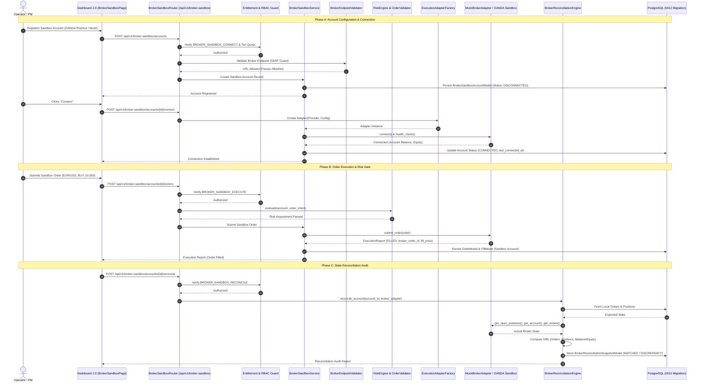
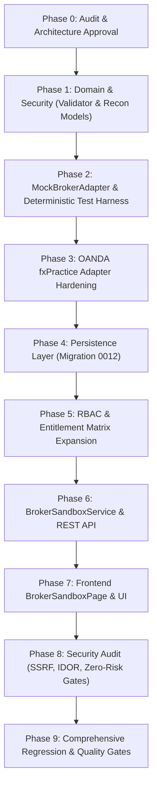

# PROJECT ORION — EPIC-026 IMPLEMENTATION PLAN
## Institutional Broker Sandbox & Demo Broker Integration: Architecture, Security, Reconciliation & Execution

**Date:** September 21, 2026  
**Repository:** `Project-ORION` (`project-orion/`)  
**Epic:** EPIC-026 — Institutional Broker Sandbox & Demo Broker Integration  
**Target Classification:** **B — BROKER SANDBOX READY WITH EXTERNAL CERTIFICATION PENDING**  
**Safety Mandate:** **STRICTLY SANDBOX / DEMO / PAPER ONLY — $0.00 CAPITAL AT RISK — ZERO LIVE BROKER CALLS**  

---

## 1. Executive Summary & Non-Negotiable Safety Invariants

The primary objective of **EPIC-026** is to deliver a production-grade, broker-agnostic adapter infrastructure enabling PROJECT ORION to connect to approved broker **SANDBOX / DEMO / PAPER** environments for external integration certification, automated execution testing, order lifecycle validation, and multi-asset position reconciliation.

This epic introduces:
1. A deterministic, seeded **`MockBrokerAdapter`** for 100% offline, zero-network, reproducible CI/CD verification covering all edge cases (instant fills, partial fills, latency spikes, rate limits, rejections, and state drift).
2. Institutional validation of the **`OANDAExecutionAdapter`** targeting OANDA's official practice environment (`https://api-fxpractice.oanda.com`).
3. An automated **`BrokerReconciliationEngine`** comparing internal database state against external broker state across orders, positions, and balances/equity.
4. Robust **SSRF & Endpoint Security** (`BrokerEndpointValidator`) with fail-closed allowlisting against loopback, RFC 1918 private subnets, cloud metadata (`169.254.169.254`), and production URLs.
5. Multi-tenant database persistence (`broker_sandbox_accounts`, `broker_reconciliation_snapshots`) via additive migration `0012_broker_sandbox_integration.py`.
6. Four new granular permissions in the institutional RBAC matrix with tier-based quota controls.
7. A complete REST API under `/api/v1/broker-sandbox/` and an interactive Dashboard 2.0 interface (`BrokerSandboxPage.tsx`).

### Non-Negotiable Safety Invariants:
1. **Strictly Sandbox / Demo Only:**
   - Real capital at risk: strictly **$0.00**.
   - Live broker connections: **0**. Live broker credentials: **0**.
   - Autonomous trading worker remains disabled by default (`ORION_WORKER_ENABLED=false`).
   - Physical and architectural prohibition against routing orders to live production broker endpoints.
2. **SSRF & Fail-Closed Endpoint Guard:**
   - Only pre-approved, allowlisted sandbox domains are accessible.
   - Any attempt to configure, resolve, or connect to a production broker endpoint (such as `api-fxtrade.oanda.com`), IP literals, private networks, or metadata services raises a fatal `SecurityViolationError` and terminates immediately.
3. **Mandatory Pre-Trade Risk Engine Gate:**
   - Every order submitted to a sandbox broker adapter MUST route through `RiskEngine.evaluate()` and `OrderValidator.validate()` prior to transmission. No sandbox order bypasses pre-trade risk controls.
4. **Isolated Gated Promotion Lifecycle (EPIC-025 Boundary):**
   - Strategies validated in the Paper Incubator (`PAPER_VALIDATED` / `PROMOTION_CANDIDATE`) cannot automatically trade on external sandbox brokers.
   - Advancing to sandbox execution requires explicit operator promotion (`BROKER_SANDBOX_CONNECT` / `DEPLOYMENT_PROMOTE`) with strict separation of duties (creator cannot self-approve).
5. **Strict SaaS Multi-Tenancy:**
   - External broker accounts, API keys, credentials, positions, and reconciliation snapshots are strictly isolated by `organization_id`.
   - Cross-tenant access attempts fail closed and return HTTP 404 Not Found.
6. **Authoritative Financial Arithmetic:**
   - All balance, equity, margin, P&L, fee, price, and volume calculations strictly use Python `Decimal`. Binary floating-point (`float`) is forbidden for ledger calculations and allowed only for final JSON charting serialization.
7. **Additive Schema Migrations:**
   - Zero modifications to existing migrations (`0001` through `0011`). All new persistence tables and indices reside in migration `0012_broker_sandbox_integration.py`.

---

## 2. Gap Analysis & Existing Component Reuse Matrix

| Capability | Existing Baseline (EPIC-025) | Required Implementation in EPIC-026 | Target Component |
| :--- | :--- | :--- | :--- |
| **Broker Abstraction** | `BrokerAdapter` ABC (`libraries/infrastructure/execution/broker_adapter.py`) | Retained as universal contract; add standardized reconciliation query methods. | `libraries/infrastructure/execution/broker_adapter.py` |
| **Deterministic Mock Adapter** | `PaperExecutionAdapter` (in-memory matching against simulated candles). | Implement `MockBrokerAdapter` with deterministic scriptable behaviors: partial fills, latency, 429 rate-limiting, rejects, desync. | `libraries/infrastructure/execution/mock_broker.py` |
| **External Forex Sandbox** | `OANDAExecutionAdapter` exists targeting `api-fxpractice.oanda.com`. | Add connection health checks, account polling, order state translation, and unit contract tests. | `libraries/infrastructure/execution/oanda_execution.py` |
| **SSRF & URL Validation** | Basic URL parsing in HTTP clients. | Implement `BrokerEndpointValidator` enforcing strict scheme, domain allowlist, IP literal block, and RFC 1918 / AWS metadata block. | `libraries/infrastructure/security/endpoint_validator.py` |
| **State Reconciliation** | Discrepancy detection was manual/ad-hoc. | Implement `BrokerReconciliationEngine` calculating order, position, and balance deltas (`MATCHED`, `DISCREPANCY`, `UNKNOWN`). | `libraries/domain/reconciliation/engine.py` |
| **Persistence Models** | `AccountModel`, `OrderModel`, `PositionModel`, `StrategyDeploymentModel`. | Add `BrokerSandboxAccountModel` and `BrokerReconciliationSnapshotModel` via migration `0012`. | `libraries/infrastructure/persistence/models/broker_sandbox.py` |
| **RBAC Matrix** | 37 canonical permissions across 7 roles. | Add 4 canonical permissions: `BROKER_READ`, `BROKER_SANDBOX_CONNECT`, `BROKER_SANDBOX_EXECUTE`, `BROKER_SANDBOX_RECONCILE`. | `libraries/domain/organization/permissions.py` |
| **Entitlement Service** | Quotas for orders, workers, and research experiments. | Add `check_broker_sandbox_quota()` checking max sandbox accounts and daily sandbox orders per tier. | `apps/trading-engine/src/services/entitlement_service.py` |
| **Application Services & API** | Routes for paper trading orders, positions, portfolio. | Implement `BrokerSandboxService` and `/api/v1/broker-sandbox/` REST router. | `apps/trading-engine/src/services/broker_sandbox_service.py`, `src/routes/broker_sandbox.py` |
| **Frontend Dashboard** | Dashboard 2.0 with Incubator, Strategies, Portfolio. | Create `BrokerSandboxPage.tsx` with Connection Center, Trading Ticket, Positions, and Reconciliation Audit. | `apps/dashboard/src/pages/BrokerSandboxPage.tsx` |

---

## 3. End-to-End Architectural Data Flow



---

## 4. System Architecture & Core Modules

### Module 1: `MockBrokerAdapter` & `BrokerEndpointValidator`

#### 1.1 `BrokerEndpointValidator` (`libraries/infrastructure/security/endpoint_validator.py`)
- **Objective:** Prevent SSRF, DNS rebinding, and unauthorized connection to live broker endpoints.
- **Rules:**
  - Scheme must be strictly `https://` (except `http://` allowed strictly for internal `localhost` testing in unit tests under `ENVIRONMENT=test`).
  - Strict domain allowlist:
    - `api-fxpractice.oanda.com` (OANDA fxPractice v20)
    - `stream-fxpractice.oanda.com` (OANDA Practice Streaming)
    - `testnet.binance.vision` (Binance Testnet)
    - `paper-api.alpaca.markets` (Alpaca Paper)
    - `mock-broker.internal` (Internal deterministic mock)
  - Explicit domain blocklist (Production):
    - `api-fxtrade.oanda.com`
    - `stream-fxtrade.oanda.com`
    - `api.binance.com`
    - `api.alpaca.markets`
  - Rejection of IP literals (IPv4 and IPv6).
  - Rejection of private subnets (`10.0.0.0/8`, `172.16.0.0/12`, `192.168.0.0/16`, `127.0.0.0/8`).
  - Rejection of link-local and cloud metadata endpoints (`169.254.169.254`).
  - Rejection of non-standard ports (allowed: 443; port 80/custom only in mock test harness).

#### 1.2 `MockBrokerAdapter` (`libraries/infrastructure/execution/mock_broker.py`)
- **Objective:** Provide a deterministic, scriptable, 100% offline implementation of `BrokerAdapter` for zero-network CI/CD verification.
- **Capabilities & Failure Injection:**
  - Seeded random or deterministic matching modes.
  - Configurable fill latency (simulates network roundtrips).
  - Scriptable execution modes:
    - `IMMEDIATE_FILL`: Fills 100% at specified/market price.
    - `PARTIAL_FILL`: Fills configurable fraction (e.g. 50%), leaving remainder pending.
    - `REJECT`: Rejects orders with configurable broker error codes (e.g., `INSUFFICIENT_MARGIN`, `MARKET_CLOSED`).
    - `RATE_LIMIT`: Simulates HTTP 429 Too Many Requests with retry-after header.
    - `LATENCY_SPIKE`: Delays response by $N$ milliseconds.
    - `DISCREPANCY_DRIFT`: Artificially alters broker positions or balances to trigger and test reconciliation alerts.
  - Complete account modeling: Balance, NAV, Margin Used, Margin Available, Unrealized P&L, Realized P&L.
  - Thread-safe / async-safe order and position store.

---

### Module 2: `BrokerReconciliationEngine` & Domain Reconciliation Models

#### 2.1 Domain Reconciliation Models (`libraries/domain/reconciliation/models.py`)
- `ReconciliationStatus`: `MATCHED`, `DISCREPANCY`, `UNKNOWN`, `ERROR`.
- `DiscrepancyType`:
  - `ORDER_STATUS_MISMATCH`: Internal order status differs from broker.
  - `MISSING_ON_BROKER`: Order exists in ORION but absent on broker.
  - `UNTRACKED_ON_BROKER`: Order exists on broker but absent in ORION.
  - `POSITION_QTY_MISMATCH`: Net volume difference exceeds epsilon ($10^{-6}$).
  - `POSITION_PRICE_MISMATCH`: Average entry price differs.
  - `POSITION_MISSING_LOCAL`: Broker has position not tracked locally.
  - `POSITION_MISSING_REMOTE`: Local position marked open but closed on broker.
  - `BALANCE_DRIFT`: Cash balance delta exceeds tolerance threshold (e.g., $0.05).
  - `EQUITY_DRIFT`: NAV / Equity delta exceeds tolerance threshold.
- `OrderDiscrepancy`: Dataclass capturing order ID, client ID, local status, remote status, details.
- `PositionDiscrepancy`: Dataclass capturing symbol, local qty, remote qty, local price, remote price, delta qty.
- `ReconciliationSnapshot`: Immutable domain aggregate representing the audit outcome.

#### 2.2 `BrokerReconciliationEngine` (`libraries/domain/reconciliation/engine.py`)
- **Algorithm:**
  1. Fetch internal active orders and open positions from ORION persistence for the sandbox account.
  2. Fetch external open orders, open positions, and account summary from the `BrokerAdapter`.
  3. Perform bidirectional order set comparison.
  4. Perform bidirectional position set comparison:
     $$\Delta \text{Qty} = |\text{Qty}_{\text{local}} - \text{Qty}_{\text{remote}}|$$
  5. Compare balance and equity with configurable float-epsilon tolerance:
     $$\Delta \text{Balance} = |\text{Balance}_{\text{local}} - \text{Balance}_{\text{remote}}| \le \epsilon_{\text{tol}}$$
  6. If any discrepancy exceeds tolerance, assign status `DISCREPANCY` and compile structured diff. Otherwise, assign `MATCHED`.
  7. Return complete `ReconciliationSnapshot`.

---

### Module 3: Persistence Layer (`0012_broker_sandbox_integration.py`)

#### 3.1 Tables & Schema
- **`broker_sandbox_accounts` Table:**
  - `id`: `VARCHAR(64)` PRIMARY KEY
  - `organization_id`: `VARCHAR(64)` NOT NULL, FOREIGN KEY (`organizations.id`) ON DELETE CASCADE
  - `provider`: `VARCHAR(32)` NOT NULL (e.g. `MOCK`, `OANDA_PRACTICE`)
  - `environment`: `VARCHAR(16)` NOT NULL DEFAULT `'SANDBOX'` (Check constraint: `environment IN ('SANDBOX', 'LOCAL')`)
  - `account_id_external`: `VARCHAR(64)` NOT NULL
  - `name`: `VARCHAR(128)` NOT NULL
  - `status`: `VARCHAR(32)` NOT NULL DEFAULT `'DISCONNECTED'` (`DISCONNECTED`, `CONNECTED`, `ERROR`, `SUSPENDED`)
  - `last_connected_at`: `TIMESTAMPTZ` NULL
  - `last_reconciled_at`: `TIMESTAMPTZ` NULL
  - `credentials_encrypted`: `JSONB` NOT NULL (AES-GCM encrypted tokens, never plaintext; masked in API responses)
  - `config`: `JSONB` NOT NULL DEFAULT `'{}'`
  - `created_at`: `TIMESTAMPTZ` NOT NULL DEFAULT `now()`
  - `updated_at`: `TIMESTAMPTZ` NOT NULL DEFAULT `now()`
  - Indexes: `ix_broker_sandbox_org_id`, `ix_broker_sandbox_provider`, `ix_broker_sandbox_status`.

- **`broker_reconciliation_snapshots` Table:**
  - `id`: `VARCHAR(64)` PRIMARY KEY
  - `organization_id`: `VARCHAR(64)` NOT NULL, FOREIGN KEY (`organizations.id`) ON DELETE CASCADE
  - `broker_account_id`: `VARCHAR(64)` NOT NULL, FOREIGN KEY (`broker_sandbox_accounts.id`) ON DELETE CASCADE
  - `status`: `VARCHAR(32)` NOT NULL (`MATCHED`, `DISCREPANCY`, `ERROR`)
  - `order_discrepancies`: `JSONB` NOT NULL DEFAULT `'[]'`
  - `position_discrepancies`: `JSONB` NOT NULL DEFAULT `'[]'`
  - `balance_delta`: `NUMERIC(18, 4)` NOT NULL DEFAULT `0.0000`
  - `equity_delta`: `NUMERIC(18, 4)` NOT NULL DEFAULT `0.0000`
  - `details`: `JSONB` NOT NULL DEFAULT `'{}'`
  - `created_at`: `TIMESTAMPTZ` NOT NULL DEFAULT `now()`
  - Indexes: `ix_recon_snapshots_org_id`, `ix_recon_snapshots_account_id`, `ix_recon_snapshots_created_at`.

---

### Module 4: RBAC & Entitlements

#### 4.1 Granular Permissions (`libraries/domain/organization/permissions.py`)
- Total permissions expand from 37 to 41:
  - `BROKER_READ` ("broker:read"): View connected broker sandbox accounts, status, balances, and reconciliation logs.
  - `BROKER_SANDBOX_CONNECT` ("broker_sandbox:connect"): Register, configure, connect, and disconnect broker sandbox environments.
  - `BROKER_SANDBOX_EXECUTE` ("broker_sandbox:execute"): Submit test and sandbox orders to the broker sandbox.
  - `BROKER_SANDBOX_RECONCILE` ("broker_sandbox:reconcile"): Initiate manual reconciliation sweeps against the broker.

#### 4.2 Role Mapping Matrix
| Role | `BROKER_READ` | `BROKER_SANDBOX_CONNECT` | `BROKER_SANDBOX_EXECUTE` | `BROKER_SANDBOX_RECONCILE` |
| :--- | :---: | :---: | :---: | :---: |
| **OWNER** | Yes | Yes | Yes | Yes |
| **ADMIN** | Yes | Yes | No | Yes |
| **PORTFOLIO_MANAGER** | Yes | Yes | Yes | Yes |
| **TRADER** | Yes | No | Yes | No |
| **QUANT_RESEARCHER** | Yes | No | No | Yes |
| **RISK_OFFICER** | Yes | No | No | Yes |
| **COMPLIANCE_VIEWER** | Yes | No | No | No |

#### 4.3 Subscription Tier Quotas (`EntitlementService`)
| Tier | Max Sandbox Accounts | Max Sandbox Orders / Day | Providers Allowed | Automated Recon |
| :--- | :---: | :---: | :--- | :---: |
| **FREE** | 1 | 50 | `MOCK` only | Manual only |
| **STARTER** | 1 | 200 | `MOCK`, `OANDA_PRACTICE` | Manual only |
| **PRO** | 3 | 1,000 | `MOCK`, `OANDA_PRACTICE`, `BINANCE_TESTNET` | Hourly |
| **ENTERPRISE** | 10 | Unlimited | All approved sandbox providers | Real-time & On-demand |

---

### Module 5: Application Services & REST API (`/api/v1/broker-sandbox/`)

#### 5.1 `BrokerSandboxService` (`apps/trading-engine/src/services/broker_sandbox_service.py`)
- Business logic orchestrator:
  - `register_account(org_id, request)`
  - `list_accounts(org_id, pagination)`
  - `get_account(org_id, account_id)`
  - `connect_account(org_id, account_id)`
  - `disconnect_account(org_id, account_id)`
  - `submit_sandbox_order(org_id, account_id, request)` (verifies risk engine & limits)
  - `cancel_sandbox_order(org_id, account_id, order_id)`
  - `get_positions(org_id, account_id)`
  - `reconcile_account(org_id, account_id)`
  - `list_reconciliation_snapshots(org_id, account_id, pagination)`

#### 5.2 REST Endpoints (`apps/trading-engine/src/routes/broker_sandbox.py`)
- `GET /api/v1/broker-sandbox/providers`: Capabilities, supported order types, and credentials requirements.
- `GET /api/v1/broker-sandbox/accounts`: List organization sandbox accounts.
- `POST /api/v1/broker-sandbox/accounts`: Register sandbox account.
- `GET /api/v1/broker-sandbox/accounts/{id}`: Fetch account details, status, balance.
- `POST /api/v1/broker-sandbox/accounts/{id}/connect`: Connect session & verify health.
- `POST /api/v1/broker-sandbox/accounts/{id}/disconnect`: Disconnect session.
- `GET /api/v1/broker-sandbox/accounts/{id}/positions`: Fetch open positions from broker.
- `GET /api/v1/broker-sandbox/accounts/{id}/orders`: Fetch open/resting orders from broker.
- `POST /api/v1/broker-sandbox/accounts/{id}/orders`: Submit test sandbox order (through risk engine).
- `POST /api/v1/broker-sandbox/accounts/{id}/orders/{order_id}/cancel`: Cancel sandbox order.
- `POST /api/v1/broker-sandbox/accounts/{id}/reconcile`: Trigger on-demand reconciliation.
- `GET /api/v1/broker-sandbox/accounts/{id}/reconciliations`: List historical reconciliation snapshots.

---

### Module 6: Frontend Dashboard 2.0 (`BrokerSandboxPage.tsx`)

#### 6.1 Layout & Navigation
- Sidebar item: **Broker Sandbox** (`Plug` / `Network` icon).
- Top banner: **`[SANDBOX DEMO ENVIRONMENT — CAPITAL AT RISK: $0.00]`** in high-contrast amber/yellow.
- Four main tabs:
  1. **Connection Center:**
     - Cards for registered sandbox connections.
     - Provider status badges (`MOCK` - Green / Active, `OANDA Practice` - Connected).
     - "Add Sandbox Connection" modal with provider selector, credential input (token masked), and endpoint verification test button.
  2. **Sandbox Trading Terminal:**
     - Order ticket (Symbol, Side, Type: Market/Limit/Stop, Units/Quantity, Price, Stop Loss, Take Profit).
     - Risk evaluation preview badge (Pass/Fail).
     - Submit button explicitly labeled "SUBMIT SANDBOX ORDER ($0 RISK)".
  3. **Positions & Working Orders:**
     - Tabular view of live open positions returned from sandbox broker.
     - Working orders table with one-click "Cancel Order" action.
  4. **Reconciliation Audit Center:**
     - Real-time reconciliation health score.
     - Discrepancy diff inspector highlighting mismatched orders, quantities, or balance drift.
     - "Trigger Manual Audit" button with live loading state.

---

### Module 7: Comprehensive Test Strategy

#### 7.1 Test Suites to Create:
1. **Unit Tests (`tests/unit/test_mock_broker.py`):**
   - Immediate fills, partial fills, order cancellation, position netting, leverage limits.
   - Scripted failure injection: `REJECT`, `RATE_LIMIT` (429), `LATENCY_SPIKE`.
2. **Endpoint Validator Tests (`tests/unit/test_endpoint_validator.py`):**
   - Validates allowlisted domains pass.
   - Verifies production domains fail closed with `SecurityViolationError`.
   - Verifies IP literals (`127.0.0.1`, `192.168.1.1`), AWS metadata (`169.254.169.254`), and non-HTTPS schemes are rejected.
3. **Reconciliation Engine Tests (`tests/unit/test_reconciliation_engine.py`):**
   - Perfectly matched states produce `MATCHED`.
   - Simulated position drift produces `POSITION_QTY_MISMATCH`.
   - Simulated unrecorded broker order produces `UNTRACKED_ON_BROKER`.
   - Simulated cash drift produces `BALANCE_DRIFT`.
4. **Service & API Contract Tests (`tests/unit/test_broker_sandbox_api.py`):**
   - Account registration, connection, order submission, reconciliation API flow.
   - Role-based access control tests (TRADER can execute, COMPLIANCE cannot execute).
   - Multi-tenant IDOR tests (Tenant A cannot see or access Tenant B's sandbox account).
   - Subscription tier quota tests (Free tier blocked on 2nd account).
5. **Full Platform Regression:**
   - Run complete suite (4,233+ tests) to guarantee zero regressions.

---

## 5. Phase-by-Phase Technical Implementation Roadmap



### Detailed Phases:
- **Phase 0: Architectural Audit & Implementation Plan (Completed)**
  - Produce `docs/EPIC-026-PHASE-0-AUDIT.md` and `docs/EPIC-026-IMPLEMENTATION-PLAN.md`.
  - Await user approval.
- **Phase 1: Security & Reconciliation Domain Models**
  - Implement `BrokerEndpointValidator` (`libraries/infrastructure/security/endpoint_validator.py`).
  - Implement domain reconciliation models (`libraries/domain/reconciliation/models.py`).
  - Implement `BrokerReconciliationEngine` (`libraries/domain/reconciliation/engine.py`).
- **Phase 2: Deterministic Mock Broker Adapter**
  - Implement `MockBrokerAdapter` (`libraries/infrastructure/execution/mock_broker.py`).
  - Register `mock` provider in `ExecutionAdapterFactory`.
  - Add unit tests for all mock broker behaviors.
- **Phase 3: OANDA fxPractice Sandbox Hardening**
  - Verify and harden `OANDAExecutionAdapter` with `BrokerEndpointValidator`.
  - Implement account balance, open positions, and execution history fetching.
  - Implement contract tests with mocked HTTP responses.
- **Phase 4: Database Persistence & Alembic Migration**
  - Create `BrokerSandboxAccountModel` and `BrokerReconciliationSnapshotModel` in `libraries/infrastructure/persistence/models/broker_sandbox.py`.
  - Create Alembic migration `0012_broker_sandbox_integration.py`.
  - Verify migration upgrade and downgrade scripts.
- **Phase 5: RBAC & Entitlements Expansion**
  - Add `BROKER_READ`, `BROKER_SANDBOX_CONNECT`, `BROKER_SANDBOX_EXECUTE`, `BROKER_SANDBOX_RECONCILE` to `Permission` enum.
  - Update `ROLE_PERMISSIONS` dictionary.
  - Add `check_broker_sandbox_quota()` to `EntitlementService`.
- **Phase 6: Application Services & REST API**
  - Implement `BrokerSandboxService` in `apps/trading-engine/src/services/broker_sandbox_service.py`.
  - Implement Pydantic request/response schemas in `apps/trading-engine/src/schemas.py`.
  - Implement FastAPI router `/api/v1/broker-sandbox/` in `apps/trading-engine/src/routes/broker_sandbox.py`.
  - Register router in `apps/trading-engine/src/main.py`.
- **Phase 7: Frontend Dashboard 2.0 Integration**
  - Implement `BrokerSandboxPage.tsx` with Connection Center, Trading Terminal, Positions, and Reconciliation Audit.
  - Add navigation item and route to `apps/dashboard/src/App.tsx`.
  - Verify TypeScript compilation (`npm run build`).
- **Phase 8: Security & Multi-Tenancy Penetration Testing**
  - Write SSRF tests against `BrokerEndpointValidator`.
  - Write cross-tenant IDOR tests against all sandbox endpoints.
  - Verify secret masking in API responses.
- **Phase 9: Full Platform Regression & Senior Quality Gate**
  - Execute full platform pytest suite (4,233+ tests).
  - Verify zero lint/type errors.
  - Verify capital at risk remains exactly **$0.00**.

---

## 6. Security Threat Model & Defense In Depth

```
+-------------------------------------------------------------------------------+
|                           ORION DEFENSE IN DEPTH                              |
+-------------------------------------------------------------------------------+
|  1. Network & Transport:    Strict HTTPS, Allowlist only, Cloud Metadata Block|
|  2. Identity & Access:      Multi-tenant Org Isolation, 41-Permission RBAC    |
|  3. Pre-Trade Risk:         RiskEngine.evaluate() mandatory on all orders    |
|  4. Execution Protection:   Closed Factory Enum, No dynamic exec/eval        |
|  5. Audit & State:          Automated Reconciliation Engine, Discrepancy Alert|
|  6. Absolute Guardrail:     Fail-closed on production URLs, $0 Capital at Risk|
+-------------------------------------------------------------------------------+
```

1. **SSRF & DNS Rebinding:**
   - `BrokerEndpointValidator` evaluates URLs prior to HTTP client initialization.
   - Blocks private IP ranges and `169.254.169.254`.
2. **Credential Sanitization:**
   - Broker API tokens are stored encrypted in the database.
   - API response schemas never expose raw tokens; credentials field is always redacted (`"***"`).
3. **Cross-Tenant IDOR:**
   - Every database query enforces `WHERE organization_id = :org_id`.
   - Cross-tenant lookups strictly return HTTP 404.
4. **Idempotent Order Routing:**
   - UUID `execution_id` is propagated to broker sandbox as client order identifier to prevent duplicate submissions on network retry.

---

## 7. Verification & Quality Gates

### Automated Verification Criteria:
1. **Unit & Contract Tests:** $\ge 60$ new automated tests across validator, mock broker, reconciliation engine, models, schemas, and routes.
2. **Full Platform Regression:** 100% pass rate across existing 4,233 tests + new tests ($\approx 4,300$ total).
3. **Frontend Build:** `npm run build` succeeds with zero TypeScript errors.
4. **Security Audit:** 0 high/critical vulnerabilities; SSRF and IDOR suites 100% passing.
5. **Zero Capital at Risk:** Real money risk = **$0.00**, Live broker connections = **0**.

---

## 8. Live Trading Boundary & Fail-Closed Invariants

PROJECT ORION adheres to an immutable live-trading boundary:

$$\text{Live Trading Allowed} = \text{FALSE} \quad (\forall \text{ environments})$$

- Any attempt to submit orders to production broker URLs (e.g. `api-fxtrade.oanda.com`) raises `LiveTradingDisabledError` and terminates the process immediately.
- `ORION_WORKER_ENABLED` remains strictly `false`.
- The sandbox adapter layer is strictly segregated from production execution paths.
