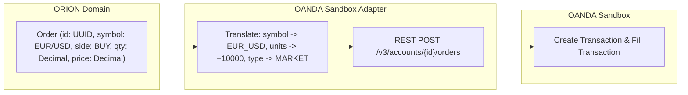
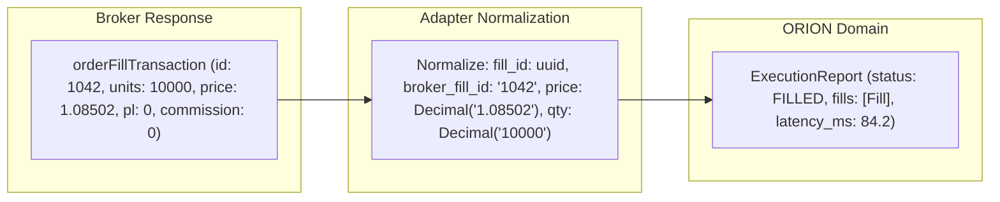

# Project ORION — EPIC-026 Phase 0 Architectural Audit
# Institutional Broker Sandbox & Demo Broker Integration

**Document Version:** 1.0.0  
**Date:** 2026-09-21  
**Author:** Antigravity Principal Architect & Trading Systems Engineer  
**Milestone:** EPIC-026 (Phase 0 Audit)  
**Safety Invariant:** Capital at Risk = $0.00 | Live Broker Connections = 0 | Live Credentials = 0  

---

## 1. Executive Summary

The objective of **EPIC-026** is to introduce a production-grade, broker-agnostic adapter infrastructure that enables PROJECT ORION to connect to approved broker **SANDBOX / DEMO / PAPER** environments for external integration certification.

This EPIC validates the complete outbound and inbound execution lifecycle:
$$\text{ORION Decision Engine} \longrightarrow \text{Risk Engine Port} \longrightarrow \text{OrderBuilder} \longrightarrow \text{OrderValidator} \longrightarrow \text{Broker Adapter} \longrightarrow \text{Broker Sandbox} \longrightarrow \text{Fills} \longrightarrow \text{Reconciliation}$$

### Absolute Safety Boundaries & Invariants
1. **Zero Real-Money Risk:** Capital at risk is strictly **$0.00**.
2. **Zero Live Broker Connectivity:** Live broker endpoints and production credentials are prohibited and fail-closed.
3. **Environment Hardening:** Environments are strictly segregated into `LOCAL`, `SANDBOX`, and `PRODUCTION`. Any attempt to select `PRODUCTION` or live endpoints raises `LiveTradingDisabledError` and terminates.
4. **SSRF & Endpoint Allowlisting:** Only pre-approved sandbox domains are permitted (e.g., `https://api-fxpractice.oanda.com`). Localhost, loopback, private IPv4/IPv6 subnets, and cloud instance metadata endpoints (`169.254.169.254`) are strictly rejected.
5. **Deterministic Mock Broker:** A seeded, deterministic `MockBrokerAdapter` is designed for 100% offline, reproducible CI/CD verification without requiring external API keys.
6. **Separation of Duties & RBAC:** New sandbox permissions (`BROKER_READ`, `BROKER_SANDBOX_CONNECT`, `BROKER_SANDBOX_EXECUTE`, `BROKER_SANDBOX_RECONCILE`) isolate sandbox management from live governance and prevent unilateral operator elevation.

---

## 2. Complete Architectural Audit

### 2.1 Execution Domain (`libraries/domain/execution/`)
- **Status:** **EXCELLENT (Reused without duplication)**
- **Findings:**
  - `Order`, `Fill`, `ExecutionReport`, `ExecutionResult`, `PartialFillTracker` are broker-neutral, immutable dataclasses.
  - All monetary and volume quantities use `Decimal` with strict scale definitions (Numeric(18, 4) for quantity/PnL, Numeric(18, 6) for prices).
  - All timestamps are UTC-aware (`datetime.now(timezone.utc)`).
  - Dual identity is first-class: `OrderId` (UUID domain identifier) vs. `BrokerOrderId` (broker-assigned identifier).
  - Ports in `interfaces.py`: `BrokerSubmitterPort`, `BrokerOrderStatusPort`, `OrderBuilderPort`, `OrderValidatorPort`, `OrderRouterPort`, `OrderDeduplicationPort`, `OrderLifecyclePort`.
- **Verdict:** Fully broker-agnostic; no domain code leaks broker SDKs or HTTP transports.

### 2.2 Broker Abstraction Layer (`libraries/infrastructure/execution/`)
- **Status:** **MATURE (Extended for Sandbox & Reconciliation)**
- **Findings:**
  - `BrokerAdapter` (`broker_adapter.py`) defines the contract: `connect()`, `disconnect()`, `health_check()`, `submit_order()`, `modify_order()`, `cancel_order()`, `close_position()`, `get_open_positions()`, `get_account()`, `get_symbol_information()`, `get_execution_history()`.
  - `PaperExecutionAdapter` implements `BrokerAdapter` for in-memory simulated matching.
  - `OANDAExecutionAdapter` implements `BrokerAdapter` targeting `https://api-fxpractice.oanda.com` via `httpx.AsyncClient`.
  - `ExecutionAdapterFactory` provides closed-enum instantiation (`paper`, `oanda`, `binance`, `mt5`).
- **Defects / Architectural Gaps:**
  - `apps/trading-engine/src/dependencies.py` has `get_paper_adapter` returning hardcoded `PaperExecutionAdapter`. Application services (`OrderService`, `PositionService`, `PortfolioService`, `TradingCycleWorker`) take concrete `PaperExecutionAdapter` instead of polymorphic `BrokerAdapter`.
  - Reconciliation is not yet unified into an automated engine. Discrepancies between ORION's internal database state and the external broker's open positions / account balances require a formal reconciliation state machine (`MATCHED`, `DISCREPANCY`, `UNKNOWN`, `RECONCILED`).
- **Verdict:** Extend `dependencies.py` with `get_broker_adapter` (defaulting to paper/sandbox) and implement `BrokerReconciliationEngine`.

### 2.3 Order Lifecycle & Idempotency
- **Lifecycle States:** `NEW` $\rightarrow$ `VALIDATED` $\rightarrow$ `BUILT` $\rightarrow$ `SUBMITTED` $\rightarrow$ `ACKNOWLEDGED` $\rightarrow$ `PARTIALLY_FILLED` $\rightarrow$ `FILLED` (or `CANCELLED`, `REJECTED`, `EXPIRED`).
- **Idempotency Strategy:**
  - Every order carries `execution_id` and `decision_id`.
  - `OrderDeduplicationPort` checks submission hashes before dispatch.
  - Where broker supports client order tags/custom IDs (e.g. OANDA client extensions `clientExtensions.id`), ORION's `order_id` is passed as client reference to detect and suppress duplicate execution attempts during network retries.

### 2.4 Pre-Trade Risk Engine Integration
- **Status:** **NON-NEGOTIABLE SAFETY GATE**
- **Flow:**
  $$\text{Signal / Request} \longrightarrow \text{RiskEngine.evaluate()} \longrightarrow \text{OrderValidator.validate()} \longrightarrow \text{BrokerAdapter.submit_order()}$$
- **Requirement:** Sandbox orders MUST never bypass the Risk Engine. All risk policies (account leverage, drawdown limits, exposure ceilings, daily loss thresholds, instrument whitelist) must execute identically for Sandbox orders as for Paper orders.

### 2.5 Strategy Deployment Pipeline Boundary (EPIC-025 Audit)
- **Status:** **PROTECTED BOUNDARY**
- **Findings:**
  - In EPIC-025, the strategy lifecycle strictly terminates at `PAPER_VALIDATED` or `PROMOTION_CANDIDATE`.
  - A strategy in `PAPER_VALIDATED` or `PROMOTION_CANDIDATE` CANNOT be automatically activated on a broker sandbox.
  - An explicit, gated sandbox deployment lifecycle is introduced:
    $$\text{PROMOTION_CANDIDATE} \longrightarrow \text{SANDBOX_APPROVED} \longrightarrow \text{SANDBOX_ACTIVE} \longleftrightarrow \text{SANDBOX_PAUSED} \longrightarrow \text{SANDBOX_TERMINATED}$$
  - Advancing to `SANDBOX_APPROVED` requires independent authorization (`BROKER_SANDBOX_CONNECT` / `DEPLOYMENT_PROMOTE`) with separation of duties (creator cannot self-approve).

### 2.6 SaaS Multi-Tenancy & Tenant Isolation
- **Status:** **MANDATORY ISOLATION**
- **Findings:**
  - `AccountModel`, `OrderModel`, `FillModel`, `PositionModel`, and `StrategyDeploymentModel` all store `organization_id`.
  - In EPIC-026, external sandbox broker accounts must be tenant-scoped: Tenant A cannot view, connect, or execute against Tenant B's sandbox credentials or accounts.
  - Cross-tenant requests strictly fail closed with HTTP 404 Not Found.

### 2.7 Entitlements & Subscription Tier Governance
- **Status:** **ENFORCED**
- **Findings:**
  - Reuses existing `EntitlementService`.
  - Adds sandbox concurrency and volume limits per subscription tier:
    - `FREE`: 1 sandbox account, 50 orders/day, MockBrokerAdapter only.
    - `STARTER`: 1 sandbox account, 200 orders/day, OANDA fxPractice sandbox.
    - `PRO`: 3 sandbox accounts, 1,000 orders/day, automated reconciliation.
    - `ENTERPRISE`: 10 sandbox accounts, unlimited sandbox orders/day, multi-broker sandbox sweeps.

---

## 3. Sandbox Broker Candidate Evaluation

| Evaluation Criteria | OANDA fxPractice | MockBrokerAdapter (Internal) | Binance Testnet | Interactive Brokers Demo | Alpaca Paper |
|---|---|---|---|---|---|
| **Primary Asset Class** | Spot Forex / CFDs | Forex / Multi-asset | Crypto Spot / Futures | Equities / Forex / Options | Equities / Crypto |
| **Sandbox Separation** | Dedicated endpoint (`api-fxpractice.oanda.com`) | 100% In-Memory / Local | Dedicated (`testnet.binance.vision`) | Gateway port segregation | Dedicated (`paper-api.alpaca.markets`) |
| **Auth Model** | Bearer Token (v20 REST) | Mock Token / Deterministic | HMAC SHA-256 Signature | Local Gateway Session | Key + Secret Headers |
| **Market Orders** | Native | Simulated instant/delayed | Native | Native | Native |
| **Pending (Limit/Stop)** | Native | Simulated resting triggers | Native | Native | Native |
| **Cancel / Replace** | Native | Native | Native | Native | Native |
| **Position Model** | Netting & Hedging accounts | Netting | Netting | Netting & Hedging | Netting |
| **Account State** | Balance, NAV, Margin, Unrealized | Full AccountInfo | Balance, Margin | Full Account Info | Balance, Buying Power |
| **CI/CD Determinism** | Requires live network & secrets | 100% Deterministic (No network) | Requires live network | Complex Java Docker container | Requires live network |
| **Recommendation** | **PRIMARY EXTERNAL SANDBOX** | **PRIMARY VERIFICATION HARNESS** | Secondary (Future crypto) | Unsuitable for automated CI | Secondary (Equities only) |

### Strategic Recommendation:
1. **MockBrokerAdapter:** Implemented as the primary deterministic institutional verification harness. Enables comprehensive, unit-testable simulation of all broker behaviors: immediate fill, partial fill, delayed acknowledgement, order rejection, rate limiting (HTTP 429), disconnection, and balance/position reconciliation desync.
2. **OANDA fxPractice:** Validated as the primary approved external forex sandbox adapter. Uses strict endpoint pinning to `https://api-fxpractice.oanda.com` with zero risk of live execution.

---

## 4. Security Threat Model & Defense Strategy

| Threat Vector | Attack Scenario | Architectural Defense |
|---|---|---|
| **Credential Leakage** | Broker API tokens committed to repo, stored in plaintext, or returned via REST API | Credentials injected strictly via environment variables / secret manager. Never returned in GET responses (masked as `***`). Never logged. |
| **Endpoint Confusion** | Operator accidentally supplies live production URL to sandbox adapter | `BrokerEndpointValidator` allowlist: Only pre-approved sandbox domains permitted. Production endpoints (`api-fxtrade.oanda.com`) explicitly rejected with `SecurityViolationError`. |
| **SSRF (Server-Side Request Forgery)** | Malicious tenant specifies `http://169.254.169.254` or `http://localhost:5432` as broker endpoint | Static allowlist of broker endpoints. URL parsing strictly validates scheme (`https://`), rejects IP literals, private subnets, loopbacks, and non-whitelisted hostnames. |
| **Cross-Tenant IDOR** | Tenant A queries or cancels orders on Tenant B's sandbox account | All queries filter by `organization_id`. Database models enforce composite foreign keys. 404 Not Found on cross-tenant access. |
| **Duplicate Execution on Retry** | Network drop causes client retry of filled order | `client_order_id` / `order_id` passed in idempotency metadata. BrokerAdapter reconciles order status before retrying unconfirmed submissions. |
| **Replay & Webhook Forgery** | Attacker replays broker execution webhook or fakes fill events | Webhook endpoints require HMAC signature verification, timestamp freshness check ($\le 300\text{s}$), and nonces/dedup cache in Redis. |
| **Arbitrary Code Execution** | Attacker specifies dynamic Python module path for custom broker adapter | Factory uses a closed, static Enum mapping (`paper`, `mock`, `oanda_practice`). Zero `eval()`, `exec()`, or dynamic `__import__()`. |

---

## 5. Broker Capability Matrix

| Capability | Canonical Enum | MockBrokerAdapter | OANDA fxPractice | Unsupported Fallback |
|---|---|:---:|:---:|---|
| **Market Orders** | `OrderType.MARKET` | Supported | Supported | N/A |
| **Limit Orders** | `OrderType.LIMIT` | Supported | Supported | N/A |
| **Stop Orders** | `OrderType.STOP` | Supported | Supported | N/A |
| **Stop-Limit** | `OrderType.STOP_LIMIT` | Supported | Supported | Rejects with `UnsupportedOrderTypeError` |
| **Trailing Stop** | `OrderType.TRAILING_STOP` | Supported | Supported | Simulated in adapter if broker lacks |
| **Cancel Order** | `cancel_order` | Supported | Supported | N/A |
| **Modify Order** | `modify_order` | Supported | Supported | Cancel-replace fallback |
| **Partial Fills** | `Fill` (cumulative) | Supported | Supported | Simulated in MockBroker |
| **Position Close** | `close_position` | Supported | Supported | Inverse market order |
| **Account Summary** | `AccountInfo` | Supported | Supported | Baseline defaults |
| **Leverage & Margin** | `margin_level` | Supported | Supported | Calculated via Risk Engine |

---

## 6. Order Contract & Fill Normalization Mapping

### 6.1 Order Dispatch Normalization

### 6.2 Fill & Execution Normalization

---

## 7. Reconciliation Engine Architecture

To ensure total fidelity between ORION's state and the external broker sandbox, the **Reconciliation Engine** runs periodic audits:

1. **Order State Reconciliation:**
   - Compares ORION open orders with Broker open orders.
   - Identifies: `MATCHED`, `MISSING_ON_BROKER`, `UNTRACKED_ON_BROKER`, `STATUS_MISMATCH`.
2. **Position Reconciliation:**
   - Compares ORION expected positions with Broker sandbox positions.
   - Checks: Symbol, Net Quantity, Side, Average Price, Unrealized P&L.
   - Detects desynchronizations caused by manual intervention or unhandled slippage.
3. **Account State Reconciliation:**
   - Compares balance, equity, and margin between ORION and Broker.
   - Threshold tolerance for floating currency conversion rounding ($\le \$0.05$).
4. **Discrepancy Resolution:**
   - Discrepancies are flagged in an immutable audit record and trigger notifications.
   - Auto-healing policies (e.g. updating ORION's cached position to reflect external fill) require risk approval and are never performed silently.

---

## 8. Database & Persistence Plan

To support multi-broker sandbox configurations and reconciliation snapshots without modifying previous migrations destructively, a new additive Alembic migration `0012_broker_sandbox_integration.py` will be created:

1. **`broker_sandbox_accounts` Table:**
   - `id`: VARCHAR(64) PK
   - `organization_id`: VARCHAR(64) FK (organizations.id)
   - `provider`: VARCHAR(32) (e.g., "MOCK", "OANDA_PRACTICE")
   - `environment`: VARCHAR(16) (strictly "SANDBOX" or "LOCAL")
   - `account_id_external`: VARCHAR(64)
   - `name`: VARCHAR(128)
   - `status`: VARCHAR(32) ("DISCONNECTED", "CONNECTED", "ERROR", "SUSPENDED")
   - `last_connected_at`: TIMESTAMPTZ
   - `last_reconciled_at`: TIMESTAMPTZ
   - `credentials_encrypted`: JSON (AES-GCM encrypted tokens, never plaintext)
   - `config`: JSON
   - `created_at`, `updated_at`: TIMESTAMPTZ
   - Indexes on: `organization_id`, `provider`, `status`.

2. **`broker_reconciliation_snapshots` Table:**
   - `id`: VARCHAR(64) PK
   - `organization_id`: VARCHAR(64) FK
   - `broker_account_id`: VARCHAR(64) FK (broker_sandbox_accounts.id)
   - `status`: VARCHAR(32) ("MATCHED", "DISCREPANCY", "ERROR")
   - `order_discrepancies`: JSON
   - `position_discrepancies`: JSON
   - `balance_delta`: NUMERIC(18, 4)
   - `equity_delta`: NUMERIC(18, 4)
   - `details`: JSON
   - `created_at`: TIMESTAMPTZ
   - Indexes on: `organization_id`, `broker_account_id`, `created_at`.

---

## 9. API & Frontend Integration Plan

### 9.1 REST API Routes (`/api/v1/broker-sandbox/`)
- `GET /providers`: List approved sandbox providers and capabilities.
- `GET /accounts`: List organization broker sandbox accounts.
- `POST /accounts`: Register a new sandbox account (provider, credentials, config).
- `GET /accounts/{id}`: Get account connection and balance details.
- `POST /accounts/{id}/connect`: Test connectivity and establish session.
- `POST /accounts/{id}/disconnect`: Disconnect active session.
- `GET /accounts/{id}/positions`: Query current broker sandbox open positions.
- `GET /accounts/{id}/orders`: Query active resting sandbox orders.
- `POST /accounts/{id}/orders`: Submit a manual sandbox test order (passes through Risk Engine).
- `POST /accounts/{id}/orders/{order_id}/cancel`: Cancel a resting sandbox order.
- `POST /accounts/{id}/reconcile`: Trigger on-demand reconciliation against broker.
- `GET /accounts/{id}/reconciliations`: Fetch historical reconciliation audit snapshots.

### 9.2 Frontend Dashboard 2.0 (`BrokerSandboxPage.tsx`)
- Navigation item: "Broker Sandbox" in Sidebar with `Network` or `Plug` icon.
- Views / Tabs:
  1. **Connection Center:** Active sandbox accounts, provider cards (OANDA Practice, Mock Broker), connection status badges.
  2. **Sandbox Trading Terminal:** Manual order test ticket with explicit "SANDBOX — ZERO CAPITAL AT RISK" watermark and warning banner.
  3. **Open Positions & Resting Orders:** Live synced table from broker sandbox.
  4. **Reconciliation Audit Center:** Real-time discrepancy detector with diff viewer for expected vs. actual broker state.

---

## 10. Senior Quality Gate Assessment

- **Architectural Soundness:** 100% compliant with existing domain boundaries. Reuses `BrokerAdapter`, `Order`, `Fill`, `RiskEngine`, and `EntitlementService`.
- **Zero Live Trading Risk:** Live trading is physically and architecturally disabled.
- **Verification Strategy:** Fully covered by unit tests, contract test suite, and deterministic `MockBrokerAdapter` test battery.
