# Project ORION — EPIC-027 Implementation Plan
# Public Beta & Commercial Launch Readiness

**Document Version:** 1.0.0
**Date:** 2026-09-22
**Milestone:** EPIC-027 (Implementation Plan)
**Author:** Quantitative Architecture & Engineering Team
**Repository:** `Project-ORION` (Branch: `main`)
**Target Delivery:** Multi-tenant quantitative paper-trading, research, optimization, and strategy SaaS

---

## 1. Architectural Principles & Safety Invariants

All changes designed within this implementation plan must strictly adhere to the Project ORION non-negotiable safety rules:
1. **Paper Trading Only:** Zero execution pathways to real market capital.
2. **Live Broker Execution Disabled:** No live broker adapters, live credentials, or production endpoint connections.
3. **Capital at Risk:** Strictly **$0.00**.
4. **Mandatory Execution Pipeline:** Signal -> EntitlementCheck -> RiskEngine -> OrderValidator -> Canonical Order -> Broker Adapter.
5. **Multi-Tenant IDOR Defense:** Fail-closed isolation returning HTTP 404 on cross-tenant access.
6. **No Silent State Mutations:** Reconciliation remains `ALERT + AUDIT + MANUAL REVIEW`.
7. **Zero Dynamic Arbitrary Code Execution:** No `eval()`, `exec()`, or runtime module compilation.
8. **Preserve Domain Architecture:** Broker-agnostic domain layer; provider-specific logic isolated inside infrastructure adapters.

---

## 2. Phased Implementation Roadmap

```mermaid
flowchart LR
    subgraph P1 ["Phase 1: Auth & Account"]
        A1["Password Reset"]
        A2["Token Refresh"]
        A3["Account Deletion Guard"]
    end

    subgraph P2 ["Phase 2: Abuse Defense"]
        B1["Rate Limiting Middleware"]
        B2["Login Throttling"]
        B3["Production Secret Guard"]
    end

    subgraph P3 ["Phase 3: Legal & Trust"]
        C1["Terms of Service"]
        C2["Privacy Policy"]
        C3["Paper Risk Disclosure"]
    end

    subgraph P4 ["Phase 4: Public Marketing"]
        D1["Landing Page (/)"]
        D2["Pricing Page"]
        D3["Feature Showcase"]
    end

    subgraph P5 ["Phase 5: Self-Serve Onboard"]
        E1["Public Signup UI"]
        E2["Terms Checkbox"]
        E3["Welcome Wizard"]
    end

    subgraph P6 ["Phase 6: Cloud & DevOps"]
        F1["Render Root Placement"]
        F2["Starter Tier Runbook"]
        F3[".env.example Template"]
    end

    subgraph P7 ["Phase 7: Verification"]
        G1["Full Regression"]
        G2["Security Audit"]
        G3["Go/No-Go Gate"]
    end

    P1 --> P2 --> P3 --> P4 --> P5 --> P6 --> P7
```

---

## 3. Detailed Work Item Specifications

### Work Item 1: Authentication & Identity Lifecycle Hardening

1. **Gap:** Missing password reset, token refresh endpoint, and email verification handling.
2. **Existing Implementation:** `apps/trading-engine/src/services/auth.py` handles password hashing with bcrypt (safe 72-byte truncation) and JWT encoding/decoding. `UserModel` stores hashed credentials.
3. **Required Change:**
   - Add `POST /api/v1/auth/refresh` to rotate access tokens using validated sessions.
   - Add `POST /api/v1/auth/forgot-password` generating a cryptographic, time-limited reset token (15-min expiry) stored with SHA-256 hash in database.
   - Add `POST /api/v1/auth/reset-password` validating token and updating password hash.
   - Add `POST /api/v1/auth/verify-email` stub/handler for user activation.
4. **Files/Modules Affected:**
   - `apps/trading-engine/src/routes/auth.py`
   - `apps/trading-engine/src/services/auth.py`
   - `apps/trading-engine/src/schemas.py`
   - `libraries/infrastructure/persistence/models/user.py`
5. **Database Migration Required?** Yes (add `reset_token_hash`, `reset_token_expires_at`, `email_verified` to `users` table via `0013_auth_lifecycle.py`).
6. **API Changes?** Yes: 3 new public auth endpoints.
7. **Frontend Changes?** Yes: Add `/forgot-password`, `/reset-password`, and `/verify-email` pages in `apps/dashboard/src/pages/`.
8. **Security Impact:** Significant improvement in user account recovery without compromising JWT signature security.
9. **Test Strategy:** Unit tests for token generation/hashing, expiration validation, and integration tests for full reset flow.
10. **Rollback Strategy:** Revert migration `0013`, downgrade Alembic, revert route additions.
11. **Dependencies:** None.
12. **Estimated Effort:** 6 hours.
13. **Acceptance Criteria:** Users can request reset, receive valid token, update password, and authenticate with new credentials. Expired or manipulated tokens fail closed.

---

### Work Item 2: Public API Rate Limiting & Abuse Defense

1. **Gap:** Inbound HTTP endpoints lack brute-force and request rate limiting.
2. **Existing Implementation:** Rate limiting exists only on outbound market data calls (`libraries/infrastructure/market_data/rate_limiter.py`).
3. **Required Change:**
   - Integrate `slowapi` or an in-process sliding-window / Redis token-bucket rate limiter.
   - Apply rate limit policies:
     - `/api/v1/auth/login`: 5 requests / minute per IP.
     - `/api/v1/onboarding/register`: 3 requests / minute per IP.
     - `/api/v1/auth/forgot-password`: 3 requests / minute per IP.
     - Authenticated API routes: 120 requests / minute per tenant.
     - `/api/v1/optimization/run`: 10 requests / minute per tenant (complements subscription plan quota).
   - Enforce maximum HTTP request body size (10 MB).
   - Fail-closed guard: `AppSettings.from_env()` must raise `ConfigurationError` if `jwt_secret_key` uses the default fallback string in `production`.
4. **Files/Modules Affected:**
   - `apps/trading-engine/src/main.py`
   - `apps/trading-engine/src/config.py`
   - `apps/trading-engine/src/dependencies.py`
   - `pyproject.toml` (add `slowapi`)
5. **Database Migration Required?** No.
6. **API Changes?** No schema changes; returns HTTP 429 Too Many Requests when limits are exceeded with `Retry-After` header.
7. **Frontend Changes?** Frontend `api/client.ts` displays descriptive toast when receiving HTTP 429.
8. **Security Impact:** Eliminates credential stuffing, registration flooding, and API denial-of-service vectors.
9. **Test Strategy:** Automated unit and integration tests hitting endpoints in rapid succession, asserting HTTP 429 and `Retry-After` header.
10. **Rollback Strategy:** Disable middleware in `main.py`.
11. **Dependencies:** Redis (optional fallback to memory cache if Redis is unavailable).
12. **Estimated Effort:** 4 hours.
13. **Acceptance Criteria:** Exceeding threshold strictly returns HTTP 429; normal traffic passes with zero false positives.

---

### Work Item 3: Legal, Trust & Risk Disclosure Infrastructure

1. **Gap:** No public legal terms, privacy policies, or paper-trading risk disclosures exist in the codebase.
2. **Existing Implementation:** Hardcoded warnings in confirmation modals and topbar amber badges.
3. **Required Change:**
   - Author comprehensive product documents (markdown & frontend components):
     - `TERMS_OF_SERVICE.md` / `/terms`: Software SaaS terms, acceptable use, paper-trading simulation definition, intellectual property, account suspension rules.
     - `PRIVACY_POLICY.md` / `/privacy`: GDPR & CCPA privacy policy, data collection disclosure (email, hashed password, telemetry, audit logs), cookie policy.
     - `RISK_DISCLOSURE.md` / `/risk-disclosure`: Explicit institutional disclosure declaring ORION is a paper-trading simulation platform with $0.00 live money, no investment advisory status, and no guarantee of profit.
     - `REFUND_POLICY.md` / `/refund-policy`: Subscription cancellation, prorating, and billing dispute terms.
     - `SUPPORT_POLICY.md` / `/support`: SLA, support email (`support@project-orion.io`), and bug disclosure channels.
4. **Files/Modules Affected:**
   - `docs/legal/` (markdown source documents)
   - `apps/dashboard/src/pages/legal/` (`TermsPage.tsx`, `PrivacyPage.tsx`, `RiskDisclosurePage.tsx`)
   - `apps/dashboard/src/App.tsx` (public routes)
5. **Database Migration Required?** No.
6. **API Changes?** None.
7. **Frontend Changes?** Add accessible, standalone legal page routes accessible without authentication.
8. **Security Impact:** Ensures legal compliance and sets clear boundaries regarding non-custodial simulated execution.
9. **Test Strategy:** Frontend unit tests asserting render, content accessibility, and public access without login.
10. **Rollback Strategy:** Remove routes from `App.tsx`.
11. **Dependencies:** None.
12. **Estimated Effort:** 4 hours.
13. **Acceptance Criteria:** All legal documents are readable at public URLs and linked from footer and signup views.

---

### Work Item 4: Public Marketing Website & Product Showcase

1. **Gap:** Navigating to `/` redirects unauthenticated visitors to `/login`. No public marketing surface exists.
2. **Existing Implementation:** Dashboard AppShell requires authentication; unauthenticated users are intercepted by `ProtectedRoute`.
3. **Required Change:**
   - Build a responsive public marketing landing page at `/` featuring:
     - Hero section with clear value proposition: *"AI-Powered Quantitative Forex Paper Trading & Strategy Incubation"*.
     - Interactive Paper Trading feature highlight (zero live capital risk).
     - Quantitative Architecture overview: 5-Gate Strategy Deployment, Walk-Forward Optimization, Broker Sandbox.
     - Plan Comparison & Pricing Grid (Free, Pro, Business, Enterprise) with feature checklist.
     - Factual disclosures: *"Simulated paper execution. No real money at risk."*
     - Clear primary CTA: `"Start Free Paper Trading"` (routes to `/signup`) and secondary CTA: `"Sign In"` (routes to `/login`).
   - Add public navigation bar and footer linking to features, pricing, security, legal docs, and support.
4. **Files/Modules Affected:**
   - `apps/dashboard/src/pages/public/LandingPage.tsx`
   - `apps/dashboard/src/pages/public/PricingPage.tsx`
   - `apps/dashboard/src/components/public/PublicHeader.tsx`
   - `apps/dashboard/src/components/public/PublicFooter.tsx`
   - `apps/dashboard/src/App.tsx`
5. **Database Migration Required?** No.
6. **API Changes?** None.
7. **Frontend Changes?** Public route group for unauthenticated visitors.
8. **Security Impact:** None; static presentation layer.
9. **Test Strategy:** Vitest render tests, responsive layout tests, and link verification.
10. **Rollback Strategy:** Revert root route `/` to redirect to `/login`.
11. **Dependencies:** None.
12. **Estimated Effort:** 8 hours.
13. **Acceptance Criteria:** Public visitor can navigate landing page, review features, examine pricing tiers, and click "Start Free" to reach signup.

---

### Work Item 5: Self-Service Signup & Guided Onboarding

1. **Gap:** Registration is not available on the dashboard UI. First-time users are dropped into an empty dashboard without guidance.
2. **Existing Implementation:** `POST /api/v1/onboarding/register` provisions user, organization, free subscription, and paper account with $100,000 balance.
3. **Required Change:**
   - Build `/signup` page in dashboard:
     - Fields: Email, Username, Password (with strength indicator), Organization Name.
     - Mandatory checkbox: *"I agree to the Terms of Service, Privacy Policy, and understand that ORION operates strictly in simulated paper-trading mode with $0.00 real capital."*
     - Connect to `/api/v1/onboarding/register`.
   - Build first-time user Onboarding Wizard (`OnboardingModal.tsx`):
     - Triggered automatically on first login if account has 0 orders.
     - Step 1: Select default paper balance ($50k, $100k, $250k).
     - Step 2: Choose strategy archetype to inspect (Trend Following, Mean Reversion).
     - Step 3: Quick tour of Dashboard, Strategy Lab, and Paper Orders.
     - Actionable completion: Execute first simulated paper market order.
4. **Files/Modules Affected:**
   - `apps/dashboard/src/pages/auth/SignupPage.tsx`
   - `apps/dashboard/src/components/onboarding/OnboardingModal.tsx`
   - `apps/dashboard/src/pages/DashboardPage.tsx`
   - `apps/dashboard/src/App.tsx`
5. **Database Migration Required?** Yes (add `onboarding_completed` boolean to `users` table via `0013_auth_lifecycle.py`).
6. **API Changes?** Add `POST /api/v1/auth/onboarding/complete` to persist completion status.
7. **Frontend Changes?** New `/signup` route and dynamic modal component.
8. **Security Impact:** Enforces mandatory terms acceptance before account creation.
9. **Test Strategy:** E2E registration test, form validation unit tests, terms acceptance checkbox validation.
10. **Rollback Strategy:** Revert `/signup` route.
11. **Dependencies:** Work Items 1 & 3.
12. **Estimated Effort:** 6 hours.
13. **Acceptance Criteria:** Visitor fills signup form, accepts terms, registers account, logs in, completes onboarding wizard, and executes first paper trade.

---

### Work Item 6: Cloud Deployment, DevOps & Backup Hardening

1. **Gap:** `render.yaml` and `.github/` workflows are located inside `project-orion/` rather than the Git repository root. Free Render PostgreSQL expires after 30 days. No `.env.example` template exists.
2. **Existing Implementation:** Shell backup scripts in `backup/`, Render blueprint in `project-orion/render.yaml`.
3. **Required Change:**
   - Provide root-level `render.yaml` or symlink configured for the repository structure.
   - Upgrade Render blueprint specification:
     - Change `orion-postgres` from `plan: free` to `plan: starter` ($7/mo) to provide persistent SSD and automated daily snapshots.
     - Change `orion-redis` to Starter to ensure cache persistence.
   - Create comprehensive `.env.example` documenting all 25+ configuration variables with secure production guidelines.
   - Update `.gitignore` from `.env` to `.env*` to prevent accidental commit of `.env.production` or `.env.local`.
   - Update GitHub Actions workflows to set `working-directory: project-orion` for Poetry and npm steps.
   - Document backup restoration runbook and RTO/RPO targets.
4. **Files/Modules Affected:**
   - `render.yaml`
   - `.env.example`
   - `.gitignore`
   - `.github/workflows/` (`ci.yml`, `container.yml`)
   - `docs/operations/RENDER-DEPLOYMENT-GUIDE.md`
5. **Database Migration Required?** No.
6. **API Changes?** None.
7. **Frontend Changes?** None.
8. **Security Impact:** Prevents accidental secret commits and eliminates data loss from free-tier database expiration.
9. **Test Strategy:** Validation of `.env.example` with `AppSettings.from_env()`, verification of workflow YAML syntax.
10. **Rollback Strategy:** Revert file modifications.
11. **Dependencies:** None.
12. **Estimated Effort:** 4 hours.
13. **Acceptance Criteria:** Blueprint deploys cleanly without missing environment variables; backups are automated via managed database provider.

---

### Work Item 7: Public Beta Release Verification & Go/No-Go Gate

1. **Gap:** Final public beta verification and formal milestone sign-off.
2. **Existing Implementation:** Test suite passing 4,308 tests.
3. **Required Change:**
   - Execute full platform regression: backend, frontend, security, migrations.
   - Verify rate limiting under simulated load (100 rapid requests).
   - Verify self-service signup, onboarding, and first paper trade E2E.
   - Verify all legal pages render with zero broken links.
   - Publish `docs/EPIC-027-FINAL-VERIFICATION.md`.
4. **Files/Modules Affected:** All test suites and documentation.
5. **Database Migration Required?** No.
6. **API Changes?** None.
7. **Frontend Changes?** None.
8. **Security Impact:** Confirms zero regressions across all 16 security invariants.
9. **Test Strategy:** Automated CI run + manual smoke test.
10. **Rollback Strategy:** N/A.
11. **Dependencies:** Work Items 1–6.
12. **Estimated Effort:** 4 hours.
13. **Acceptance Criteria:** 100% of release gates PASS; classification elevated to **A — PUBLIC BETA READY**.

---

## 4. Summary of Effort & Schedule

| Phase | Description | Estimated Effort |
|---|---|:---:|
| **Phase 1** | Auth & Account Lifecycle Hardening | 6 Hours |
| **Phase 2** | Public API Rate Limiting & Abuse Defense | 4 Hours |
| **Phase 3** | Legal, Trust & Risk Disclosure Surface | 4 Hours |
| **Phase 4** | Public Marketing Website & Pricing Pages | 8 Hours |
| **Phase 5** | Self-Service Signup & Guided Onboarding | 6 Hours |
| **Phase 6** | Cloud Deployment, DevOps & Backup Hardening | 4 Hours |
| **Phase 7** | Public Beta Verification & Release Sign-Off | 4 Hours |
| **TOTAL** | **Full EPIC-027 Public Beta Delivery** | **36 Hours** |
