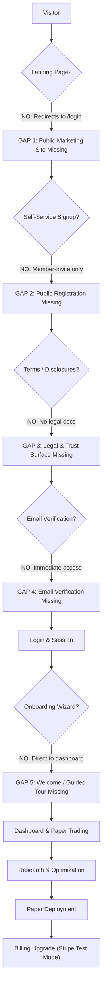

# Project ORION — EPIC-027 Phase 0 Comprehensive Audit Report
# Public Beta & Commercial Launch Readiness

**Document Version:** 1.0.0
**Date:** 2026-09-22
**Milestone:** EPIC-027 (Phase 0 Audit & Gap Analysis)
**Author:** Quantitative Architecture, Security, & Operations Audit Team
**Repository:** `Project-ORION` (Branch: `main`, Commit: `a8dcb21`)
**Product Target:** Multi-tenant quantitative paper-trading, research, optimization, and strategy-development SaaS

---

## 1. Executive Summary & Audit Baseline

Project ORION has established an institutional-grade, mathematically verified algorithmic trading core through EPIC-001 to EPIC-026. The platform features strict separation of concerns, fail-closed multi-tenancy, deterministic backtesting and walk-forward analysis, an automated strategy deployment pipeline with 5 quality gates, an institutional paper incubator, and a hardened broker sandbox engine with AES-256-GCM encrypted credentials and SSRF immunity.

However, the existing platform is currently **configured as an internal/private engineering system**. It lacks the public-facing onboarding surfaces, self-service identity lifecycle, legal/trust disclosures, public marketing presentation, and inbound HTTP abuse defenses required for an open public beta and commercial SaaS launch.

### Invariant Status:
- **Capital at Risk:** Strictly **$0.00** (Simulated Paper Trading Only)
- **Live Broker Connections:** **0**
- **Live Broker Credentials:** **0**
- **Worker Enabled:** **false** (Background auto-execution disabled)
- **Live Trading Activation:** **Strictly Prohibited**

---

## 2. 16-Domain Backend Capability Inventory

| # | Domain / Feature | Status | Location | Test Coverage | Public-Ready? | Gap Analysis & Findings |
|---|---|:---:|---|:---:|:---:|---|
| **1** | **Authentication & Identity** | **PARTIAL** | `apps/trading-engine/src/routes/auth.py`, `services/auth.py`, `models/user.py` | Tested (unit + integration) | **NO** | Missing token refresh (`/refresh`), self-service password reset, email verification, and brute-force lockout. |
| **2** | **Organization & Multi-Tenancy** | **COMPLETE** | `libraries/domain/organization/`, `routes/organization.py`, `services/organization_service.py` | Tested (100% isolation) | **YES** | Multi-tenant isolation verified; invitations generate tokens, but external SMTP/transactional email dispatch is pending. |
| **3** | **RBAC & Entitlements** | **COMPLETE** | `libraries/domain/organization/permissions.py`, `services/entitlement_service.py` | Tested (41 perms, 7 roles) | **YES** | Complete 41-permission matrix across 7 roles; quotas enforced across accounts, orders, workers, research, optimization, deployments. |
| **4** | **Accounts, Orders & Portfolio** | **COMPLETE** | `apps/trading-engine/src/routes/` (`account`, `orders`, `positions`, `trades`, `portfolio`, `paper`) | Tested (unit + E2E) | **YES** | Complete ledger: order lifecycle, position netting, mark-to-market valuations, equity curves, paper reset. |
| **5** | **Strategies & Risk** | **PARTIAL** | `libraries/domain/strategy/`, `libraries/domain/risk/`, `routes/strategies.py`, `routes/risk.py` | Tested | **PARTIAL** | Domain `RiskEngine` is production-grade; however, `routes/risk.py` returns static/stub limit responses, and strategy catalogue route uses static list. |
| **6** | **Market Data Platform** | **COMPLETE** | `libraries/infrastructure/market_data/`, `libraries/domain/market_data/`, `routes/market_data.py` | Tested | **YES** | TwelveData real provider + deterministic MockMarketDataProvider, Redis caching, rate limiting, and circuit breaker. |
| **7** | **Research Lab & Backtesting** | **COMPLETE** | `libraries/domain/backtesting/` (30 modules), `libraries/domain/research/`, `routes/research.py` | Tested | **YES** | Deterministic simulation, leakage guards, slippage/spread/commission models, Monte Carlo, and experiment comparison. |
| **8** | **Optimization Studio** | **COMPLETE** | `libraries/domain/research/optimization_engine.py`, `routes/optimization.py` | Tested | **YES** | Grid/Random sweeps, multi-window Walk-Forward Analysis (WFA), parameter stability analysis, overfitting guards, heatmaps. |
| **9** | **Deployment Pipeline** | **COMPLETE** | `libraries/domain/deployment/`, `routes/deployments.py`, `services/deployment_service.py` | Tested | **YES** | 5 quality gates (WFE, Regime, Stability, Trade Count, Sharpe), incubation policy, evidence chain, separation of duties. |
| **10** | **Broker Sandbox** | **COMPLETE** | `libraries/infrastructure/execution/mock_broker.py`, `libraries/infrastructure/security/` | Tested | **YES** | MockBrokerAdapter, 6-stage SSRF validator, AES-256-GCM cipher, state reconciliation engine with zero silent mutations. |
| **11** | **Commercial Billing** | **COMPLETE** | `libraries/infrastructure/billing/`, `routes/billing.py`, `services/billing_service.py` | Tested | **PARTIAL** | Complete Stripe integration with Free/Pro/Business/Enterprise tiers; runs in Stripe Test Mode; live keys pending. |
| **12** | **Audit Trail** | **COMPLETE** | `models/audit.py`, `routes/organization.py`, domain interceptors | Tested | **YES** | Immutable regulatory audit log, tenant isolation, automatic secret/credential redaction on serialization. |
| **13** | **Autonomous Worker** | **COMPLETE** | `apps/trading-engine/src/workers/` (`coordinator`, `lifecycle`, `scheduler`, `trading_cycle`) | Tested | **YES** | 8 safety gates, paper-only adapter binding, fail-closed disabled guard (`ORION_WORKER_ENABLED=false`). |
| **14** | **Database & Migrations** | **COMPLETE** | `database/migrations/versions/` (12 revisions), `models/` (24 models) | Tested | **YES** | Contiguous 12-revision Alembic chain (`0001` through `0012`), clean upgrade/downgrade paths, multi-tenant indexes. |
| **15** | **Observability** | **COMPLETE** | `libraries/observability/` (8 modules), `routes/health.py`, `routes/metrics.py` | Tested | **YES** | Prometheus `/metrics`, structured JSON logging with correlation IDs, OpenTelemetry tracing, granular `/health/ready`. |
| **16** | **API Security** | **PARTIAL** | `main.py`, `libraries/infrastructure/security/endpoint_validator.py` | Tested | **PARTIAL** | CORS, HSTS, CSP, and SSRF filtering implemented; inbound HTTP rate limiting on public endpoints is missing. |

---

## 3. Public User Journey Gap Analysis

### Detailed Journey Matrix:

| Step | User Action | Implemented? | Error Handling? | UX States? | Public-Ready? | Gap Description |
|---|---|:---:|:---:|:---:|:---:|---|
| **1** | **Visit `/`** | No | N/A | N/A | **NO** | Root route redirects unauthenticated users to `/login`. No public value proposition, product tour, or pricing page. |
| **2** | **Sign Up** | Backend only | Partial | N/A | **NO** | `POST /api/v1/onboarding/register` exists, but frontend dashboard has zero registration links or signup forms. |
| **3** | **Accept Terms** | No | None | None | **NO** | No Terms of Service, Privacy Policy, or Paper Trading Risk Disclosure agreements exist. |
| **4** | **Verify Email** | No | None | None | **NO** | No email token dispatch, verification link, or confirmation view. |
| **5** | **Login** | Yes | Yes | Complete | **PARTIAL** | Functional credentials form; lacks "Forgot Password" link and brute-force rate limiting. |
| **6** | **Create Org** | Backend only | Yes | None | **PARTIAL** | Tenant created automatically on onboarding; no in-app creation wizard for subsequent teams. |
| **7** | **Free Tier** | Yes | Yes | Complete | **YES** | Free tier automatically assigned with valid paper quotas. |
| **8** | **Paper Account** | Yes | Yes | Complete | **YES** | $100,000 simulated account auto-provisioned upon tenant creation. |
| **9** | **Dashboard** | Yes | Yes | Complete | **YES** | Financial metrics, equity curve, watchlist, and simulation widget. |
| **10** | **Strategy Setup** | Yes | Yes | Complete | **YES** | Strategy catalogue and parameters configurable per tenant. |
| **11** | **Risk Config** | Partial | Partial | Read-only | **PARTIAL** | UI displays limits; backend endpoints currently return static responses. |
| **12** | **First Trade** | Yes | Yes | Complete | **YES** | Order modal with Market/Limit/Stop, lot sizing, and paper confirmation dialog. |
| **13** | **Positions/PnL** | Yes | Yes | Complete | **YES** | Mark-to-market calculations, position netting, and liquidation modals. |
| **14** | **Strategy Lab** | Yes | Yes | Complete | **YES** | Backtest execution, Monte Carlo analysis, and experiment comparison. |
| **15** | **Optimization** | Yes | Yes | Complete | **YES** | Grid/Random search, Walk-Forward Analysis, heatmaps, and leaderboard. |
| **16** | **Deployment** | Yes | Yes | Complete | **YES** | Promotion through 5 quality gates into the paper incubator. |
| **17** | **Upgrade Plan** | Yes | Yes | Complete | **PARTIAL** | Functional Stripe checkout session in Test Mode; live keys pending. |

---

## 4. Frontend & User Experience Audit (`apps/dashboard/`)

### 4.1 Page Inventory & State Health
All 15 internal dashboard pages (`/dashboard`, `/orders`, `/positions`, `/trades`, `/portfolio`, `/broker-sandbox`, `/strategies`, `/research`, `/optimization`, `/deployments`, `/risk`, `/worker`, `/billing`, `/organization`, `/audit`) feature:
- **Loading States:** Implemented via pulse `Skeleton`, `CardSkeleton`, or table spinners.
- **Empty States:** Implemented via descriptive `EmptyState` components.
- **Error States:** Implemented via `ErrorState` with correlation ID display and retry triggers.
- **Paper Trading Notices:** Prominently declared in topbar amber badges, sidebar footer mode boxes, and all execution confirmation dialogs (`SIMULATED PAPER EXECUTION — $0.00 REAL CAPITAL AT RISK`).

### 4.2 Missing Frontend Pages & Surfaces:
1. **Public Marketing Website:** Missing `/`, `/features`, `/paper-trading`, `/research`, `/optimization`, `/pricing`, `/security`, `/faq`, `/about`, `/contact`.
2. **Authentication Screens:** Missing `/signup`, `/forgot-password`, `/reset-password`, `/verify-email`.
3. **Legal / Trust Pages:** Missing `/terms`, `/privacy`, `/risk-disclosure`, `/refund-policy`.
4. **First-Time User Onboarding:** Missing welcome modal, interactive quick-start stepper, and guided tour.
5. **SEO & Discovery Assets:** Missing `robots.txt`, `sitemap.xml`, and OpenGraph / Twitter meta tags in `index.html`.

---

## 5. Security & Threat Modeling Audit

| Security Vector | Current State | Risk Level | Required Remediation |
|---|---|:---:|---|
| **Inbound HTTP Rate Limiting** | **None on API endpoints** | **HIGH** | Add `slowapi` or Redis token-bucket middleware on `/api/v1/auth/login` (5/min), `/onboarding/register` (3/min), and `/optimization/run` (10/min). |
| **Default Secret Fallbacks** | Default dev key in `AppSettings` | **HIGH** | Fail-closed: raise `ConfigurationError` on startup if `jwt_secret_key` uses the default string while `ORION_ENVIRONMENT=production`. |
| **Brute-Force Protection** | No lockout or delay | **MEDIUM** | Implement exponential backoff or 5-attempt temporary lockout on repeated authentication failures. |
| **Token Handling** | `sessionStorage` | **LOW/MEDIUM** | Standard for SPAs; ensure short TTL (30 min) and implement token refresh endpoint. |
| **SSRF Defense** | 6-stage validator | **ZERO** | Verified immune to loopback, RFC 1918, link-local, cloud metadata (`169.254.169.254`), and production broker hosts. |
| **Credential Encryption** | AES-256-GCM | **ZERO** | Credential secrets authenticated, encrypted at rest, and masked as `"***"` in API/logs. |
| **Tenant Isolation (IDOR)** | Scoped queries, 404 return | **ZERO** | Verified fail-closed; cross-tenant resource requests strictly return 404. |
| **Live Execution Risk** | Hard-blocked | **ZERO** | Capital at risk strictly $0.00; factory rejects `LIVE` environment; live URLs blocked. |

---

## 6. Infrastructure, Cloud & Operations Audit

### 6.1 Render Cloud Architecture
- **Blueprint Location:** `project-orion/render.yaml` must be relocated or symlinked to the Git repository root (`forex-trading-platform-architecture/`) for automatic Render Blueprint detection.
- **Database Persistence Warning:** Render Free PostgreSQL instances expire and are deleted after 30 days. Commercial and public beta deployments must use **Render Starter tier ($7/mo)** with persistent SSD storage and automated daily snapshots.
- **Inactivity Spin-Down:** Free web services spin down after 15 minutes of idle time, causing 50–90s cold boots. Paid Starter tier ($7/mo) ensures 100% liveness for real-time paper tick evaluation.

### 6.2 Backup & Disaster Recovery
- Shell scripts exist in `project-orion/backup/` (`database-backup.sh`, `restore-database.sh`, AES-256-CBC, S3 sync).
- **Gap:** No automated cloud cron runs these scripts in Render. Automated daily snapshots via managed PostgreSQL Starter tier satisfy RTO < 60 min and RPO < 24 hrs.

### 6.3 CI/CD GitHub Actions
- Workflows exist in `project-orion/.github/workflows/`.
- **Gap:** GitHub Actions requires workflows to reside at the **Git repository root** (`forex-trading-platform-architecture/.github/workflows/`), with `working-directory: project-orion` configured on all job steps.

---

## 7. Commercial Billing Audit (Stripe & Entitlements)

| Plan Tier | Monthly Price | Account Quota | Daily Orders | Workers | Optimization Jobs | Broker Sandbox | Stripe Status |
|---|:---:|:---:|:---:|:---:|:---:|:---:|:---:|
| **FREE** | $0.00 | 1 | 50 | 0 | 5 / mo | Mock Only | Active (No card required) |
| **PRO** | $49.00 | 3 | 500 | 1 | 50 / mo | 1 Sandbox | Verified in Test Mode |
| **BUSINESS** | $199.00 | 10 | 5,000 | 5 | 500 / mo | 5 Sandboxes | Verified in Test Mode |
| **ENTERPRISE** | Custom | Custom | Unlimited | Custom | Unlimited | Custom | Contact Sales |

- **Stripe Integration Status:** Fully implemented via `StripeBillingAdapter`, webhook signature validation, checkout session generation, customer portal, and invoice ledger.
- **Production Status:** Operating safely in **Stripe Test Mode**. Live credential activation will occur post-beta upon commercial launch.

---

## 8. Audit Classification & Readiness Verdict

$$\mathbf{AUDIT\ CLASSIFICATION: D — NOT\ READY\ (PUBLIC\ BETA)}$$

### Classification Justification:
While the backend quantitative trading engine is 100% verified (4,308 tests passing), the platform **CANNOT be opened to external public beta users today** due to 5 critical public-facing blockers:
1. **No Public Marketing / Landing Page:** Prospective visitors cannot learn about the product or view pricing.
2. **No Self-Service Registration / Signup:** New users cannot register without a pre-existing manual invitation.
3. **No Legal / Trust Documents:** Missing Terms of Service, Privacy Policy, and mandatory Paper Trading Risk Disclosure.
4. **No Inbound HTTP Rate Limiting:** Sensitive endpoints (`/auth/login`, `/onboarding/register`) lack brute-force abuse protection.
5. **No Password Reset / Account Recovery:** Users locked out of accounts have no self-service recovery mechanism.

Addressing these 5 gaps through the EPIC-027 Implementation Plan will elevate the platform directly to **A — PUBLIC BETA READY**.
