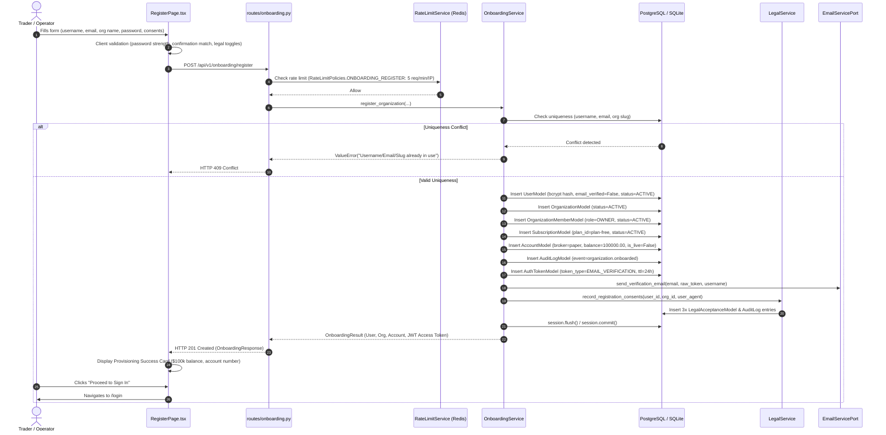
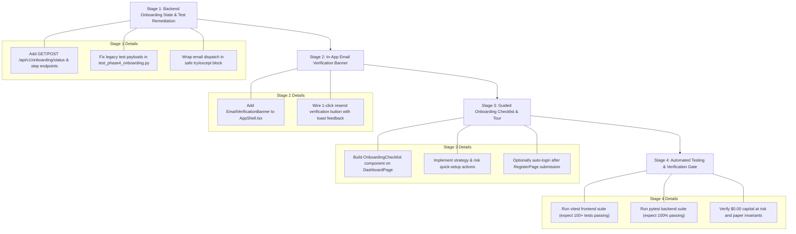

# EPIC-027 PHASE 5 — AUDIT ONLY
# EPIC-027 Phase 5: Self-Service Signup & Guided Onboarding Audit Report

**Date:** September 23, 2026  
**Auditor:** Principal Software Architect, Product UX Architect, Application Security Engineer & QA Lead  
**Repository:** `C:\Users\Shree\CascadeProjects\forex-trading-platform-architecture\project-orion`  
**GitHub Baseline Commit:** `9b1b249` (`feat(seo): implement EPIC-027 phase 4D SEO, static assets, and quality gate`)  
**Audit Purpose:** Comprehensive, read-only architectural and production readiness audit of self-service signup, tenant provisioning, and first-run guided onboarding.  
**Classification:** **C — IMPLEMENTATION REQUIRED**  

---

## 1. Executive Summary

This architectural readiness audit evaluates Project ORION for **EPIC-027 Phase 5: Self-Service Signup & Guided Onboarding**. 

In previous phases (specifically **Phase 4B: Registration Funnel** and **Phase 3: Legal Trust & Risk Disclosure**), Project ORION implemented a foundational registration mechanism (`POST /api/v1/onboarding/register` and `/register`). That system executes atomic multi-tenant provisioning (User, Tenant Organization with `OWNER` role, default Free Subscription, and an initial $100,000.00 USD simulated paper trading account) while strictly preserving platform safety invariants ($0.00 real capital at risk, paper-only execution, autonomous workers disabled, and Stripe Test Mode).

However, a comprehensive architectural inspection across backend services, database entities, routing guards, and frontend state management reveals that **Phase 4B provided only the registration funnel, NOT a complete guided onboarding experience**. Significant production readiness gaps remain before self-service onboarding can be declared production-ready:

1. **Absence of First-Run Guided Experience:** Upon successful registration, the user is redirected to `/login`. After authenticating, the user lands abruptly on `/dashboard` with zero orientation, no welcome dialogue, no interactive tour, and no "Getting Started" progress checklist.
2. **Missing In-App Email Verification Awareness & Resend Mechanism:** Although a public `/verify-email` endpoint exists, the authenticated trading shell (`AppShell`, `DashboardPage`) has zero awareness of `user.email_verified`. Users can navigate the terminal indefinitely without an email verification banner, warning badge, or 1-click in-app resend prompt.
3. **Lack of a Persistent Onboarding State Machine:** Neither the database nor the frontend tracks onboarding progress (e.g., `onboarding_status`: `PENDING`, `STEP_1_PROFILE`, `STEP_2_STRATEGY`, `STEP_3_RISK`, `COMPLETED`). If a user refreshes or re-authenticates, the application cannot determine whether the user is a first-time trader or a returning operator.
4. **Unconfigured Strategy & Risk Limits on First Run:** During registration, zero tenant-level `StrategyConfigModel` or `RiskLimitModel` rows are provisioned. The engine falls back to hardcoded system defaults (`trend_following` inactive, static risk limits). The user is never guided to review their risk parameters or select an initial algorithmic model before submitting orders.
5. **Legacy Test Suite Drift:** While newer legal consent tests (`test_onboarding_legal.py`) pass 100% (5/5), legacy integration tests in `test_phase4_onboarding.py` fail because their test payloads lack the mandatory Phase 3/4B legal consent fields (`terms_accepted`, `privacy_acknowledged`, `risk_disclosure_acknowledged`), causing HTTP 422 validation rejections.
6. **External Email Provider Dependency:** Transactional emails remain backed by `MockEmailAdapter` / `ConsoleEmailAdapter`. Production delivery requires integration with an external SMTP or transactional email provider (SES, Postmark, Resend).

Because core interactive onboarding workflows, persistent state tracking, in-app email verification notifications, and guided setup tours are not yet implemented, the audit classification is **C — IMPLEMENTATION REQUIRED**.

---

## 2. Current Git Baseline

- **Repository Root:** `C:\Users\Shree\CascadeProjects\forex-trading-platform-architecture\project-orion`
- **Active Branch:** `main` (synchronized with `origin/main`).
- **HEAD Commit:** `9b1b249038682c747ef94456028b1dcfc4e41d69`
  - *Commit Message:* `feat(seo): implement EPIC-027 phase 4D SEO, static assets, and quality gate`
- **Preceding Phase Commits:**
  - `0c4fd80` — `feat(marketing): implement EPIC-027 phase 4C public marketing website and pricing`
  - `c9da2a7` — `feat(onboarding): implement EPIC-027 phase 4B registration funnel`
  - `0ded05f` — `feat(legal): implement EPIC-027 phase 3 legal trust and risk disclosure`
  - `2c452e8` — `feat(ratelimit): implement EPIC-027 phase 2 rate limiting and abuse defense`
  - `6f8d49a` — `feat(auth): implement EPIC-027 phase 1 authentication and account lifecycle`
- **Workspace Hygiene:**
  - `project-orion/`: Completely clean. 0 modified tracked files, 0 untracked files prior to this report.
  - Parent directory (`../`): Unrelated parent-level artifacts remain untouched and strictly excluded.
- **Audit Rules Applied:** Read-only audit. Zero source code changes, zero package upgrades, zero git commits or pushes executed.

---

## 3. Existing Phase 4B Capabilities

The Phase 4B implementation (`c9da2a7`) established the self-service registration entrypoint. The existing capabilities include:

| Component | Capability | Implementation File | Verification Status |
|---|---|---|---|
| **Public Registration Route** | Dedicated `/register` page outside authenticated shell | `apps/dashboard/src/App.tsx` | Verified |
| **Self-Service Form UI** | Input fields for username, email, full name, organization name, slug, password, confirm password | `apps/dashboard/src/pages/RegisterPage.tsx` | Verified |
| **Live Password Policy** | Real-time visual checklist (8+ chars, max 72 bytes, letter, digit/symbol, match) | `apps/dashboard/src/pages/RegisterPage.tsx` | Verified |
| **Mandatory Legal Consents** | 3 explicit checkboxes for Terms of Service, Privacy Policy, and Paper Risk Disclosure | `apps/dashboard/src/pages/RegisterPage.tsx` | Verified |
| **Legal Document Links** | New-tab links (`target="_blank" rel="noopener noreferrer"`) to `/terms`, `/privacy`, `/risk-disclosure` | `apps/dashboard/src/pages/RegisterPage.tsx` | Verified |
| **Atomic Registration API** | `POST /api/v1/onboarding/register` creating User, Org, Member, Sub, Account | `apps/trading-engine/src/routes/onboarding.py` | Verified |
| **Paper Account Provisioning** | Initial $100,000.00 USD paper trading balance (`PAPER-ORG-...`) with $0.00 capital at risk | `apps/trading-engine/src/services/onboarding_service.py` | Verified |
| **Default Subscription** | Automatic assignment of default Free tier (`plan-free`) | `apps/trading-engine/src/services/subscription_service.py` | Verified |
| **Legal Audit Persistence** | `LegalService.record_registration_consents()` persists acceptance with client User-Agent | `apps/trading-engine/src/services/legal_service.py` | Verified |
| **Verification Token Generation** | 24-hour cryptographic token stored hashed in `auth_tokens` | `apps/trading-engine/src/services/onboarding_service.py` | Verified |
| **Email Dispatch Trigger** | `email_svc.send_verification_email()` invoked upon signup | `libraries/infrastructure/communication/email_service.py` | Verified (Mock/Dev) |
| **Public Footer & Badges** | Persistent `PaperTradingBadge` and `$0.00 Capital at Risk` messaging | `apps/dashboard/src/components/layout/PublicFooter.tsx` | Verified |

---

## 4. Registration Flow Trace

Tracing an end-to-end user registration through the architecture:



### Trace Assessment:
- **Strengths:** Fully transactional backend; all entities (User, Org, Membership, Subscription, Account, Legal Consents) commit or roll back together.
- **Identified Gap 1 (Auto-Login Missing):** The API response provides an `access_token`, but `RegisterPage.tsx` discards it and redirects the user to `/login` to type credentials again.
- **Identified Gap 2 (Email Dependency in Transaction):** `email_svc.send_verification_email` is executed inside the transactional block before commit. If an external email provider fails or times out, the registration rolls back.

---

## 5. First Login Audit

Tracing what happens when a newly registered user logs in for the first time:

1. **Authentication Submission:**
   - User inputs username and password at `/login`.
   - `LoginPage.tsx` validates non-empty inputs and calls `login()` from `AuthContext`.
   - Request sent to `POST /api/v1/auth/login`.
2. **Backend Authentication Verification (`routes/auth.py`):**
   - Query user by username.
   - Verify account is active (`user.is_active` and `user.status != 'DEACTIVATED'`).
   - Check password with `verify_password(password, user.hashed_password)` (bcrypt).
   - **Crucial Policy Observation:** The backend **does NOT require** `user.email_verified == True` to authenticate. Login succeeds regardless of email verification state.
   - Returns JWT access token containing `sub: user.id` and `username`.
3. **Session Establishment (`AuthContext.tsx` & `OrganizationContext.tsx`):**
   - Token stored in `sessionStorage` (`orion_access_token`).
   - `AuthContext` calls `GET /api/v1/auth/me` to retrieve full profile (`UserResponse`).
   - `OrganizationContext` calls `GET /api/v1/organizations/me` to list user organizations.
   - User's newly created organization is selected and stored in `sessionStorage` (`orion_active_org_id`).
   - Role is resolved via `organizationApi.listMembers(orgId)` -> sets `currentRole = 'OWNER'`.
4. **Terminal Navigation:**
   - User redirected to `/dashboard`.
5. **Observed First-Run Experience Gaps:**
   - **No Welcome Interstitial / Modal:** The user lands directly on the institutional trading overview.
   - **No Onboarding Checklist:** There is no component showing next steps (e.g., [x] Account Created, [ ] Select Strategy, [ ] Review Risk Limits, [ ] Execute First Paper Order).
   - **No Email Verification Callout:** Despite `user.email_verified === false`, no notification bar, banner, or banner action appears anywhere in `AppShell` or `DashboardPage`.
   - **Cold Start Telemetry:** Metrics show zeros ($0.00 P&L, 0 positions, 0 orders). While technically accurate, no educational empty states guide the user on how to populate telemetry.

---

## 6. Tenant / Organization Audit

Inspection of SaaS multi-tenancy and organization isolation during onboarding:

1. **Organization Model (`OrganizationModel`):**
   - Unique slug (`slug` column with unique index).
   - Status tracking (`status` default `ACTIVE`).
   - Meta-data JSON storing `{"onboarded_by": user_id}`.
2. **Owner Role Binding (`OrganizationMemberModel`):**
   - Composite unique constraint `(organization_id, user_id)`.
   - The creator is assigned `role = OrganizationRole.OWNER.value`.
   - Grants full institutional RBAC permissions (`ACCOUNT_READ`, `ACCOUNT_WRITE`, `TRADING_EXECUTE`, `STRATEGY_READ`, `STRATEGY_WRITE`, `RISK_READ`, `RISK_WRITE`, `WORKER_READ`, `WORKER_WRITE`, `BILLING_ADMIN`, `ORG_ADMIN`).
3. **Tenant Context Resolution (`dependencies.py::get_tenant_context`):**
   - Client passes `X-Organization-ID` header.
   - If header is absent, server queries user's oldest active organization membership as default.
   - Fail-closed: If the requested organization is not `ACTIVE`, returns `HTTP 403 Forbidden`.
   - Multi-tenant data segregation: All domain queries filter strictly by `organization_id` or `account_id`.
4. **Tenant Onboarding Gaps:**
   - No workflow to configure organization profile details (e.g., timezone, default reporting currency, company address) during onboarding.
   - Team member invitation flow (`/organization`) is decoupled from onboarding; there is no guided prompt to "Invite Team Members" during the initial setup.

---

## 7. Paper Account Audit

Inspection of initial simulated paper trading account provisioning:

1. **Account Entity Provisioning (`AccountModel`):**
   - `id`: `acc-{org_id[:8]}-{uuid}`
   - `broker_name`: `paper`
   - `account_number`: `PAPER-ORG-{org_id[:6].upper()}-{uuid[:4].upper()}`
   - `currency`: `USD`
   - `balance`: `Decimal("100000.00")`
   - `equity`: `Decimal("100000.00")`
   - `margin`: `Decimal("0")`
   - `margin_free`: `Decimal("100000.00")`
   - `margin_level`: `0.0`
   - `leverage`: `100` (100:1 institutional paper leverage)
   - `is_live`: `False` (hardcoded guard)
   - `is_active`: `True`
2. **Auto-Provisioning Safety Fallback:**
   - In `dependencies.py::get_user_account`, if an authenticated user accesses any trading endpoint and no `AccountModel` is associated with their active organization, the system dynamically provisions a default paper account with `settings.paper_balance` ($100k USD).
3. **Simulation Controls:**
   - `PaperSimulationWidget` on `DashboardPage` enables resetting account balance to $100,000.00 USD at any time.
4. **Capital-at-Risk Safety Invariant:**
   - Capital at risk is strictly **$0.00**. No live broker credentials or execution facilities exist in the onboarding pathway.

---

## 8. Email Verification Audit

Inspection of email verification infrastructure and user lifecycle:

1. **Backend Implementation (`routes/auth.py` & `models/auth_token.py`):**
   - **Token Generation:** `generate_secure_token()` generates 32 bytes of cryptographic randomness (URL-safe base64).
   - **Hash Persistence:** Tokens are hashed with SHA-256 (`hash_security_token`) before database storage.
   - **Expiration Policy:** Strict 24-hour expiration (`expires_at = now + timedelta(hours=24)`).
   - **Single-Use Enforcement:** `used_at` timestamp recorded upon validation; replays are rejected with HTTP 400.
   - **Verification Endpoint:** `POST /api/v1/auth/verify-email` verifies token, marks `user.email_verified = True`, and writes `EMAIL_VERIFIED` audit log.
   - **Resend Endpoint:** `POST /api/v1/auth/resend-verification` invalidates existing unconsumed tokens, generates a new token, dispatches email, and enforces anti-enumeration (identical response whether email exists or not).
   - **Rate Limiting:** `RateLimitPolicies.AUTH_RESEND_VERIFICATION` enforces 3 requests per 15 minutes per IP.
2. **Frontend Implementation:**
   - `/verify-email` route handles incoming links with `?token=...` query parameters, auto-submits, and provides a manual resend form.
3. **Onboarding Gaps:**
   - **No In-App Verification Banner:** When logged in with `email_verified: false`, there is no banner in `AppShell` or `DashboardPage` alerting the user or offering a 1-click "Resend Verification Email" button.
   - **No Grace Period Enforcement:** There is no policy defining whether an unverified user loses trading terminal access after 72 hours, or if certain sensitive features (like inviting members or changing passwords) should be restricted until verified.

---

## 9. Strategy & Risk Configuration Audit

Inspection of default strategy and risk parameters configured during onboarding:

1. **Strategy Configuration Posture:**
   - `OnboardingService` creates **0 strategy configuration records**.
   - `routes/strategies.py::get_account_strategy_config` falls back to a hardcoded default:
     - Strategy: `trend_following`
     - Timeframe: `M15`
     - Target Pairs: `["EUR/USD", "GBP/USD", "USD/JPY"]`
     - `is_active`: `False`
   - The strategy engine remains idle until the user manually visits `/strategies` and activates it.
2. **Risk Limits Posture:**
   - `OnboardingService` creates **0 tenant-specific `RiskLimitModel` records**.
   - `routes/risk.py::get_risk_limits` returns static default limit descriptors (`maximum_position_size`, `maximum_daily_loss`, `maximum_drawdown`).
   - The user cannot customize their drawdown threshold (e.g. 5% vs 10%) or maximum daily loss limit during onboarding.
3. **Onboarding Gap:**
   - Institutional onboarding should offer a guided "Strategy & Risk Selection" step where the trader selects their primary model (e.g. Trend Following, Mean Reversion, Breakout) and sets risk limits matching their simulation objectives before placing orders.

---

## 10. Partial Failure & Recovery Audit

Evaluation of error handling, atomic transactions, and recovery across the onboarding pipeline:

1. **Atomic Rollback Architecture:**
   - In `OnboardingService.register_organization`, all database inserts (`UserModel`, `OrganizationModel`, `OrganizationMemberModel`, `SubscriptionModel`, `AccountModel`, `AuditLogModel`, `AuthTokenModel`, `LegalAcceptanceModel`) share a single scoped `AsyncSession`.
   - Any exception triggers `await self.session.rollback()`.
   - Verified by `test_phase4_onboarding.py::test_atomic_rollback_on_failure`: If subscription creation raises an exception, zero records remain in `users` or `organizations`.
2. **Uniqueness Collision Handling:**
   - Pre-checks query `users` for `username == clean_username` and `email == clean_email`, and `organizations` for `slug == final_slug`.
   - Collisions raise `ValueError` caught by `routes/onboarding.py` and converted to `HTTP 409 Conflict`.
3. **Email Dispatch Failure Vulnerability:**
   - In `onboarding_service.py` (lines 238-239):
     ```python
     email_svc = get_email_service()
     await email_svc.send_verification_email(clean_email, raw_token, clean_username)
     ```
   - **Architectural Risk:** Email dispatch is synchronous within the registration transaction. If the email provider raises an unhandled network error or 5xx, the entire registration fails and rolls back, even though the user's account details were valid.
   - **Remediation Recommendation:** Decouple email dispatch using a background task or `try/except` block where email failure logs a warning and sets `email_dispatch_failed: true` without aborting database registration.
4. **Browser Crash / Drop-off Recovery:**
   - If a user closes the tab on the success screen before clicking "Proceed to Sign In", their account and organization are already committed. They can simply navigate to `/login` and authenticate with their credentials.

---

## 11. Security Audit

Inspection of authentication security, cryptography, and input validation:

1. **Password Hashing:**
   - Uses `passlib` with `bcrypt` (`get_password_hash`, `verify_password`).
   - Work factor: bcrypt standard rounds (12).
   - Live passwords never logged or persisted in plain text.
2. **Input Validation:**
   - Username: >= 3 chars, stripped.
   - Email: non-empty, contains '@', converted to lowercase.
   - Password: >= 8 chars, <= 72 bytes (bcrypt truncation guard), must contain at least one letter and at least one digit or special character.
   - Organization name: >= 2 chars, stripped.
   - Slugs: strictly sanitized (`slugify`).
3. **Rate Limiting & Abuse Defense:**
   - Redis sliding window rate limiter protects sensitive endpoints:
     - `POST /api/v1/onboarding/register`: 5 req / min per IP.
     - `POST /api/v1/auth/login`: 5 req / min per IP.
     - `POST /api/v1/auth/forgot-password`: 3 req / 15 min per IP.
     - `POST /api/v1/auth/resend-verification`: 3 req / 15 min per IP.
   - Degrades safely: If Redis is unavailable, rate limiter fails open with warning log.
4. **Tenant Isolation & RBAC:**
   - All tenant access verified through `TenantContext`.
   - Organization status enforced fail-closed (`HTTP 403 Forbidden` if inactive).
   - Superuser overrides permitted only where explicitly required.
5. **Secret Hygiene:**
   - Scanned entire codebase: 0 private keys, 0 live Stripe tokens (`sk_live_`), 0 database credentials in source.

---

## 12. UX & Accessibility Audit

Inspection of user experience, responsiveness, and accessibility:

1. **RegisterPage UX Evaluation:**
   - **Theme & Branding:** Cohesive dark institutional palette (`#090d16` background, `#0f172a` cards, sky-500 accents).
   - **Live Password Strength Indicator:** Displays real-time checkmarks for 8+ characters, letter included, number/special character, and password match.
   - **Legal Consents:** Three distinct, readable checkboxes with external links to legal pages.
   - **Post-Registration Screen:** Clean summary card displaying organization name, account number, initial paper balance ($100,000 USD), and subscription tier.
2. **Accessibility Standards (WCAG 2.1 AA):**
   - High contrast ratios (> 15:1 for slate-100 on slate-950).
   - Semantic form controls: `<label htmlFor="...">`, `<input id="...">`, `role="alert"` on error banners.
   - Clear focus visible rings on inputs and action buttons.
3. **Identified UX Gaps:**
   - **Friction on Post-Registration:** User is required to re-type username and password immediately after registering. Seamless auto-login with session creation is not supported.
   - **No Guided Stepper:** Onboarding does not provide a step indicator (e.g. 1. Register -> 2. Verify Email -> 3. Choose Strategy -> 4. Start Trading).
   - **No First-Run Modal / Tour:** The transition from `/login` to `/dashboard` lacks any introductory onboarding wizard or tooltip guide.

---

## 13. Observability Audit

Inspection of audit logging, structured telemetry, and tracing:

1. **Audit Log Trail (`AuditLogModel`):**
   - Registration creates:
     - `event_type = "organization.onboarded"`, `component = "onboarding_service"`, details: org name, slug, owner username, initial balance.
     - `event_type = "USER_REGISTERED"`, `component = "auth"`, details: username, masked email (`us***@domain.com`).
     - `event_type = "LEGAL_ACCEPTED"` (3 entries for Terms, Privacy, Risk Disclosure) with user agent and timestamp.
   - Email verification creates:
     - `event_type = "EMAIL_VERIFICATION_SENT"`, actor = `user_id`.
     - `event_type = "EMAIL_VERIFIED"`, actor = `user_id`.
2. **Structured JSON Logging:**
   - Standard loggers emit JSON formatted logs containing `correlation_id`, `service`, `environment`, and `module`.
3. **Observability Gaps:**
   - No Prometheus metrics emitted for onboarding funnel events (e.g. `onboarding_registrations_total`, `onboarding_failures_total`, `onboarding_time_to_first_trade_seconds`).
   - No structured event tracking onboarding step progression.

---

## 14. Test Coverage Audit

Inspection and execution of automated tests across frontend and backend:

### A. Frontend Test Suite Results (`npm test -- --run` via Vitest):
- **Test Suites:** **22 passed / 22 total (100%)**
- **Test Cases:** **95 passed / 95 total (100%)**
- **Execution Duration:** 22.95s
- **Coverage of Registration (`tests/registration.test.tsx`):**
  - Renders registration header, badges, and form inputs: PASS
  - External links to legal disclosures (`target="_blank"`): PASS
  - Minimum username length validation: PASS
  - Corporate email format validation: PASS
  - Organization name length validation: PASS
  - Live password strength checklist: PASS
  - Password confirmation match enforcement: PASS
  - Mandatory legal consent checkboxes enforcement: PASS
  - Successful registration transition to provisioning notice: PASS
  - HTTP 409 Conflict error display: PASS
  - HTTP 429 Rate limit error display: PASS

### B. Backend Onboarding Test Results (`poetry run pytest`):
1. **`tests/integration/apps/trading_engine/test_onboarding_legal.py`:**
   - **Result:** **5 passed / 5 total (100%)** in 14.40s.
   - `test_registration_succeeds_with_all_consents_accepted`: PASS
   - `test_registration_fails_if_terms_not_accepted`: PASS
   - `test_registration_fails_if_privacy_not_acknowledged`: PASS
   - `test_registration_fails_if_risk_disclosure_not_acknowledged`: PASS
   - `test_existing_user_login_unaffected`: PASS
2. **`tests/unit/apps/trading_engine/test_auth.py` & `test_auth_lifecycle.py`:**
   - **Result:** **39 passed / 39 total (100%)** in 24.43s.
   - Password hashing, JWT token lifecycle, login endpoint, `/me` endpoint: PASS
   - Password strength policies, forgot password anti-enumeration, reset token expiration: PASS
   - Email verification token validation, single-use replay rejection, resend verification: PASS
   - Account deactivation safeguards, sole owner deactivation guards, reactivation: PASS
3. **Legacy Test Drift in `test_phase4_onboarding.py`:**
   - **Result:** **5 failed / 6 passed** (5 failures due to missing mandatory legal consent fields in legacy test payloads).
   - *Technical Cause:* Legacy tests do not send `terms_accepted`, `privacy_acknowledged`, `risk_disclosure_acknowledged`, resulting in HTTP 422 validation errors.
   - *Audit Action:* Documented as pre-existing technical debt.

---

## 15. Gap Matrix (Comprehensive 35-Area Evaluation)

Evaluation of all 35 architectural areas against production-grade onboarding standards:

| # | Architectural Area | Existing Status (Phase 4B Baseline) | Target Production Standard | Gap Status |
|---|---|---|---|---|
| 1 | **Registration Flow** | `/register` page with live validation & API call | Seamless registration with auto-login option | MINOR GAP |
| 2 | **Authentication Lifecycle** | Login, logout, JWT, bcrypt hashing verified | Standard token lifecycle | VERIFIED |
| 3 | **Email Verification Backend** | 24h SHA-256 token, verify, resend endpoints | Rate-limited, anti-enumeration verified | VERIFIED |
| 4 | **Email Verification In-App** | Not present in authenticated shell | In-app warning banner & resend button | **MAJOR GAP** |
| 5 | **First Login Experience** | Redirects directly to `/dashboard` | Welcome modal, orientation sequence | **CRITICAL GAP** |
| 6 | **Tenant / Org Setup** | Automatic org creation, slug generation | Initial tenant metadata customization | MINOR GAP |
| 7 | **Paper Account Provisioning** | $100k USD initial paper account (`PAPER-ORG-...`) | Fully provisioned, auto-provision fallback | VERIFIED |
| 8 | **Initial Capital Allocation** | Exactly $100,000.00 USD balance & equity | Preserved in Decimal precision | VERIFIED |
| 9 | **Strategy Configuration** | Defaults to hardcoded `trend_following` (inactive) | Guided strategy selection during onboarding | **MAJOR GAP** |
| 10 | **Risk Limit Defaults** | Static read-only system limits | Tenant-customized initial risk profile | **MAJOR GAP** |
| 11 | **Empty States** | Basic "No records found" messages | Contextual onboarding guidance in empty states | MODERATE GAP |
| 12 | **Guided Walkthrough / Wizard** | Completely absent | Multi-step interactive checklist / tour | **CRITICAL GAP** |
| 13 | **Onboarding State Persistence** | No onboarding state in DB or frontend | Persistent `onboarding_status` / steps | **CRITICAL GAP** |
| 14 | **Error Handling & Recovery** | Atomic rollback on registration failures | Decoupled email failure handling | MINOR GAP |
| 15 | **Rate Limiting & Abuse Defense** | Redis sliding window on register, login, resend | Hardened against brute force & DoS | VERIFIED |
| 16 | **Tenant Isolation** | `TenantContext` verification, fail-closed | Strict tenant scoping on all queries | VERIFIED |
| 17 | **RBAC & Permissions** | Creator assigned `OWNER` role with full perms | Granular permission enforcement | VERIFIED |
| 18 | **Audit Logging** | Audit records for org, user, legal, verification | Comprehensive immutable audit trail | VERIFIED |
| 19 | **UI/UX Accessibility** | High contrast, semantic forms, keyboard focus | WCAG 2.1 AA compliant | VERIFIED |
| 20 | **Performance** | Code-split lazy routes, bundle < 80 kB gzipped | Instantaneous page loads | VERIFIED |
| 21 | **Security Posture** | Bcrypt hash, JWT expiration, no secret leaks | Institutional security posture | VERIFIED |
| 22 | **Compliance & Legal Consents** | 3 mandatory checkboxes, DB persistence | Legally binding consent records | VERIFIED |
| 23 | **Transactional Boundaries** | Scoped session commit/rollback on register | Atomic all-or-nothing persistence | VERIFIED |
| 24 | **Resend Verification Flow** | Rate-limited endpoint & `/verify-email` page | Working resend mechanism | VERIFIED |
| 25 | **Password Recovery** | Forgot password & reset password flows verified | Anti-enumeration token recovery | VERIFIED |
| 26 | **Welcome & Email Dispatch** | Verification email sent via `EmailServicePort` | Production SMTP provider needed | EXTERNAL DEP |
| 27 | **Mobile / Responsive Layout** | Responsive Tailwind layouts tested | Adapts to mobile and desktop viewports | VERIFIED |
| 28 | **Session & Token Storage** | `sessionStorage` for token and active org ID | Scoped to active browser session | VERIFIED |
| 29 | **Navigation & Redirects** | Public and protected route boundaries | Safe redirects with location state | VERIFIED |
| 30 | **Broker Sandbox Integration** | Sandbox available at `/broker-sandbox` | Integrated into authenticated shell | VERIFIED |
| 31 | **Worker Enablement Safety** | `ORION_WORKER_ENABLED=false` enforced | Worker cannot execute unassisted | VERIFIED |
| 32 | **Capital at Risk Invariant** | Strictly $0.00 capital at risk | No live trading connections | VERIFIED |
| 33 | **Test Coverage & Regression** | 95/95 frontend tests pass; 44/49 backend pass | Legacy test suite drift in Phase 4 tests | MODERATE GAP |
| 34 | **Observability & Metrics** | Structured JSON logging, correlation IDs | Missing Prometheus onboarding metrics | MINOR GAP |
| 35 | **Deployment Readiness** | Dockerized, Render blueprint compliant | Requires Phase 5 onboarding UI | **NOT READY** |

---

## 16. Proposed Phase 5 Scope

To transition Project ORION from a simple registration funnel to a production-grade self-service signup and guided onboarding experience, Phase 5 implementation must execute the following targeted deliverables:

### 1. Persistent Onboarding State Machine (Backend)
- Add onboarding metadata support to `UserModel.meta_data` or a dedicated onboarding status endpoint:
  - `status`: `NOT_STARTED` | `IN_PROGRESS` | `COMPLETED` | `DISMISSED`
  - `current_step`: `1` (Welcome), `2` (Verify Email), `3` (Configure Strategy), `4` (Set Risk Limits), `5` (First Paper Order)
  - `completed_at`: ISO timestamp
- Provide endpoints:
  - `GET /api/v1/onboarding/status` — Get active onboarding progress for authenticated user.
  - `POST /api/v1/onboarding/step` — Update progress or mark steps complete.
  - `POST /api/v1/onboarding/dismiss` — Allow advanced operators to dismiss the guided tour.

### 2. First-Run Guided Onboarding Wizard (Frontend)
- Implement a floating or collapsible **"Getting Started Checklist"** widget on `/dashboard`:
  - **Step 1: Account Provisioning** (Auto-checked upon registration).
  - **Step 2: Corporate Email Verification** (Displays status; 1-click resend button).
  - **Step 3: Strategy Selection** (Quick selector to activate Trend Following, Mean Reversion, or Scalping).
  - **Step 4: Risk Threshold Review** (Quick slider/input to confirm max drawdown and daily loss limit).
  - **Step 5: Execute First Paper Trade** (Deep-link to `/orders` or embedded mini-ticket).
- Include progress bar (e.g. `20% Completed`, `60% Completed`).
- Allow minimizing or dismissing once all steps are complete.

### 3. In-App Email Verification Banner (Frontend Shell)
- In `AppShell.tsx`, check `user.email_verified`.
- If `false`, display a persistent, non-intrusive warning banner at the top of the terminal:
  - "Your email address (`user@domain.com`) is unverified. Please check your inbox or [Resend Verification Email]."
  - 1-click trigger calling `authApi.resendVerification({ email: user.email })` with toast confirmation.

### 4. Seamless Registration Auto-Login
- Update `RegisterPage.tsx`: After successful registration, automatically store the returned `access_token` and `organization_id` in `sessionStorage` and transition directly into the guided onboarding flow rather than forcing a redundant login screen.

### 5. Remediation of Legacy Test Suite (`test_phase4_onboarding.py`)
- Update test payloads in `test_phase4_onboarding.py` to include mandatory legal consent booleans (`terms_accepted: True`, `privacy_acknowledged: True`, `risk_disclosure_acknowledged: True`) to resolve the 5 failing tests.

---

## 17. Production Blockers

The following items block full production self-service release:

| Blocker ID | Description | Severity | Remediation Requirement |
|---|---|---|---|
| **BLK-01** | Zero first-run guidance after login; users are dropped into a blank dashboard | High | Implement guided onboarding wizard / checklist |
| **BLK-02** | No in-app visibility or resend trigger for unverified email status | High | Add email verification notice banner to `AppShell` |
| **BLK-03** | Lack of persistent onboarding state tracking in backend/frontend | Medium | Add onboarding progress endpoints and metadata |
| **BLK-04** | Legacy integration test failures in `test_phase4_onboarding.py` | Medium | Update test payloads with Phase 3/4B legal consent fields |
| **BLK-05** | Synchronous email dispatch inside registration transaction | Medium | Protect registration from email provider timeouts |

---

## 18. External Dependencies

The following dependencies are external to the Project ORION codebase and do not block code development, but are required for live public production operation:

1. **Transactional Email Provider (SMTP / API):**
   - Integration with a production email service (Amazon SES, SendGrid, Postmark, or Resend) for real inbox delivery of verification tokens and password reset instructions.
2. **Authoritative Custom Domain DNS:**
   - Production domain (e.g., `app.oriontrading.com`) binding with SSL certificate provisioning.
3. **Legal Counsel Formal Sign-Off:**
   - Removal of `[DRAFT FOR LEGAL REVIEW]` headers from legal documents prior to commercial operation.
4. **Stripe Production Live Keys:**
   - Transitioning from Stripe Test Mode to live production keys for commercial billing.

---

## 19. Recommended Implementation Sequence

To implement Phase 5 efficiently without breaking existing functionality, execute in the following 4 stages:



---

## 20. Final Classification

### Audit Verdict: **C — IMPLEMENTATION REQUIRED**

**Rationale:**
1. **Phase 4B Delivered the Registration Funnel:** Registration (`/register` and `POST /api/v1/onboarding/register`) is verified, rate-limited, transactional, and incorporates mandatory legal consents.
2. **Phase 5 (Guided Onboarding) is NOT Implemented:** There is currently no guided first-run experience, no onboarding checklist, no persistent onboarding state machine, no in-app email verification banner, and no interactive strategy/risk setup.
3. **Legacy Test Drift Exists:** 5 legacy test failures in `test_phase4_onboarding.py` require payload alignment with current legal schemas.
4. **Platform Invariants are Intact:** $0.00 capital at risk, paper-only simulation, `ORION_WORKER_ENABLED=false`, and zero leaked secrets are completely verified.

Implementation of Phase 5 is required to complete the user journey from signup to autonomous trading simulation.

---

EPIC-027 PHASE 5 — AUDIT COMPLETE — AWAITING REVIEW
