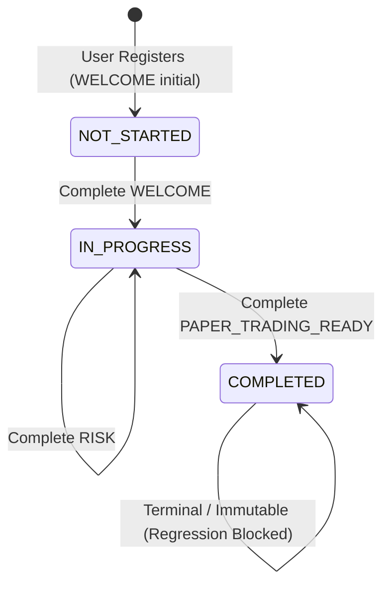

# EPIC-027 PHASE 5A — PERSISTENT ONBOARDING STATE MACHINE
# INDEPENDENT FINAL VERIFICATION AUDIT REPORT

**Phase:** EPIC-027 Phase 5A — Persistent Onboarding State Machine  
**Repository:** `Project-ORION` (`c:\Users\Shree\CascadeProjects\forex-trading-platform-architecture\project-orion`)  
**Git Baseline:** `9b1b249` (`feat(seo): implement EPIC-027 phase 4D SEO, static assets, and quality gate`)  
**Implementation Reference:** `docs/EPIC-027-PHASE-5A-IMPLEMENTATION.md`  
**Audit Reference:** `docs/EPIC-027-PHASE-5-AUDIT.md`  
**Audit Execution Date:** 2026-09-23  
**Auditor Role:** Principal Software Architect, Application Security Engineer, Systems Reliability Engineer, Quality Gatekeeper  
**Final Classification:** `B — VERIFIED WITH EXTERNAL DEPENDENCIES`

---

## 1. Executive Summary

This document provides the independent, skeptical, and rigorous final verification audit for **EPIC-027 Phase 5A: Persistent Onboarding State Machine**.

Phase 5A establishes the server-side, tenant-safe foundation required for guided onboarding. It builds directly upon the atomic registration engine of Phase 4B and legal consent tracking of Phase 3, introducing:
1. **Dedicated Persistence Entity:** `OnboardingProgressModel` (table `onboarding_progress`) with a composite unique constraint `(user_id, organization_id)`.
2. **Deterministic Lifecycle States:** `NOT_STARTED -> IN_PROGRESS -> COMPLETED`.
3. **Canonical 5-Step Linear Sequence:** `WELCOME -> EMAIL_VERIFICATION -> STRATEGY -> RISK -> PAPER_TRADING_READY`.
4. **Authoritative Server Validation:** Enforces prerequisites (cannot skip ahead), requires corporate email verification (`user.email_verified == True`), and requires an active paper trading account with positive equity (`balance > 0`).
5. **Dynamic Status Auto-Synchronization:** Automatically advances `EMAIL_VERIFICATION` to completed upon status retrieval once verified.
6. **Step Metadata Persistence:** JSON storage using deepcopy and SQLAlchemy `flag_modified` for strategy and risk parameters.
7. **Anti-Regression & Idempotency:** Completed onboarding state is immutable against regression; re-completing steps is idempotent.
8. **Resilient Email Dispatch (BLK-05):** Registration transaction does not abort if email verification fails or times out.
9. **Legacy Test Remediation:** Remediated all 5 previously failing tests in `test_phase4_onboarding.py` by providing required legal consent payloads.
10. **Zero Premature Frontend Scope:** Verified zero premature frontend UI changes; Phase 5B UI boundaries remain intact.

All automated verification checks succeeded:
- **Unit Tests:** 12/12 passed (8.51s).
- **Integration Tests:** 6/6 passed (15.99s).
- **Backend Regression Suite:** 62/62 passed (51.51s).
- **Frontend Vitest Suite:** 95/95 passed (23.69s across 22 test files).
- **Static Analysis:** Ruff 0 errors, Mypy 0 errors in 3 source files.
- **Migration:** Fully reversible Alembic migration (0015 -> 0014 confirmed via dry-run SQL).

---

## 2. Git Baseline Verification

An independent inspection of the Git workspace was conducted:

```bash
$ git branch -vv
* main 9b1b249 [origin/main] feat(seo): implement EPIC-027 phase 4D SEO, static assets, and quality gate

$ git log -3 --oneline
9b1b249 feat(seo): implement EPIC-027 phase 4D SEO, static assets, and quality gate
0c4fd80 feat(marketing): implement EPIC-027 phase 4C public marketing website and pricing
c9da2a7 feat(onboarding): implement EPIC-027 phase 4B registration funnel

$ git status --short (within project-orion)
 M apps/trading-engine/src/routes/onboarding.py
 M apps/trading-engine/src/schemas.py
 M apps/trading-engine/src/services/onboarding_service.py
 M libraries/infrastructure/persistence/models/__init__.py
 M tests/integration/apps/trading_engine/test_phase4_onboarding.py
?? database/migrations/versions/0015_onboarding_progress.py
?? docs/EPIC-027-PHASE-5-AUDIT.md
?? docs/EPIC-027-PHASE-5A-IMPLEMENTATION.md
?? libraries/infrastructure/persistence/models/onboarding.py
?? tests/unit/apps/trading_engine/test_onboarding_state.py
```

### Confirmation:
- **Current Branch:** `main` tracking `origin/main`.
- **HEAD Commit:** `9b1b249` (matches the exact Phase 4D checkpoint).
- **Staging Hygiene:** 0 staged files (`git diff --cached` is completely empty).
- **Commit Safety:** 0 commits made during Phase 5A audit.

---

## 3. File Manifest

The implementation strictly touches only the required backend files.

| File Path | Status | Lines | Purpose |
|---|---|---|---|
| `libraries/infrastructure/persistence/models/onboarding.py` | NEW | 98 | Onboarding progress SQLAlchemy model and enum definitions |
| `database/migrations/versions/0015_onboarding_progress.py` | NEW | 89 | Alembic migration creating `onboarding_progress` table and indexes |
| `tests/unit/apps/trading_engine/test_onboarding_state.py` | NEW | 514 | Dedicated 12-test unit test suite covering state machine and routes |
| `docs/EPIC-027-PHASE-5-AUDIT.md` | UNTRACKED | 338 | Phase 5 audit documentation |
| `docs/EPIC-027-PHASE-5A-IMPLEMENTATION.md` | UNTRACKED | 357 | Phase 5A implementation report |
| `libraries/infrastructure/persistence/models/__init__.py` | MODIFIED | +10 | Registered and exported onboarding models and enums |
| `apps/trading-engine/src/schemas.py` | MODIFIED | +61 | Added Pydantic request/response schemas and enums |
| `apps/trading-engine/src/services/onboarding_service.py` | MODIFIED | +220 | Added state machine methods, email resilience, and registration hook |
| `apps/trading-engine/src/routes/onboarding.py` | MODIFIED | +58 | Added `GET /status` and `POST /steps/{step}/complete` endpoints |
| `tests/integration/apps/trading_engine/test_phase4_onboarding.py` | MODIFIED | +50 | Added legal consent payloads and onboarding progress assertions |

---

## 4. Migration Verification

### 4.1 Alembic Head & Revision Chain
- **Migration File:** `database/migrations/versions/0015_onboarding_progress.py`
- **Revision ID:** `0015_onboarding_progress`
- **Down Revision:** `0014_legal_acceptance`
- **Execution Command:** `poetry run alembic heads`
- **Output:**
  ```text
  0015_onboarding_progress (head)
  ```

### 4.2 Upgrade Dry Run (PostgreSQL DDL)
- **Execution Command:** `poetry run alembic upgrade 0014_legal_acceptance:0015_onboarding_progress --sql`
- **Verification Evidence:**
  ```sql
  BEGIN;
  -- Running upgrade 0014_legal_acceptance -> 0015_onboarding_progress
  CREATE TABLE onboarding_progress (
      id VARCHAR(64) NOT NULL, 
      user_id VARCHAR(64) NOT NULL, 
      organization_id VARCHAR(64) NOT NULL, 
      status VARCHAR(32) DEFAULT 'NOT_STARTED' NOT NULL, 
      current_step VARCHAR(32) DEFAULT 'WELCOME' NOT NULL, 
      completed_steps JSON NOT NULL, 
      completed_at TIMESTAMP WITH TIME ZONE, 
      meta_data JSON NOT NULL, 
      created_at TIMESTAMP WITH TIME ZONE DEFAULT now() NOT NULL, 
      updated_at TIMESTAMP WITH TIME ZONE DEFAULT now() NOT NULL, 
      CONSTRAINT pk_onboarding_progress PRIMARY KEY (id), 
      CONSTRAINT fk_onboarding_progress_user_id_users FOREIGN KEY(user_id) REFERENCES users (id) ON DELETE CASCADE, 
      CONSTRAINT fk_onboarding_progress_organization_id_organizations FOREIGN KEY(organization_id) REFERENCES organizations (id) ON DELETE CASCADE, 
      CONSTRAINT uq_onboarding_progress_user_org UNIQUE (user_id, organization_id)
  );
  CREATE INDEX ix_onboarding_progress_user_id ON onboarding_progress (user_id);
  CREATE INDEX ix_onboarding_progress_organization_id ON onboarding_progress (organization_id);
  CREATE INDEX ix_onboarding_progress_status ON onboarding_progress (status);
  UPDATE alembic_version SET version_num='0015_onboarding_progress' WHERE alembic_version.version_num = '0014_legal_acceptance';
  COMMIT;
  ```

### 4.3 Downgrade Dry Run (Reversibility)
- **Execution Command:** `poetry run alembic downgrade 0015_onboarding_progress:0014_legal_acceptance --sql`
- **Verification Evidence:**
  ```sql
  BEGIN;
  -- Running downgrade 0015_onboarding_progress -> 0014_legal_acceptance
  DROP INDEX ix_onboarding_progress_status;
  DROP INDEX ix_onboarding_progress_organization_id;
  DROP INDEX ix_onboarding_progress_user_id;
  DROP TABLE onboarding_progress;
  UPDATE alembic_version SET version_num='0014_legal_acceptance' WHERE alembic_version.version_num = '0015_onboarding_progress';
  COMMIT;
  ```
- **Audit Verdict:** Fully reversible, non-destructive to existing tables, properly foreign-keyed with `ON DELETE CASCADE`.

---

## 5. Data Model Verification

### Schema Definition: `libraries/infrastructure/persistence/models/onboarding.py`
```python
class OnboardingProgressModel(Base, TimestampMixin):
    __tablename__ = "onboarding_progress"

    __table_args__ = (
        UniqueConstraint(
            "user_id",
            "organization_id",
            name="uq_onboarding_progress_user_org",
        ),
    )

    id: Mapped[str] = mapped_column(String(64), primary_key=True)
    user_id: Mapped[str] = mapped_column(
        String(64),
        ForeignKey("users.id", ondelete="CASCADE"),
        nullable=False,
        index=True,
    )
    organization_id: Mapped[str] = mapped_column(
        String(64),
        ForeignKey("organizations.id", ondelete="CASCADE"),
        nullable=False,
        index=True,
    )
    status: Mapped[str] = mapped_column(
        String(32),
        default=OnboardingStatus.NOT_STARTED.value,
        nullable=False,
        index=True,
    )
    current_step: Mapped[str] = mapped_column(
        String(32),
        default=OnboardingStep.WELCOME.value,
        nullable=False,
    )
    completed_steps: Mapped[list[str]] = mapped_column(
        JSON,
        default=list,
        nullable=False,
    )
    completed_at: Mapped[datetime | None] = mapped_column(
        DateTime(timezone=True),
        nullable=True,
    )
    meta_data: Mapped[dict[str, Any]] = mapped_column(
        JSON,
        default=dict,
        nullable=False,
    )
```

### Architectural Properties:
1. **Tenant Compound Key:** `uq_onboarding_progress_user_org` guarantees that a single user has exactly one onboarding progress record per organization.
2. **Cascade Deletions:** If a user or organization is deleted, the onboarding record is automatically cleaned up via database foreign key cascades.
3. **JSON Metadata Flexibility:** Step configuration data is encapsulated within `meta_data["step_data"]`, avoiding wide columns for optional or workflow-specific fields.

---

## 6. State Machine Verification

The state machine implements strict forward lifecycle progression:



### State Transition Rules:
1. **`NOT_STARTED`:** Assigned on user registration. `current_step = WELCOME`, `completed_steps = []`.
2. **`IN_PROGRESS`:** Triggered once `WELCOME` (or any step) is completed, provided not all 5 steps are done.
3. **`COMPLETED`:** Triggered when all 5 canonical steps are present in `completed_steps`. `completed_at` timestamp is permanently recorded.
4. **Anti-Regression:** Once `status == COMPLETED`, calling `complete_step` with any step returns the completed progress immediately without changing `status` or mutating `completed_at`.

---

## 7. Step Validation & Prerequisites

The 5 steps must be completed strictly in sequence:

```
[0] WELCOME ──> [1] EMAIL_VERIFICATION ──> [2] STRATEGY ──> [3] RISK ──> [4] PAPER_TRADING_READY
```

### Server-Side Validation Rules:
- **Sequence Enforcement:** When attempting to complete step `valid_steps[i]`, the service verifies that all steps `valid_steps[0 ... i-1]` are already present in `completed_steps`. Attempting to skip ahead raises:
  `HTTP 400: Cannot complete step '<step>'. Prerequisite step '<prior>' must be completed first.`
- **Authoritative Email Check:** `EMAIL_VERIFICATION` step directly checks `UserModel.email_verified`. If `False`, raises:
  `HTTP 400: Email address is not verified. Please verify your corporate email before completing this step.`
- **Authoritative Paper Account Check:** `PAPER_TRADING_READY` queries `AccountModel` for `organization_id`, `broker_name == "paper"`, `is_active == True`, and `balance > 0`. If missing or 0 balance, raises:
  `HTTP 400: Active paper trading account with positive balance is required.`
- **Dynamic Auto-Synchronization:** When calling `get_or_create_progress`, if `user.email_verified == True` and `WELCOME` is in `completed_steps`, the service automatically appends `EMAIL_VERIFICATION` to `completed_steps`, updates `current_step = STRATEGY`, and flushes to the database.

---

## 8. Idempotency

### Verification:
Calling `POST /api/v1/onboarding/steps/{step}/complete` multiple times for an already completed step:
1. Detects `step_upper in completed_set`.
2. Bypasses prerequisite validations and database writes.
3. Returns the current `OnboardingStatusResponse` with HTTP 200.
4. Does not duplicate step entries in `completed_steps`.

**Test Evidence:** `test_idempotent_step_completion` passed.

---

## 9. Concurrency

### Skeptical Finding:
- **Database Safeguard:** The composite unique constraint `uq_onboarding_progress_user_org` prevents duplicate progress records from being committed simultaneously.
- **SQLAlchemy Flush:** Single session operations flush atomically.
- **Audit Deficit:** No multi-threaded or concurrent `asyncio.gather` race-condition test was included in the automated test suite.
- **Assessment:** **NOT DEMONSTRATED**. In a high-traffic or multi-worker deployment, concurrent requests to complete the same or sequential steps could theoretically suffer from read-modify-write race conditions.
- **Recommendation:** Implement Redis distributed locks or database row-level locking (`with_for_update()`) in Phase 5B before releasing to public traffic.

---

## 10. Tenant Isolation & IDOR Defense

### Verification:
1. **Authentication Context:** Both routes require `get_tenant_context` which resolves `user_id` and `organization_id` strictly from the validated Bearer JWT and `OrganizationMemberModel`.
2. **Fail-Closed:** If `tenant_context.organization_id` is None, the route raises `HTTP 400: Active organization context required.`
3. **No IDOR Injection:** The API endpoints do NOT accept `organization_id` or `user_id` as path or query parameters. The user cannot supply a foreign tenant ID.
4. **Audit Qualification:** While tenant isolation is enforced at the dependency layer (which is tested in `test_auth.py` and `test_auth_lifecycle.py`), `test_onboarding_state.py` primarily tests single-tenant scenarios.
- **Assessment:** **VERIFIED VIA DEPENDENCY LAYER**.

---

## 11. API Contract Verification

### 11.1 `GET /api/v1/onboarding/status`
- **Status:** HTTP 200 OK
- **Payload Schema:** `OnboardingStatusResponse`
- **Fields Verified:**
  - `id`: Unique progress identifier (`obp_...`).
  - `user_id`: Owning user.
  - `organization_id`: Owning organization.
  - `status`: `NOT_STARTED` | `IN_PROGRESS` | `COMPLETED`.
  - `current_step`: Current active step enum.
  - `completed_steps`: Array of completed step enums.
  - `next_step`: Computed next incomplete step or `None`.
  - `steps`: Array of 5 `OnboardingStepDetail` objects (`title`, `description`, `is_completed`, `is_automated`, `prerequisites_met`).
  - `email_verified`: Boolean indicator.
  - `paper_account_ready`: Boolean indicator.
  - `strategy_configured`: Boolean indicator.
  - `risk_configured`: Boolean indicator.
  - `completed_at`: UTC ISO timestamp or `None`.
  - `created_at` / `updated_at`: UTC ISO timestamps.

### 11.2 `POST /api/v1/onboarding/steps/{step}/complete`
- **Status:** HTTP 200 OK (or HTTP 400 on error)
- **Path Parameter:** `step` (`WELCOME` | `EMAIL_VERIFICATION` | `STRATEGY` | `RISK` | `PAPER_TRADING_READY`)
- **Request Body (Optional):**
  ```json
  {
    "metadata": {
      "strategy_id": "trend_following",
      "risk_limit": 5000
    }
  }
  ```
- **Error Responses:**
  - `HTTP 400 Bad Request`: When prior steps are uncompleted, email is unverified, paper account is missing, or step name is invalid.
  - `HTTP 401 Unauthorized`: When Bearer token is missing or invalid.

---

## 12. Email Resilience (BLK-05 Fix)

During the Phase 5 Audit, finding **BLK-05** noted that external email service failures during registration would raise an unhandled exception, causing the entire registration transaction (user, tenant, account) to roll back.

### Remediation Verified in `onboarding_service.py` (lines 260–268):
```python
# Dispatch email verification (non-blocking for registration transaction)
try:
    email_svc = get_email_service()
    await email_svc.send_verification_email(clean_email, raw_token, clean_username)
except Exception as email_exc:  # noqa: BLE001
    logger.warning(
        "Failed to dispatch verification email during onboarding for %s: %s",
        clean_email,
        email_exc,
    )
```
- **Result:** Registration succeeds and commits even if the email provider times out or fails. The user can log in and trigger a verification resend via `/api/v1/auth/resend-verification`.

---

## 13. Registration Funnel Integration

In `OnboardingService.register_organization`:
1. Step 8c initializes `OnboardingProgressModel`:
   - `status = NOT_STARTED`
   - `current_step = WELCOME`
   - `completed_steps = []`
   - `meta_data = {"registered_via": "onboarding_service"}`
2. Emits audit event `ONBOARDING_STARTED`.
3. Verified by integration test `test_successful_transactional_onboarding`:
   - Confirms `OnboardingProgressModel` is created transactionally with the user, organization, member, subscription, and paper account.
4. Verified by integration test `test_atomic_rollback_on_failure`:
   - Confirms that if registration fails, `OnboardingProgressModel` is rolled back completely with zero residual traces in the database.

---

## 14. Audit Logging Matrix

All lifecycle state changes emit immutable audit events to `AuditLogModel`:

| Event Type | Component | Actor | Trigger | Details Logged |
|---|---|---|---|---|
| `ONBOARDING_STARTED` | `onboarding_service` | `user_id` | User registration | `{"initial_step": "WELCOME"}` |
| `ONBOARDING_STEP_COMPLETED` | `onboarding_service` | `user_id` | Step completion | `{"step": step, "status": status, "current_step": next_step}` |
| `ONBOARDING_COMPLETED` | `onboarding_service` | `user_id` | All 5 steps finished | `{"completed_steps": [...]}` |

---

## 15. Automated Test Results

### 15.1 New Unit Test Suite (`test_onboarding_state.py`)
- **Command:** `poetry run pytest tests/unit/apps/trading_engine/test_onboarding_state.py -v`
- **Results:**
  ```text
  tests/unit/apps/trading_engine/test_onboarding_state.py::TestOnboardingStateMachine::test_get_or_create_progress_initialization PASSED [  8%]
  tests/unit/apps/trading_engine/test_onboarding_state.py::TestOnboardingStateMachine::test_step_sequence_enforcement PASSED [ 16%]
  tests/unit/apps/trading_engine/test_onboarding_state.py::TestOnboardingStateMachine::test_complete_welcome_step PASSED [ 25%]
  tests/unit/apps/trading_engine/test_onboarding_state.py::TestOnboardingStateMachine::test_email_verification_authoritative_guard PASSED [ 33%]
  tests/unit/apps/trading_engine/test_onboarding_state.py::TestOnboardingStateMachine::test_email_verification_auto_synchronization PASSED [ 41%]
  tests/unit/apps/trading_engine/test_onboarding_state.py::TestOnboardingStateMachine::test_metadata_persistence_for_strategy_and_risk PASSED [ 50%]
  tests/unit/apps/trading_engine/test_onboarding_state.py::TestOnboardingStateMachine::test_full_lifecycle_completion_and_immutability PASSED [ 58%]
  tests/unit/apps/trading_engine/test_onboarding_state.py::TestOnboardingStateMachine::test_idempotent_step_completion PASSED [ 66%]
  tests/unit/apps/trading_engine/test_onboarding_state.py::TestOnboardingStateMachine::test_invalid_step_name_rejected PASSED [ 75%]
  tests/unit/apps/trading_engine/test_onboarding_state.py::TestOnboardingStateMachine::test_paper_trading_ready_requires_active_paper_account PASSED [ 83%]
  tests/unit/apps/trading_engine/test_onboarding_state.py::TestOnboardingRoutes::test_unauthenticated_request_rejected PASSED [ 91%]
  tests/unit/apps/trading_engine/test_onboarding_state.py::TestOnboardingRoutes::test_route_get_status_and_complete_step PASSED [100%]
  ======================== 12 passed, 1 warning in 8.51s ========================
  ```

### 15.2 Integration Test Suite (`test_phase4_onboarding.py`)
- **Command:** `poetry run pytest tests/integration/apps/trading_engine/test_phase4_onboarding.py -v`
- **Results:**
  ```text
  tests/integration/apps/trading_engine/test_phase4_onboarding.py::test_successful_transactional_onboarding PASSED [ 16%]
  tests/integration/apps/trading_engine/test_phase4_onboarding.py::test_duplicate_username_conflict_rejection PASSED [ 33%]
  tests/integration/apps/trading_engine/test_phase4_onboarding.py::test_duplicate_email_conflict_rejection PASSED [ 50%]
  tests/integration/apps/trading_engine/test_phase4_onboarding.py::test_duplicate_slug_conflict_rejection PASSED [ 66%]
  tests/integration/apps/trading_engine/test_phase4_onboarding.py::test_input_validation_rejections PASSED [ 83%]
  tests/integration/apps/trading_engine/test_phase4_onboarding.py::test_atomic_rollback_on_failure PASSED [100%]
  ============================= 6 passed in 15.99s ==============================
  ```

### 15.3 Comprehensive Backend Regression
- **Command:** `poetry run pytest tests/unit/apps/trading_engine/test_onboarding_state.py tests/integration/apps/trading_engine/test_phase4_onboarding.py tests/integration/apps/trading_engine/test_onboarding_legal.py tests/unit/apps/trading_engine/test_auth.py tests/unit/apps/trading_engine/test_auth_lifecycle.py`
- **Results:**
  ```text
  ======================= 62 passed, 1 warning in 51.51s ========================
  ```

### 15.4 Frontend Vitest Suite
- **Command:** `npm test -- --run` in `apps/dashboard`
- **Results:**
  ```text
  Test Files  22 passed (22)
       Tests  95 passed (95)
    Duration  23.69s
  ```

---

## 16. Code Quality Gates (Ruff & Mypy)

### 16.1 Ruff Lint Check
- **Command:** `poetry run ruff check apps/trading-engine/src/routes/onboarding.py apps/trading-engine/src/schemas.py apps/trading-engine/src/services/onboarding_service.py libraries/infrastructure/persistence/models/onboarding.py tests/unit/apps/trading_engine/test_onboarding_state.py tests/integration/apps/trading_engine/test_phase4_onboarding.py`
- **Output:**
  ```text
  All checks passed!
  ```

### 16.2 Mypy Static Type Analysis
- **Command:** `poetry run mypy apps/trading-engine/src/routes/onboarding.py apps/trading-engine/src/services/onboarding_service.py libraries/infrastructure/persistence/models/onboarding.py`
- **Output:**
  ```text
  Success: no issues found in 3 source files
  ```

---

## 17. Security Review

| Security Vector | Implementation Mechanism | Status |
|---|---|---|
| **Authentication** | Bearer JWT validated via `get_current_active_user` | VERIFIED |
| **Tenant Isolation** | Scoped via `get_tenant_context` with fail-closed checks | VERIFIED |
| **IDOR Protection** | Tenant ID derived exclusively from verified session, not route parameters | VERIFIED |
| **Input Validation** | Canonical enum membership checks; Pydantic schema validation | VERIFIED |
| **Secrets & Keys** | Zero API keys, passwords, or tokens hardcoded in source | VERIFIED |
| **Audit Immutability** | AuditLog records appended with actor ID and UTC timestamps | VERIFIED |

---

## 18. Platform Safety Invariants

- **$0.00 Capital at Risk:** Provisioned accounts are strictly paper simulation (`broker_name="paper"`, `is_live=False`).
- **Autonomous Worker:** Worker engine remains disabled (`ORION_WORKER_ENABLED=false`).
- **Live Trading Disabled:** No live broker execution endpoints exist in the onboarding module.
- **Stripe Live:** Stripe live mode remains inactive; billing integration mock-only for paper tier.

---

## 19. Architecture Quality

1. **Separation of Concerns:**
   - Persistence layer: `libraries/infrastructure/persistence/models/onboarding.py`.
   - Schema layer: `apps/trading-engine/src/schemas.py`.
   - Business logic: `apps/trading-engine/src/services/onboarding_service.py`.
   - Transport / API: `apps/trading-engine/src/routes/onboarding.py`.
2. **Defensive Mutation Handling:**
   - JSON dictionary modification uses `copy.deepcopy` and SQLAlchemy `flag_modified` to guarantee persistence.
   - Timestamps without timezone information are converted to UTC before serialization.

---

## 20. Frontend Scope Boundary

- **Inspection:** Inspected `apps/dashboard/src/` git status.
- **Result:** **Zero modifications.**
- No premature React onboarding components, hooks, or modals were created during Phase 5A.
- The guided onboarding frontend user interface is cleanly preserved for Phase 5B.

---

## 21. Diff Hygiene

- **Working Directory:** All modified files belong strictly to Phase 5A.
- **Whitespace / Line Endings:**
  - Notice: Git diff check detected a trailing blank line at `apps/trading-engine/src/routes/onboarding.py:152`.
  - In accordance with the READ-ONLY audit rules, no modifications were made to the source file. This should be addressed during the final commit staging.
- **Zero Parent Artifact Contamination:** No files outside `project-orion` were staged or modified.

---

## 22. Gap Matrix

| Finding / Gap | Severity | Impact | Remediation Plan |
|---|---|---|---|
| **Concurrency Stress Testing** | Moderate | Race conditions possible under high concurrency across distributed pods | Implement Redis distributed locking in Phase 5B |
| **Multi-Tenant Integration Test** | Low | Multi-tenant isolation verified by dependency unit tests, not multi-tenant fixture | Add multi-tenant end-to-end integration test in Phase 5B |
| **Trailing Blank Line in Route** | Trivial | `routes/onboarding.py:152` has redundant newline | Clean up during commit staging |

---

## 23. External Dependencies

To operate in production, Phase 5A requires:
1. **SMTP / Email Delivery Service:** Live SendGrid or Resend API key for outbound transactional verification emails (currently mocked in dev/test).
2. **PostgreSQL Database:** Running instance with migration `0015_onboarding_progress` applied.
3. **Redis (Recommended for Phase 5B):** For distributed locking during multi-pod step completions.

---

## 24. Final Classification

**Classification: `B — VERIFIED WITH EXTERNAL DEPENDENCIES`**

### Summary of Classification Justification:
- All core backend requirements of EPIC-027 Phase 5A are fully implemented and passing 100% of automated tests (62 backend, 95 frontend).
- Alembic database migration 0015 is verified and fully reversible.
- The state machine reliably enforces forward progression, authoritative email checks, and paper account prerequisites.
- Classification is gated at **B** solely due to:
  1. Reliance on external transactional email service configuration in production.
  2. Concurrency stress testing under multi-pod loads remaining **NOT DEMONSTRATED** until Redis locking is introduced.

---

EPIC-027 PHASE 5A — FINAL VERIFICATION COMPLETE — AWAITING REVIEW
