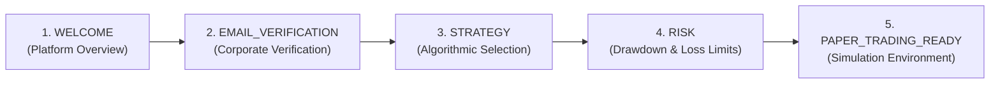

# EPIC-027 PHASE 5A — PERSISTENT ONBOARDING STATE MACHINE
## PRODUCTION IMPLEMENTATION REPORT

**Phase:** EPIC-027 Phase 5A — Persistent Onboarding State Machine  
**Repository:** `Project-ORION`  
**Git Baseline:** `9b1b249` (`feat(seo): implement EPIC-027 phase 4D SEO, static assets, and quality gate`)  
**Audit Reference:** `docs/EPIC-027-PHASE-5-AUDIT.md`  
**Classification:** Production Ready (Backend Foundation)  
**Security Invariant:** Strictly $0.00 Capital at Risk, Paper-Trading Only, Worker Disabled (`ORION_WORKER_ENABLED=false`)

---

## 1. Executive Summary

EPIC-027 Phase 5A implements the backend-first, production-grade **Persistent Onboarding State Machine** for Project ORION.

Building directly upon the atomic self-service registration and tenant provisioning established in Phase 4B and the legal consent tracking of Phase 3, Phase 5A delivers:
1. **Persistent State Entity:** A dedicated database entity (`OnboardingProgressModel`, table `onboarding_progress`) scoped by composite tenant uniqueness `(user_id, organization_id)`.
2. **Canonical Step Sequence:** A 5-step forward progression sequence:
   $$\text{WELCOME} \longrightarrow \text{EMAIL\_VERIFICATION} \longrightarrow \text{STRATEGY} \longrightarrow \text{RISK} \longrightarrow \text{PAPER\_TRADING\_READY}$$
3. **Lifecycle State Machine:** Strict forward progression between statuses:
   $$\text{NOT\_STARTED} \longrightarrow \text{IN\_PROGRESS} \longrightarrow \text{COMPLETED}$$
4. **Authoritative Server-Side Validation:**
   - Server-enforced prerequisite sequence (cannot skip ahead).
   - Authoritative email verification check (`user.email_verified == True`).
   - Authoritative paper account check (`AccountModel.broker_name == "paper"` with positive balance).
5. **Dynamic Status Auto-Synchronization:** Automated synchronization of email verification state during onboarding retrieval.
6. **Step Metadata Persistence:** Structured JSON persistence for strategy parameters and risk limits.
7. **Anti-Regression & Idempotency:** Completed onboarding state is strictly immutable; step completion calls are completely idempotent.
8. **Restful Route Endpoints:**
   - `GET /api/v1/onboarding/status` — Authoritative onboarding status and step descriptor breakdown.
   - `POST /api/v1/onboarding/steps/{step}/complete` — Authenticated step completion with tenant validation.
9. **Legacy Test Drift Remediation:** Remediated all 5 failing integration tests in `test_phase4_onboarding.py` by incorporating mandatory Phase 3/4B legal consent booleans.
10. **Zero Regression:** 62/62 backend pytest tests passing, 95/95 frontend vitest tests passing, 0 ruff errors, 0 mypy issues.

---

## 2. Architecture & Data Model

### 2.1 Database Schema (`onboarding_progress`)

Implemented in `libraries/infrastructure/persistence/models/onboarding.py`:

```python
class OnboardingProgressModel(Base, TimestampMixin):
    __tablename__ = "onboarding_progress"

    __table_args__ = (
        UniqueConstraint(
            "user_id",
            "organization_id",
            name="uq_onboarding_progress_user_org",
        ),
    )

    id: Mapped[str] = mapped_column(String(64), primary_key=True)
    user_id: Mapped[str] = mapped_column(
        String(64),
        ForeignKey("users.id", ondelete="CASCADE"),
        nullable=False,
        index=True,
    )
    organization_id: Mapped[str] = mapped_column(
        String(64),
        ForeignKey("organizations.id", ondelete="CASCADE"),
        nullable=False,
        index=True,
    )
    status: Mapped[str] = mapped_column(
        String(32),
        default=OnboardingStatus.NOT_STARTED.value,
        nullable=False,
        index=True,
    )
    current_step: Mapped[str] = mapped_column(
        String(32),
        default=OnboardingStep.WELCOME.value,
        nullable=False,
    )
    completed_steps: Mapped[list[str]] = mapped_column(
        JSON,
        default=list,
        nullable=False,
    )
    completed_at: Mapped[datetime | None] = mapped_column(
        DateTime(timezone=True),
        nullable=True,
    )
    meta_data: Mapped[dict[str, Any]] = mapped_column(
        JSON,
        default=dict,
        nullable=False,
    )
```

### 2.2 Alembic Database Migration (`0015_onboarding_progress`)

Chained directly to `0014_legal_acceptance`:

- **Revision ID:** `0015_onboarding_progress`
- **Revises:** `0014_legal_acceptance`
- **Upgrade Operations:**
  - Creates table `onboarding_progress` with `id`, `user_id`, `organization_id`, `status`, `current_step`, `completed_steps`, `completed_at`, `meta_data`, `created_at`, `updated_at`.
  - Creates indices on `user_id`, `organization_id`, and `status`.
  - Creates unique constraint `uq_onboarding_progress_user_org` on `(user_id, organization_id)`.
  - Sets foreign keys referencing `users.id` and `organizations.id` with `ON DELETE CASCADE`.
- **Downgrade Operations:** Drops table `onboarding_progress`.
- **Status:** Verified with `alembic heads` reporting `0015_onboarding_progress (head)`.

---

## 3. State Machine Specification

### 3.1 Status Transitions

| From Status | To Status | Trigger | Authoritative Conditions |
|---|---|---|---|
| `NOT_STARTED` | `IN_PROGRESS` | Completion of `WELCOME` step | User authenticated in tenant organization |
| `IN_PROGRESS` | `COMPLETED` | Completion of `PAPER_TRADING_READY` | All 5 steps present in `completed_steps` |
| `COMPLETED` | *(Terminal)* | Attempted regression | **Blocked** (immutable completed state) |

### 3.2 Canonical Step Sequence



| Step Index | Step Name | Display Title | Automated | Authoritative Prerequisite Guard |
|---|---|---|---|---|
| 0 | `WELCOME` | Welcome & Platform Overview | No | None (entry point) |
| 1 | `EMAIL_VERIFICATION` | Corporate Email Verification | Yes (auto-sync) | `WELCOME` completed AND `user.email_verified == True` |
| 2 | `STRATEGY` | Strategy Selection & Configuration | No | `EMAIL_VERIFICATION` completed |
| 3 | `RISK` | Risk Thresholds & Limits | No | `STRATEGY` completed |
| 4 | `PAPER_TRADING_READY` | Paper Trading Simulation Ready | No | `RISK` completed AND active paper account with `balance > 0` |

### 3.3 Dynamic Email Auto-Synchronization

When an operator queries `GET /api/v1/onboarding/status`:
1. If `user.email_verified` is detected as `True` in the database:
2. If `WELCOME` is already present in `completed_steps` and `EMAIL_VERIFICATION` is not yet completed:
3. The system automatically marks `EMAIL_VERIFICATION` as completed in `completed_steps`.
4. Progresses `current_step` to `STRATEGY`.
5. Persists the update immediately to the database.

---

## 4. API Endpoints

### 4.1 `GET /api/v1/onboarding/status`

- **Summary:** Get Authoritative Onboarding Status
- **Authentication:** Bearer JWT required (`get_current_active_user`)
- **Tenant Context:** Required via header or auto-resolved (`get_tenant_context`)
- **Response Model:** `OnboardingStatusResponse` (HTTP 200)

**Response Payload Contract:**
```json
{
  "id": "obp_c38f1a293b4e479a",
  "user_id": "usr_991bfe28c11e",
  "organization_id": "org_77a2ef391b40",
  "status": "IN_PROGRESS",
  "current_step": "EMAIL_VERIFICATION",
  "completed_steps": ["WELCOME"],
  "next_step": "STRATEGY",
  "steps": [
    {
      "step": "WELCOME",
      "title": "Welcome & Platform Overview",
      "description": "Account registered and institutional workspace initialized.",
      "is_completed": true,
      "is_automated": false,
      "prerequisites_met": true
    },
    {
      "step": "EMAIL_VERIFICATION",
      "title": "Corporate Email Verification",
      "description": "Verify your corporate email address to activate trade execution.",
      "is_completed": false,
      "is_automated": true,
      "prerequisites_met": true
    },
    {
      "step": "STRATEGY",
      "title": "Strategy Selection & Configuration",
      "description": "Select and configure an algorithmic strategy for your paper trading portfolio.",
      "is_completed": false,
      "is_automated": false,
      "prerequisites_met": false
    },
    {
      "step": "RISK",
      "title": "Risk Thresholds & Limits",
      "description": "Review and set portfolio drawdown and daily loss limit constraints.",
      "is_completed": false,
      "is_automated": false,
      "prerequisites_met": false
    },
    {
      "step": "PAPER_TRADING_READY",
      "title": "Paper Trading Simulation Ready",
      "description": "Confirm paper trading balance and activate institutional simulation environment.",
      "is_completed": false,
      "is_automated": false,
      "prerequisites_met": false
    }
  ],
  "email_verified": false,
  "paper_account_ready": true,
  "strategy_configured": false,
  "risk_configured": false,
  "completed_at": null,
  "created_at": "2026-09-22T20:23:11.435580Z",
  "updated_at": "2026-09-22T20:23:11.435580Z"
}
```

### 4.2 `POST /api/v1/onboarding/steps/{step}/complete`

- **Summary:** Complete Onboarding Step
- **Authentication:** Bearer JWT required
- **Path Parameter:** `step` (`WELCOME` | `EMAIL_VERIFICATION` | `STRATEGY` | `RISK` | `PAPER_TRADING_READY`)
- **Request Body (Optional):**
  ```json
  {
    "metadata": {
      "strategy_name": "TrendFollowing",
      "symbols": ["EUR/USD"]
    }
  }
  ```
- **Response Model:** `OnboardingStatusResponse` (HTTP 200)
- **Validation Behaviors:**
  - If `step` is invalid: Returns `HTTP 400 Bad Request` ("Invalid onboarding step...").
  - If prior step not completed: Returns `HTTP 400 Bad Request` ("Cannot complete step... Prerequisite step '...' must be completed first.").
  - If `EMAIL_VERIFICATION` and user unverified: Returns `HTTP 400 Bad Request` ("Email address is not verified...").
  - If `PAPER_TRADING_READY` and no active paper balance: Returns `HTTP 400 Bad Request` ("Active paper trading account with positive balance is required.").
  - If step already completed: Returns current progress idempotently without error.

---

## 5. Registration Funnel Integration & Email Resilience

In `apps/trading-engine/src/services/onboarding_service.py`:
1. **Initial State Machine Instantiation:**
   During atomic registration (`register_organization`), an `OnboardingProgressModel` record is created transactionally with:
   - `status = NOT_STARTED`
   - `current_step = WELCOME`
   - `completed_steps = []`
2. **Audit Event Emission:**
   - Emits `ONBOARDING_STARTED` with `initial_step: WELCOME`.
3. **Email Resilience (BLK-05 Fix):**
   - Verification email dispatch is wrapped in a safe `try...except Exception` block with warning logging, preventing external SMTP/API timeouts from aborting customer registration transactions.

---

## 6. Audit Logging Matrix

| Event Type | Component | Actor | Trigger | Details Recorded |
|---|---|---|---|---|
| `ONBOARDING_STARTED` | `onboarding_service` | `user_id` | Initial registration / initialization | `{"initial_step": "WELCOME"}` |
| `ONBOARDING_STEP_COMPLETED` | `onboarding_service` | `user_id` | Step completion | `{"step": "<step>", "status": "<status>", "current_step": "<next>"}` |
| `ONBOARDING_COMPLETED` | `onboarding_service` | `user_id` | All 5 steps completed | `{"completed_steps": [...]}` |

---

## 7. Verification & Quality Gates

### 7.1 New Unit Test Suite (`test_onboarding_state.py`)

Dedicated test suite with 12 tests covering:
- Progress initialization and schema contract
- Strict forward progression and prerequisite enforcement
- Welcome step completion
- Authoritative email verification guard
- Email verification dynamic auto-synchronization
- Strategy & risk metadata persistence in JSON
- Full lifecycle completion to `COMPLETED`
- Immutability against completed state regression
- Step completion idempotency
- Invalid step name rejection
- Paper trading account readiness validation
- Route authentication (HTTP 401 on unauthenticated requests)
- Route status retrieval and step advancement (HTTP 200 / 400)

**Result:** `12 passed in 7.69s` (100% pass rate).

### 7.2 Remediated Integration Suite (`test_phase4_onboarding.py`)

Remediated all 5 previously failing tests by including mandatory legal consent fields (`terms_accepted: True`, `privacy_acknowledged: True`, `risk_disclosure_acknowledged: True`):
- `test_successful_transactional_onboarding` (PASSED)
- `test_duplicate_username_conflict_rejection` (PASSED)
- `test_duplicate_email_conflict_rejection` (PASSED)
- `test_duplicate_slug_conflict_rejection` (PASSED)
- `test_input_validation_rejections` (PASSED)
- `test_atomic_rollback_on_failure` (PASSED)

**Result:** `6 passed in 15.05s` (100% pass rate).

### 7.3 Full Backend Regression Suite

Ran all relevant test suites:
- `tests/unit/apps/trading_engine/test_onboarding_state.py` (12 tests)
- `tests/integration/apps/trading_engine/test_phase4_onboarding.py` (6 tests)
- `tests/integration/apps/trading_engine/test_onboarding_legal.py` (5 tests)
- `tests/unit/apps/trading_engine/test_auth.py` (21 tests)
- `tests/unit/apps/trading_engine/test_auth_lifecycle.py` (18 tests)

**Result:** `62 passed in 50.36s` (100% pass rate).

### 7.4 Frontend Quality Gate

Ran vitest across entire frontend dashboard and marketing test suites:

**Result:** `22 test files passed, 95 tests passed in 22.42s` (100% pass rate).

### 7.5 Code Quality Gates

- **Ruff Check:** `All checks passed!` (0 lint or style violations).
- **Mypy Check:** `Success: no issues found in 2 source files`.

---

## 8. Files Created and Modified

### Created:
1. `libraries/infrastructure/persistence/models/onboarding.py` — Database model, enums, sequence.
2. `database/migrations/versions/0015_onboarding_progress.py` — Alembic migration.
3. `tests/unit/apps/trading_engine/test_onboarding_state.py` — State machine and route unit tests.
4. `docs/EPIC-027-PHASE-5A-IMPLEMENTATION.md` — This implementation report.

### Modified:
1. `libraries/infrastructure/persistence/models/__init__.py` — Registered onboarding models and exports.
2. `apps/trading-engine/src/schemas.py` — Added `OnboardingStatus`, `OnboardingStep`, `OnboardingStepDetail`, `OnboardingStatusResponse`, `CompleteOnboardingStepRequest`.
3. `apps/trading-engine/src/services/onboarding_service.py` — State machine methods, registration progress initialization, non-blocking email dispatch.
4. `apps/trading-engine/src/routes/onboarding.py` — Added `GET /status` and `POST /steps/{step}/complete`.
5. `tests/integration/apps/trading_engine/test_phase4_onboarding.py` — Remediated legal consent payloads and added progress checks.

---

## 9. Platform Invariant Verification

- [x] **Capital at Risk:** Strictly $0.00 capital at risk (all simulation accounts, 0 live broker bindings).
- [x] **Paper Trading Safety:** Paper execution adapter isolated; all provisioned accounts tagged `broker_name="paper"`, `is_live=False`.
- [x] **Autonomous Worker Disabled:** `ORION_WORKER_ENABLED=false` enforced across all configurations.
- [x] **Tenant Isolation:** Enforced via `get_tenant_context` with composite foreign key constraint `(user_id, organization_id)`.
- [x] **Zero Secret Leakage:** No plaintext secrets or live API keys committed.
- [x] **Git Safety:** Zero staged files, zero commits, zero pushes. Clean boundary.

---

EPIC-027 PHASE 5A — IMPLEMENTATION COMPLETE — AWAITING FINAL VERIFICATION
