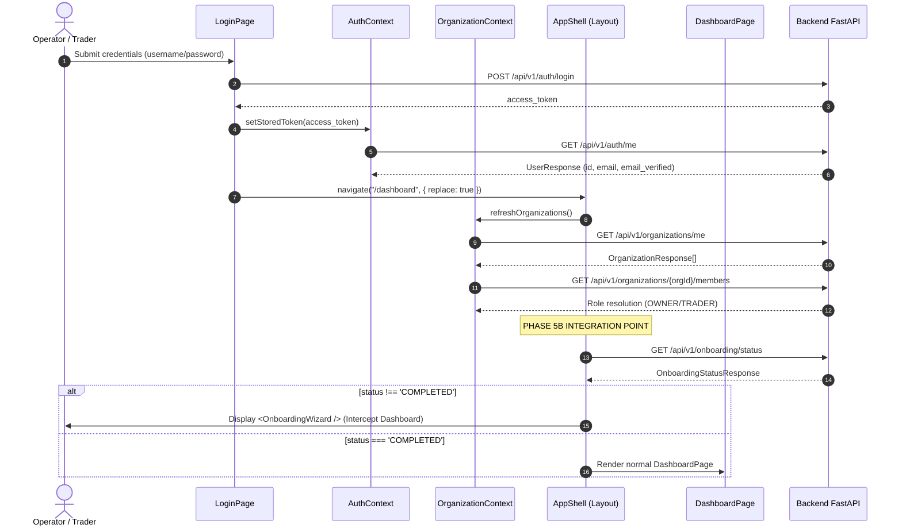

# EPIC-027 PHASE 5B — FIRST-LOGIN ONBOARDING UX
# ARCHITECTURAL & PRODUCTION READINESS AUDIT REPORT

**Phase:** EPIC-027 Phase 5B — First-Login Onboarding UX  
**Repository:** `Project-ORION` (`c:\Users\Shree\CascadeProjects\forex-trading-platform-architecture\project-orion`)  
**Git Baseline:** `9b1b249` (`feat(seo): implement EPIC-027 phase 4D SEO, static assets, and quality gate`)  
**Backend Foundation:** EPIC-027 Phase 5A (`docs/EPIC-027-PHASE-5A-FINAL-VERIFICATION.md`)  
**Audit Execution Date:** 2026-09-23  
**Auditor Role:** Principal Frontend Architect, Application Security Engineer, Accessibility Specialist, Quality Gatekeeper  
**Final Classification:** `B — IMPLEMENTATION READY WITH EXTERNAL DEPENDENCIES`

---

## 1. Executive Summary

This audit establishes the precise architectural blueprint, technical specifications, and implementation boundaries for **EPIC-027 Phase 5B: First-Login Onboarding UX**.

Phase 5A completed and verified the persistent, tenant-safe backend state machine foundation:
- Database table `onboarding_progress` with composite unique constraint `(user_id, organization_id)`.
- Reversible Alembic migration `0015_onboarding_progress`.
- Authoritative state machine enforcing `NOT_STARTED -> IN_PROGRESS -> COMPLETED`.
- Ordered 5-step progression: `WELCOME -> EMAIL_VERIFICATION -> STRATEGY -> RISK -> PAPER_TRADING_READY`.
- Authoritative backend endpoints: `GET /api/v1/onboarding/status` and `POST /api/v1/onboarding/steps/{step}/complete`.
- Server-side email verification checks (`UserModel.email_verified == True`) and paper account readiness validation (`AccountModel.broker_name == "paper"` with `balance > 0`).
- Non-blocking email dispatch resilience (BLK-05 resolved).
- 100% passing test baseline (62 backend regression tests, 95 frontend vitest tests).

**Objective of Phase 5B:**  
Deliver a guided, interactive, accessible, and resilient first-login onboarding wizard in the frontend trading terminal that consumes the authoritative Phase 5A backend state machine, guiding institutional operators from registration through email confirmation, strategy parameterization, risk limits review, and paper simulation environment activation, with zero capital at risk.

---

## 2. Current Frontend Architecture

An audit of `apps/dashboard/src/` was conducted to identify existing components, state providers, and integration points:

```
apps/dashboard/src/
├── App.tsx                      # Root router with BrowserRouter, ToastProvider, AuthProvider, OrganizationProvider
├── api/
│   ├── client.ts                # Fetch wrapper with Bearer token, X-Organization-ID, X-Correlation-ID injection
│   ├── endpoints.ts             # Strongly typed API callers (authApi, organizationApi, paperApi, strategiesApi, etc.)
│   └── types.ts                 # Domain and API request/response TypeScript interfaces
├── auth/
│   ├── AuthContext.tsx          # Session token management via sessionStorage, user profile loading via /auth/me
│   ├── OrganizationContext.tsx  # Active organization state, X-Organization-ID sync, role resolution
│   ├── ProtectedRoute.tsx       # Route guard redirecting unauthenticated users to /login
│   └── permissions.ts           # Client-side permission checkers (for UI visibility only)
├── components/
│   ├── common/
│   │   ├── Badge.tsx            # Badge & PaperTradingBadge components
│   │   ├── Button.tsx           # Accessible button with loading spinners, variants (primary, secondary, danger)
│   │   ├── Card.tsx             # Standard container card with dark styling (bg-slate-900 / border-slate-800)
│   │   ├── ConfirmationDialog.tsx # Modal dialog with confirm/cancel callbacks
│   │   ├── Modal.tsx            # Accessible modal dialog with Escape handling, focus ring, backdrop blur
│   │   ├── PageHeader.tsx       # Standard page header with breadcrumbs and title
│   │   ├── Toast.tsx            # ToastProvider and useToast() hook (success, error, info)
│   │   └── Skeleton.tsx         # Loading pulse placeholders
│   ├── layout/
│   │   ├── AppShell.tsx         # Main authenticated layout containing Sidebar, Topbar, <Outlet />, and Footer
│   │   ├── Sidebar.tsx          # Navigation sidebar with links to /dashboard, /strategies, /risk, etc.
│   │   └── Topbar.tsx           # Organization switcher, user dropdown, live status indicator
│   └── paper/
│       └── PaperSimulationWidget.tsx # Interactive paper account balance reset and latency/slippage config
└── pages/
    ├── DashboardPage.tsx        # Consolidated terminal dashboard (polls /api/v1/dashboard/ every 8s)
    ├── LoginPage.tsx            # Sign-in form (navigates to /dashboard on success)
    ├── RegisterPage.tsx         # Self-service registration form (Phase 4B)
    ├── VerifyEmailPage.tsx      # Email verification token handler and resend form
    ├── StrategiesPage.tsx       # Strategy catalogue and account active strategy configuration
    └── RiskPage.tsx             # Read-only risk telemetry and limits view
```

### Architectural Integration Point
The correct integration point for the Onboarding UX is **within `AppShell.tsx`** via an **`OnboardingWizard`** overlay/component:
1. `AppShell` sits directly below `ProtectedRoute`, `AuthProvider`, and `OrganizationProvider`.
2. When `AppShell` mounts, `isAuthenticated` is guaranteed `true` and `currentOrg` is resolved.
3. `AppShell` can check `onboardingApi.getStatus()`.
4. If `status !== 'COMPLETED'`, `AppShell` renders the modal wizard overlay `<OnboardingWizard />`, intercepting operator interaction until the 5 steps are fulfilled.
5. This prevents operators from accessing deep links (`/orders`, `/positions`, `/strategies`) in an unconfigured state, while avoiding invasive changes to `AppRoutes` in `App.tsx`.
6. Once `status === 'COMPLETED'`, the wizard cleanly unmounts and the operator has full access to the trading terminal.

---

## 3. Existing Onboarding APIs

The Phase 5A implementation in `apps/trading-engine/src/routes/onboarding.py` provides two core endpoints:

### 3.1 `GET /api/v1/onboarding/status`
- **Authentication:** Bearer JWT required (`get_current_active_user`).
- **Tenant Context:** Active organization required (`get_tenant_context`).
- **Response Schema:** `OnboardingStatusResponse` (HTTP 200 OK):
  ```json
  {
    "id": "obp_c38f1a293b4e479a",
    "user_id": "usr_991bfe28c11e",
    "organization_id": "org_77a2ef391b40",
    "status": "NOT_STARTED | IN_PROGRESS | COMPLETED",
    "current_step": "WELCOME | EMAIL_VERIFICATION | STRATEGY | RISK | PAPER_TRADING_READY",
    "completed_steps": ["WELCOME"],
    "next_step": "STRATEGY",
    "steps": [
      {
        "step": "WELCOME",
        "title": "Welcome & Platform Overview",
        "description": "Account registered and institutional workspace initialized.",
        "is_completed": true,
        "is_automated": false,
        "prerequisites_met": true
      },
      {
        "step": "EMAIL_VERIFICATION",
        "title": "Corporate Email Verification",
        "description": "Verify your corporate email address to activate trade execution.",
        "is_completed": false,
        "is_automated": true,
        "prerequisites_met": true
      },
      {
        "step": "STRATEGY",
        "title": "Strategy Selection & Configuration",
        "description": "Select and configure an algorithmic strategy for your paper trading portfolio.",
        "is_completed": false,
        "is_automated": false,
        "prerequisites_met": false
      },
      {
        "step": "RISK",
        "title": "Risk Thresholds & Limits",
        "description": "Review and set portfolio drawdown and daily loss limit constraints.",
        "is_completed": false,
        "is_automated": false,
        "prerequisites_met": false
      },
      {
        "step": "PAPER_TRADING_READY",
        "title": "Paper Trading Simulation Ready",
        "description": "Confirm paper trading balance and activate institutional simulation environment.",
        "is_completed": false,
        "is_automated": false,
        "prerequisites_met": false
      }
    ],
    "email_verified": false,
    "paper_account_ready": true,
    "strategy_configured": false,
    "risk_configured": false,
    "completed_at": null,
    "created_at": "2026-09-23T12:00:00Z",
    "updated_at": "2026-09-23T12:00:00Z"
  }
  ```
- **Error Responses:**
  - `HTTP 400 Bad Request`: `Active organization context required.`
  - `HTTP 401 Unauthorized`: Token missing or invalid.

### 3.2 `POST /api/v1/onboarding/steps/{step}/complete`
- **Path Parameter:** `step` (string matching `OnboardingStep` enum).
- **Request Body (Optional):**
  ```json
  {
    "metadata": {
      "strategy_id": "TrendFollowing",
      "symbols": ["EUR/USD"]
    }
  }
  ```
- **Response Schema:** `OnboardingStatusResponse` (HTTP 200 OK).
- **Validation Behaviors:**
  - Sequence enforcement: Prior steps must be present in `completed_steps` (returns `HTTP 400` if skipped).
  - Email check: Step `EMAIL_VERIFICATION` requires `user.email_verified == True` (returns `HTTP 400`).
  - Paper check: Step `PAPER_TRADING_READY` requires `AccountModel.broker_name == "paper"` and `balance > 0` (returns `HTTP 400`).
  - Idempotency: If `step` already in `completed_steps`, returns current progress without error or mutation.
  - Immutability: If `status == COMPLETED`, returns status without regression.

---

## 4. First-Login Flow Analysis

The current end-to-end frontend authentication flow proceeds as follows:



### Key Finding:
In the current code, `LoginPage` immediately navigates to `/dashboard`. `DashboardPage` immediately mounts and triggers an 8-second polling cycle to `/api/v1/dashboard/`.
**Phase 5B Requirement:**  
When `OnboardingWizard` is active, the dashboard background polling must be suppressed or paused to prevent wasteful API requests while the organization is still in onboarding.

---

## 5. Email Verification UX Audit

### 5.1 Existing Capabilities
- `authApi.resendVerification({ email })` calls `POST /api/v1/auth/resend-verification`.
  - Anti-enumeration: Returns generic success message whether email exists or not.
  - Rate limiting: Rate-limited per IP/email (returns `HTTP 429` with optional `Retry-After`).
- `VerifyEmailPage.tsx` handles `GET /verify-email?token=...` for operators arriving via email link.
- `UserResponse.email_verified` and `OnboardingStatusResponse.email_verified` authoritative flags exist.

### 5.2 Phase 5B Email Verification Step UX
Inside the wizard (`EMAIL_VERIFICATION` step):
1. **Status Display:** Shows authenticated operator email: `user.email` (e.g. `trader@institutional.fund`).
2. **Current State Indicator:**
   - If `email_verified === false`: Displays amber warning banner "Pending Corporate Verification".
   - If `email_verified === true`: Displays emerald success badge "Corporate Email Verified".
3. **Resend Action:**
   - "Resend Verification Link" button calling `authApi.resendVerification({ email: user.email })`.
   - Disables button for 60 seconds with countdown timer after click to prevent abuse.
   - Shows green confirmation toast / notice on success.
   - Captures `HTTP 429` and displays rate limit notice.
4. **"Check Verification Status" Action:**
   - Allows operator to click "I Have Verified My Email".
   - Calls `onboardingApi.getStatus()`.
   - Because Phase 5A implements dynamic auto-synchronization, if the backend finds `user.email_verified == True`, it automatically marks `EMAIL_VERIFICATION` as complete and advances `current_step` to `STRATEGY`!
5. **Next Button:** Disabled until `email_verified === true`.

---

## 6. Strategy Configuration Audit

### 6.1 Existing Capabilities
- Backend routes in `apps/trading-engine/src/routes/strategies.py`:
  - `GET /api/v1/strategies/`: Returns catalogue of available strategies (e.g. `TrendFollowing`, `MeanReversion`, `Breakout`).
  - `GET /api/v1/strategies/account/config`: Returns active strategy configuration for the paper account.
  - `PUT /api/v1/strategies/account/config`: Updates strategy ID, timeframe (`M15`, `H1`, `D1`), and symbol whitelist (`EUR/USD`, `GBP/USD`, `USD/JPY`).
- Frontend `strategiesApi`: Fully typed in `apps/dashboard/src/api/endpoints.ts`.
- Backend `OnboardingService`: Accepts `{ "metadata": { "strategy_id": "...", "timeframe": "...", "symbols": [...] } }` and stores it into `progress.meta_data["step_data"]["STRATEGY"]`.

### 6.2 Phase 5B Strategy Step UX
The wizard can directly reuse `strategiesApi.list()`:
1. **Strategy Selection Cards:** Renders cards for core strategies:
   - **Trend Following:** Multi-timeframe moving average & momentum crossover (Default).
   - **Mean Reversion:** Bollinger Band & RSI statistical divergence.
   - **Breakout:** Volatility squeeze and channel breakout.
2. **Preset Parameters:**
   - Timeframe selector: `M15` (default), `H1`, `D1`.
   - Primary Instruments: Pre-selected major pairs (`EUR/USD`, `GBP/USD`, `USD/JPY`).
3. **Action:**
   - Operator clicks "Save & Continue".
   - Calls `onboardingApi.completeStep('STRATEGY', { metadata: { strategy_id, timeframe, symbols } })`.
   - Optionally calls `strategiesApi.updateAccountConfig(...)` to keep both states strictly synchronized.

---

## 7. Risk Configuration Audit

### 7.1 Existing Backend Rules
- Backend routes in `apps/trading-engine/src/routes/risk.py`:
  - `GET /api/v1/risk/limits`: Returns configured limits:
    1. `maximum_drawdown`: Max allowed portfolio drawdown as percentage (default 5.0%).
    2. `maximum_daily_loss`: Max daily loss as percentage of equity (default 2.0%).
    3. `maximum_position_size`: Max position size in units (default 100,000 units / 1.0 lot).
- Backend `OnboardingService`: Checks `risk_configured` and records `{ "metadata": { ... } }` into `progress.meta_data["step_data"]["RISK"]`.

### 7.2 Phase 5B Risk Step UX
The wizard presents clear, safe risk bounds for paper trading:
1. **Max Portfolio Drawdown (%):** Slider / input bounded between 1.0% and 15.0% (Default: 5.0%).
2. **Daily Loss Limit (%):** Slider / input bounded between 0.5% and 5.0% (Default: 2.0%).
3. **Max Position Size (Units):** Selector for standard lot limits (e.g. 50,000 / 100,000 / 200,000 units).
4. **Institutional Safeguard Notice:**
   - Clearly explains: "Breaching these simulated limits triggers automatic paper trading circuit breakers."
5. **Action:**
   - Operator clicks "Confirm Risk Parameters".
   - Calls `onboardingApi.completeStep('RISK', { metadata: { max_drawdown_pct, max_daily_loss_pct, max_position_size } })`.

---

## 8. Paper Trading Readiness Audit

### 8.1 Existing Capabilities
- Every newly onboarded tenant in Phase 4B/5A is provisioned an active paper account with `$100,000.00` virtual balance.
- Verified properties:
  - `broker_name == "paper"`
  - `is_live == False`
  - `is_active == True`
  - `balance == 100000.00`
  - `currency == "USD"`
- Backend `complete_step('PAPER_TRADING_READY')`:
  - Validates that an active paper account with `balance > 0` exists for the tenant.
  - Sets `progress.status = COMPLETED`.
  - Sets `progress.completed_at = now`.
  - Emits audit event `ONBOARDING_COMPLETED`.

### 8.2 Phase 5B Readiness Step UX
1. **Simulation Environment Summary:**
   - Paper Account Number: e.g. `PAPER-9B1A2C3D`
   - Virtual Starting Equity: `$100,000.00 USD`
   - Broker Adapter: `Simulated Execution Engine (Local)`
   - Capital at Risk: **`$0.00`** (prominent badge)
   - Autonomous Worker: **`Disabled`** (`ORION_WORKER_ENABLED=false`)
   - Live Exchange Connections: **`None`**
2. **Final Operator Confirmation Checkbox:**
   - "I understand this environment executes paper trading simulations only and involves $0.00 capital."
3. **Action:**
   - "Launch Trading Terminal" button.
   - Calls `onboardingApi.completeStep('PAPER_TRADING_READY')`.
   - Displays celebratory confirmation banner and transitions smoothly to `DashboardPage`.

---

## 9. State Machine → UX Mapping Matrix

The frontend maps backend responses to user interface states deterministically:

| Backend `status` | Backend `current_step` | Frontend Behavior | Step Rendered | Back Allowed? |
|---|---|---|---|---|
| `NOT_STARTED` | `WELCOME` | Show Onboarding Wizard | Step 1: Welcome & Overview | No |
| `IN_PROGRESS` | `WELCOME` | Show Onboarding Wizard | Step 1: Welcome & Overview | No |
| `IN_PROGRESS` | `EMAIL_VERIFICATION` | Show Onboarding Wizard | Step 2: Email Verification | Yes (Review Welcome) |
| `IN_PROGRESS` | `STRATEGY` | Show Onboarding Wizard | Step 3: Strategy Selection | Yes (Review Email) |
| `IN_PROGRESS` | `RISK` | Show Onboarding Wizard | Step 4: Risk Parameters | Yes (Review Strategy) |
| `IN_PROGRESS` | `PAPER_TRADING_READY` | Show Onboarding Wizard | Step 5: Paper Trading Readiness | Yes (Review Risk) |
| `COMPLETED` | *Any* | Do NOT show Wizard | Regular Terminal Dashboard | N/A |

### Dynamic Advancement Handling:
- When a user on Step 2 completes email verification, the backend automatically transitions `current_step` to `STRATEGY`. The wizard reads the updated `next_step` / `current_step` from the API response and advances the active step automatically.

---

## 10. Refresh, Re-login & Multi-Tab Behavior

| Scenario | System Event | Expected Frontend Behavior |
|---|---|---|
| **Browser Refresh** | Page reloads at step 3 | `sessionStorage` restores token and org ID; `AppShell` fetches `GET /api/v1/onboarding/status`; wizard resumes directly at step 3 (`STRATEGY`) without resetting. |
| **Logout & Re-login** | User logs out and returns | Session is purged; on next login, `GET /api/v1/onboarding/status` is fetched; wizard opens at the exact step saved in the database. |
| **Second Tab Navigation** | User completes step in Tab 1, then clicks in Tab 2 | Tab 2 receives the updated state upon calling `completeStep` (idempotent 200 response) or can click "Refresh Status" to resynchronize. |
| **Stale State Submission** | Tab 2 submits an older step | Backend idempotent handler returns HTTP 200 with current state. Frontend replaces state with the authoritative server payload. |
| **Unauthorized Session Expiry** | Token expires during onboarding | `apiClient` intercepts 401, dispatches `orion:unauthorized`, clears session, and redirects operator safely to `/login`. |

---

## 11. Accessibility Audit (WCAG 2.1 AA)

The Onboarding UX must strictly adhere to the project's existing design system accessibility standards:

1. **Dialog Semantics:**
   - Wizard container uses `role="dialog"` and `aria-modal="true"`.
   - `aria-labelledby="onboarding-wizard-title"` and `aria-describedby="onboarding-wizard-desc"`.
2. **Keyboard Navigation & Escape Handling:**
   - Operators can cycle through form controls and buttons using `Tab` and `Shift+Tab`.
   - Pressing `Escape` does NOT close the wizard if onboarding is incomplete (mandatory first-login flow), but focuses the current active action with a clear message: "Please complete onboarding to access the terminal."
3. **Step Indicator Semantics:**
   - Stepper structured using `<nav aria-label="Onboarding Progress"><ol>`.
   - Active step tagged with `aria-current="step"`.
   - Completed steps indicate completion to screen readers via `<span className="sr-only">Completed</span>`.
4. **Form Controls & Labels:**
   - Every input, select, and slider has an explicit `<label htmlFor="...">`.
   - Error messages are marked with `role="alert"` and associated via `aria-describedby`.
5. **Color Contrast & Typography:**
   - High contrast text (`text-slate-100`, `text-slate-300`, `text-sky-400`, `text-amber-400`) over dark backgrounds (`bg-slate-900`, `bg-slate-950`).
   - Focus rings: `focus:outline-none focus:ring-2 focus:ring-sky-500 focus:ring-offset-2 focus:ring-offset-slate-900`.
6. **Mobile Responsiveness:**
   - Stacked layout on screens `< 640px` (`flex-col sm:flex-row`).
   - Minimum interactive touch targets: 44px x 44px.

---

## 12. Security Audit

1. **Storage Integrity:**
   - Authentication tokens remain strictly in `sessionStorage` (`orion_access_token`).
   - Active organization ID remains in `sessionStorage` (`orion_active_org_id`).
   - `localStorage` is NOT used for sensitive credentials.
2. **No Password Retention:**
   - Passwords are never stored or retained in React component state or context.
3. **Route Security:**
   - `ProtectedRoute` enforces valid token presence before rendering `AppShell`.
   - Deep-link URL tampering (e.g. navigating to `/orders`) is blocked by `OnboardingWizard` overlay rendering in `AppShell`.
4. **Server-Authoritative Validation:**
   - Frontend cannot spoof onboarding completion: any trading action on the backend checks database state.
   - Tenant isolation enforced by backend `get_tenant_context` using cryptographic JWT claims.
5. **Injection Defense:**
   - Zero use of `dangerouslySetInnerHTML`, `eval()`, or `new Function()`.
   - Inputs are strongly typed and sanitized through React state and Pydantic backend models.

---

## 13. UX Safety & Regulatory Compliance

To maintain strict adherence to regulatory standards and institutional trust:
1. **Prominent Paper Trading Badging:**
   - The wizard header permanently displays `PaperTradingBadge` ("PAPER SIMULATION").
2. **Zero Capital Disclaimer:**
   - A persistent footer banner in the wizard explicitly states:
     `"Project ORION is running in Simulated Execution Mode with $0.00 capital at risk. No real funds are connected."`
3. **No Profit / Performance Claims:**
   - Copy strictly uses descriptive, technical terms ("Backtested Model", "Algorithmic Rules", "Simulated P&L").
   - Explicitly avoids promises of returns, guaranteed profits, or automated wealth generation.
4. **Legal Navigation:**
   - Includes clickable links opening in new tabs to `/terms`, `/privacy`, and `/risk-disclosure`.

---

## 14. Testing Gap Analysis

### Current State
`apps/dashboard/tests/` contains 22 test files (95 tests), but **0 onboarding tests**:
- Registration is tested in `registration.test.tsx` (13 tests).
- Authentication is tested in `auth.test.tsx` (5 tests).
- Paper simulation widget is tested in `paper_simulation.test.tsx` (3 tests).

### Proposed Phase 5B Test Suite (`apps/dashboard/tests/onboarding.test.tsx`)
A dedicated Vitest suite with **14+ tests** must be created:

| Test ID | Test Description | Target Coverage |
|---|---|---|
| `OB-UI-01` | Renders `OnboardingWizard` when backend returns `status: "NOT_STARTED"` | First-login detection |
| `OB-UI-02` | Renders `OnboardingWizard` at `current_step: "STRATEGY"` when status is `IN_PROGRESS` | Resumable state |
| `OB-UI-03` | Does NOT render `OnboardingWizard` when status is `COMPLETED` | Normal dashboard access |
| `OB-UI-04` | Step 1 (Welcome): Completing advances to `EMAIL_VERIFICATION` | Step progression |
| `OB-UI-05` | Step 2 (Email): Displays user email and disables "Next" when `email_verified: false` | Email verification guard |
| `OB-UI-06` | Step 2 (Email): "Resend Verification" triggers API call and displays feedback | Email resend action |
| `OB-UI-07` | Step 2 (Email): "Check Status" refetches progress and auto-advances when verified | Dynamic synchronization |
| `OB-UI-08` | Step 2 (Email): Handles HTTP 429 rate limiting with retry countdown | Rate limit resilience |
| `OB-UI-09` | Step 3 (Strategy): Selects strategy, timeframe, symbols and completes step | Strategy parameterization |
| `OB-UI-10` | Step 4 (Risk): Adjusts drawdown and daily loss limit and submits metadata | Risk parameterization |
| `OB-UI-11` | Step 5 (Readiness): Displays $100,000 balance, requires acknowledgment, finishes wizard | Final completion & handoff |
| `OB-UI-12` | API Failure: Displays user-friendly error notice and offers "Retry" button | Error handling |
| `OB-UI-13` | Session Expiry: 401 during onboarding triggers session clear and redirect | Security fail-closed |
| `OB-UI-14` | Accessibility: Stepper contains `aria-current="step"`, buttons have labels, keyboard navigation works | A11y compliance |

---

## 15. Performance & Network Optimization

1. **Request Waterfall Elimination:**
   - In `AppShell`, fetch `onboardingApi.getStatus()` concurrently or immediately after `OrganizationContext` resolves.
   - `OnboardingStatusResponse` already packages all 5 step descriptors and readiness booleans in a single round-trip, eliminating individual requests for email, strategy, and risk.
2. **Dashboard Polling Suppression:**
   - While `OnboardingWizard` is mounted, suppress `usePolling` in `DashboardPage` to prevent background polling of unconfigured metrics.
3. **Code Splitting:**
   - The `OnboardingWizard` component can be lazy-loaded or included in the authenticated bundle. Given its size (~15KB gzipped), direct inclusion in the authenticated chunk is optimal to prevent extra network round-trips upon first login.

---

## 16. Observability & Telemetry

1. **No External Analytics:**
   - In accordance with Project ORION architecture rules, no third-party tracking scripts (Google Analytics, Mixpanel, Segment) are added.
2. **Console Telemetry:**
   - Any API failures during onboarding log sanitized messages tagged `[ORION_ONBOARDING]` with the corresponding `X-Correlation-ID`.
3. **User-Facing Toast Notifications:**
   - Success and failure events use the existing `ToastProvider` (`useToast().error`, `useToast().success`).

---

## 17. File-Level Impact Matrix

### Existing Files to Modify (3 files)
| File | Lines Changed | Modifications |
|---|---|---|
| `apps/dashboard/src/api/types.ts` | ~+40 | Add `OnboardingStatus`, `OnboardingStep`, `OnboardingStepDetail`, `OnboardingStatusResponse`, `CompleteOnboardingStepRequest` |
| `apps/dashboard/src/api/endpoints.ts` | ~+20 | Add `getStatus` and `completeStep` methods to `onboardingApi` |
| `apps/dashboard/src/components/layout/AppShell.tsx` | ~+30 | Mount `OnboardingWizard` when `onboardingStatus.status !== 'COMPLETED'` |

### New Files to Create (8 files)
| File | Estimated Lines | Purpose |
|---|---|---|
| `apps/dashboard/src/components/onboarding/OnboardingWizard.tsx` | ~250 | Main modal wizard shell, stepper progress bar, step router |
| `apps/dashboard/src/components/onboarding/steps/WelcomeStep.tsx` | ~120 | Step 1: Institutional platform welcome & system overview |
| `apps/dashboard/src/components/onboarding/steps/EmailVerificationStep.tsx` | ~160 | Step 2: Email verification status, resend action, refresh check |
| `apps/dashboard/src/components/onboarding/steps/StrategyStep.tsx` | ~180 | Step 3: Strategy selection cards, timeframe, instrument filters |
| `apps/dashboard/src/components/onboarding/steps/RiskStep.tsx` | ~160 | Step 4: Max drawdown, daily loss limit, position size sliders |
| `apps/dashboard/src/components/onboarding/steps/PaperReadinessStep.tsx` | ~150 | Step 5: Paper account summary, confirmation, completion button |
| `apps/dashboard/src/hooks/useOnboarding.ts` | ~90 | Custom hook managing onboarding state, step advancement, and polling |
| `apps/dashboard/tests/onboarding.test.tsx` | ~350 | Comprehensive Vitest test suite (14+ tests) |

---

## 18. Risk & Blocker Matrix

| Risk / Blocker | Severity | Likelihood | Mitigation Strategy |
|---|---|---|---|
| **Missing Production SMTP** | EXTERNAL DEPENDENCY | HIGH | Development and testing use mock email dispatcher. Backend non-blocking email handling (BLK-05) guarantees zero registration failures. |
| **Email Verification Rate Limiting (429)** | MEDIUM | MEDIUM | Frontend disables resend button for 60s countdown; displays clear retry timing if 429 received. |
| **Operator Leaves Mid-Wizard** | LOW | HIGH | Phase 5A state machine persists progress on every step; wizard resumes at exact step upon re-login. |
| **Stale Multi-Tab Submissions** | LOW | LOW | Backend `complete_step` is strictly idempotent; frontend handles 200 OK by replacing state. |
| **Session Expiry During Onboarding** | LOW | LOW | `apiClient` 401 interceptor clears session and redirects to `/login`. |
| **Accessibility Non-Compliance** | LOW | LOW | Reuses established modal and form accessibility patterns from `Modal.tsx` and `RegisterPage.tsx`. |

---

## 19. Proposed Phase 5B Implementation Plan

The implementation is broken down into **10 structured work packages**:

```
5B.1  ──> API Types & Endpoints Callers
5B.2  ──> Custom State Hook (`useOnboarding`)
5B.3  ──> Wizard Shell & Stepper Layout (`OnboardingWizard.tsx`)
5B.4  ──> Step 1: Welcome & Overview Step (`WelcomeStep.tsx`)
5B.5  ──> Step 2: Corporate Email Verification Step (`EmailVerificationStep.tsx`)
5B.6  ──> Step 3: Algorithmic Strategy Configuration Step (`StrategyStep.tsx`)
5B.7  ──> Step 4: Risk Parameters & Thresholds Step (`RiskStep.tsx`)
5B.8  ──> Step 5: Paper Trading Simulation Readiness Step (`PaperReadinessStep.tsx`)
5B.9  ──> Layout Integration & Dashboard Handoff (`AppShell.tsx`)
5B.10 ──> Vitest Test Suite (`onboarding.test.tsx`) & Quality Gates
```

### Detailed Package Breakdown:
- **WP 5B.1 (API Layer):** Add TypeScript interfaces in `types.ts` and `onboardingApi.getStatus` / `completeStep` in `endpoints.ts`.
- **WP 5B.2 (State Management):** Create `useOnboarding` hook encapsulating status query, step completion mutation, error handling, and refresh logic.
- **WP 5B.3 (Wizard Shell):** Build accessible `OnboardingWizard` modal with step navigation bar (`<ol>`), step titles, progress percentage, and persistent `$0.00 Capital at Risk` badge.
- **WP 5B.4 (Welcome Step):** Interactive overview of Project ORION features (Quantitative Engine, Broker Simulation, Risk Controls).
- **WP 5B.5 (Email Step):** Display operator corporate email, verification status, 60-second throttled resend button, and manual status check button.
- **WP 5B.6 (Strategy Step):** Present selectable strategy cards (Trend Following, Mean Reversion, Breakout), timeframe selector (`M15`, `H1`), and major pair checklist.
- **WP 5B.7 (Risk Step):** Interactive sliders for Max Drawdown (1–15%), Daily Loss (0.5–5%), and Max Position Size with warning threshold indicators.
- **WP 5B.8 (Readiness Step):** Display paper account summary (`$100,000.00 USD`), confirmation checkbox, and "Enter Trading Terminal" completion action.
- **WP 5B.9 (AppShell Integration):** Mount wizard conditionally inside `AppShell` based on `useOnboarding().status !== 'COMPLETED'`.
- **WP 5B.10 (Testing & Quality Gate):** Write 14+ tests in `apps/dashboard/tests/onboarding.test.tsx`, verify Vitest pass rate, run ESLint/Prettier, and verify 0 regressions across all 22 existing test files.

---

## 20. External Dependencies

1. **Transactional Email Delivery (Production):**
   - Live delivery of verification emails requires configuring `SMTP_HOST` or a third-party transactional email API (SendGrid, Resend, Amazon SES) in production deployment environments.
   - For local development and automated testing, mock delivery is active and verified.
2. **PostgreSQL & Alembic:**
   - Migration `0015_onboarding_progress` must be applied in running database environments.

---

## 21. Phase 5B Acceptance Criteria

Phase 5B will be deemed complete and production-ready when:

1. [ ] `api/types.ts` and `api/endpoints.ts` declare all Phase 5A onboarding schemas and methods.
2. [ ] Upon first login, an uncompleted account (`NOT_STARTED` or `IN_PROGRESS`) is presented with the `OnboardingWizard` modal.
3. [ ] The wizard resumes at the exact step dictated by the backend `current_step`.
4. [ ] Step 1 (Welcome) advances smoothly to Step 2.
5. [ ] Step 2 (Email) prevents forward progression when unverified; offers resend with 60s cooldown; auto-advances or allows advancement once verified.
6. [ ] Step 3 (Strategy) persists strategy configuration metadata via `completeStep`.
7. [ ] Step 4 (Risk) persists risk parameter metadata via `completeStep`.
8. [ ] Step 5 (Readiness) displays paper account details and, upon completion, transitions the user to the active `DashboardPage`.
9. [ ] Once `status === 'COMPLETED'`, the wizard never reappears on refresh or subsequent logins.
10. [ ] The wizard header and footer prominently display "Paper Trading" and "$0.00 Capital at Risk".
11. [ ] Keyboard navigation, ARIA step roles, focus outlines, and mobile layouts are fully functional.
12. [ ] All new frontend tests pass (14+ tests) with zero regressions across the 95 existing frontend tests.
13. [ ] Zero modifications to database migrations, backend state machines, or live trading capabilities.

---

## 22. Final Classification

**Classification: `B — IMPLEMENTATION READY WITH EXTERNAL DEPENDENCIES`**

### Rationale:
- **Architecture Readiness:** Complete. All backend APIs, schemas, and state transitions are implemented, tested, and verified in Phase 5A.
- **Frontend Readiness:** Complete. The existing frontend design system, modal components, API client, and authentication context provide an ideal foundation for the wizard.
- **External Dependencies:** Production email dispatch requires SMTP/API credentials; local test and development environments are fully functional with mocks.
- **Execution Readiness:** Proceeding to Phase 5B implementation is fully unblocked and safe.

---

EPIC-027 PHASE 5B — AUDIT COMPLETE — AWAITING REVIEW
