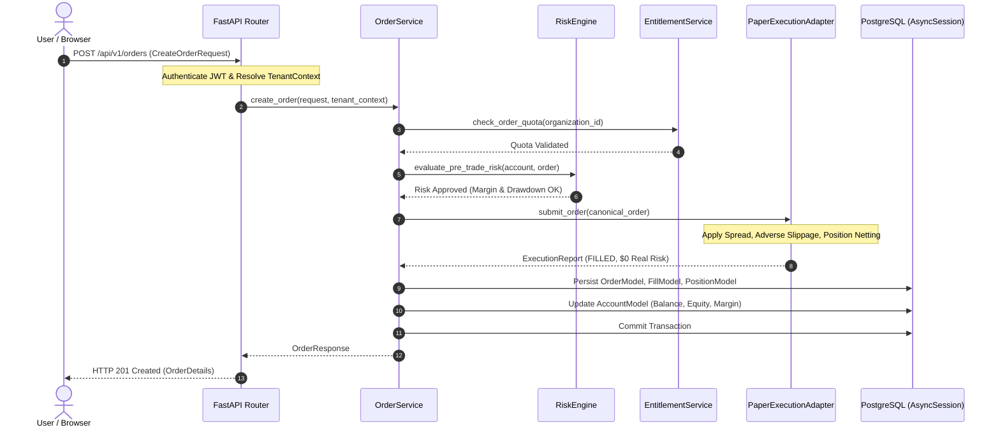

# Project ORION — Architecture Overview & Technical Blueprint

**Document Version:** 1.0.0<br>
**Target Milestone:** EPIC-027 Phase 7B Acquisition Due Diligence<br>
**Repository Working Copy:** `project-orion/`<br>
**Classification:** Confidential — Due Diligence Technical Data Room (Tier 2 / NDA)<br>
**Safety Mandate:** STRICT PAPER TRADING ONLY ($0.00 Capital at Risk — Zero Live Broker Endpoints)

---

## 1. Executive Architecture Summary

Project ORION is an asynchronous, event-aware quantitative trading and simulation platform built on **Clean Architecture** and **Domain-Driven Design (DDD)** principles. It provides a quantitative simulation environment for Forex strategy research, walk-forward optimization, adverse-slippage paper execution, and multi-tenant commercial operations.

### Non-Negotiable System Invariants
- **Simulation Isolation:** The platform executes exclusively in paper and sandbox simulation modes. Zero real capital is deposited, transferred, or placed at risk ($0.00 capital at risk).
- **Broker Safety Boundary:** All live broker connector environments fail closed. Integration with external broker networks is restricted strictly to official practice/demo endpoints (OANDA v20 practice).
- **Deterministic Microstructure:** Adverse slippage, bid/ask spread modeling, and resting trigger orders are simulated deterministically using arbitrary-precision arithmetic (`Decimal`).
- **Autonomous Worker State:** The background automated trading loop is disabled by default (`ORION_WORKER_ENABLED=false`).

---

## 2. Architectural Style and Design Principles

Project ORION strictly decouples business domain logic from frameworks, databases, and third-party vendors via a **Hexagonal (Ports and Adapters)** architecture:

```
+-----------------------------------------------------------------------------------+
|                           EXTERNAL CLIENTS & CONSUMERS                            |
|             Browser SPA (React/Vite)  |  Third-Party Webhooks (Stripe)            |
+-----------------------------------------------------------------------------------+
                                         │
                                         ▼ (HTTP / JSON)
+-----------------------------------------------------------------------------------+
|                        APPLICATION & INTERFACE ADAPTERS                           |
|       FastAPI Routers (24 modules)  |  Starlette Middleware  |  CLI Runners       |
+-----------------------------------------------------------------------------------+
                                         │
                                         ▼ (DTOs / Request Objects)
+-----------------------------------------------------------------------------------+
|                           APPLICATION SERVICE LAYER                               |
|        Orchestration Services (Order, Position, Billing, Research, Auth)          |
+-----------------------------------------------------------------------------------+
                                         │
                                         ▼ (Pure Domain Calls)
+-----------------------------------------------------------------------------------+
|                            CORE DOMAIN LAYER (DDD)                                |
|        Pure Domain Models  |  Business Rules  |  Value Objects  |  Ports          |
|    (execution, risk, market_data, optimization, strategy, billing, organization)   |
+-----------------------------------------------------------------------------------+
                                         │
                                         ▼ (Implements Abstract Ports)
+-----------------------------------------------------------------------------------+
|                        INFRASTRUCTURE & DRIVER ADAPTERS                           |
|  SQLAlchemy 2.0 (PostgreSQL/asyncpg)  |  Redis 7 Client  |  SMTP / Stripe Adapter  |
+-----------------------------------------------------------------------------------+
```

### Core Design Principles
1. **Dependency Inversion Principle (DIP):** High-level domain logic does not import from low-level infrastructure modules. Adapters implement abstract ports (`typing.Protocol`) defined inside the domain layer.
2. **Explicit Dependency Injection:** Services, database sessions, and cache clients are injected explicitly into route handlers via FastAPI `Depends()`, avoiding global state anti-patterns.
3. **Immutability & Value Objects:** Financial numbers, identifiers, and configuration matrices are encapsulated in frozen dataclasses and typed enumerations.
4. **Decimal Precision Invariant:** All financial arithmetic (balances, equity, margin, exposure, fees, and P&L) uses `Decimal` to eliminate floating-point drift.

---

## 3. System Boundary

The primary runtime boundary is encapsulated within the `project-orion` monorepo:

- **Frontend Client (`apps/dashboard`):** Static React Single Page Application (SPA) executing within the user's browser, communicating via RESTful JSON over HTTPS.
- **Backend API (`apps/trading-engine`):** Python 3.11 ASGI application running on Uvicorn.
- **Relational Storage:** PostgreSQL 15 accessed asynchronously via `asyncpg`.
- **In-Memory Cache & Distributed Lock:** Redis 7 accessed asynchronously via `redis.asyncio`.
- **External Boundaries:**
  - Stripe Test API (`api.stripe.com`) for subscription billing webhooks.
  - OANDA Practice API (`api-fxpractice.oanda.com`) for demo broker validation.
  - TwelveData REST API (`api.twelvedata.com`) for historical market candle ingestion.
  - SMTP Relay (Standard RFC 5321) for outbound transactional email.

---

## 4. Bounded Contexts

The domain model is partitioned into distinct bounded contexts within `libraries/domain/`:

| Bounded Context | Package Path | Primary Responsibilities |
|---|---|---|
| **Execution** | `libraries/domain/execution/` | Order models, fills, order book state, resting order triggers, slippage simulation. |
| **Risk** | `libraries/domain/risk/` | Drawdown policies, leverage restrictions, margin checks, exposure limits. |
| **Market Data** | `libraries/domain/market_data/` | OHLCV candle feeds, quote structures, symbol definitions, data validation. |
| **Optimization** | `libraries/domain/optimization/` | Parameter search spaces, Grid/Random search sweeps, Walk-Forward Analysis (WFA), regime analysis. |
| **Strategy** | `libraries/domain/strategy/` | Quantitative strategy archetypes, parameter schemas, signal generation contracts. |
| **Backtesting** | `libraries/domain/backtesting/` | Historical replay, equity curve tracking, tear-sheet performance calculations. |
| **Organization** | `libraries/domain/organization/` | Multi-tenant organization boundaries, memberships, roles, and 41 granular permissions. |
| **Subscription** | `libraries/domain/subscription/` | Commercial tiers (Free, Pro, Business, Enterprise) and quota entitlement enforcement. |
| **Billing** | `libraries/domain/billing/` | Customer mapping, Stripe checkout sessions, invoice history, webhook verification. |
| **Legal** | `libraries/domain/legal/` | Versioned legal documents, user consent receipts, risk disclosures, refund policies. |
| **Security** | `libraries/domain/security/` | Rate-limiting policies, token hashing contracts, trusted proxy validation. |

---

## 5. Domain Layer

The domain layer resides in `libraries/domain/` and contains pure Python logic:
- Zero references to web frameworks (`fastapi`, `starlette`), database engines (`sqlalchemy`, `asyncpg`), or external APIs.
- Domain entities maintain operational invariants. For example, `Order` validates that limit prices are positive, quantities exceed minimum lot sizes, and timestamps are timezone-aware UTC.
- Interfaces are declared as `@runtime_checkable` protocols (e.g. `BillingProvider`, `EmailServicePort`, `ExecutionAdapterPort`).

---

## 6. Application / Service Layer

The application orchestration layer resides in `apps/trading-engine/src/services/` and coordinates domain entities with infrastructure adapters:
- `OrderService`: Traverses pre-trade risk checks, evaluates margin, submits to execution adapter, and records transactional fills.
- `PositionService`: Tracks open positions, executes FIFO/netting logic, computes mark-to-market valuations, and closes positions.
- `BillingService`: Idempotently manages Stripe customer creation, webhook signature verification, event deduplication, and entitlement synchronization.
- `OnboardingService`: Enforces the 6-step user onboarding sequence (`WELCOME` through `COMPLETE`).
- `OptimizationService`: Executes asynchronous parameter optimization sweeps and Walk-Forward Analysis.
- `AuthService`: Manages password verification (Bcrypt), JWT generation, single-use token issuance, and password-change revocation.

---

## 7. Infrastructure Adapter Layer

Infrastructure adapters in `libraries/infrastructure/` implement domain ports:
- **Persistence (`libraries/infrastructure/persistence/`):** SQLAlchemy ORM models, session factories, and database connection pooling.
- **Caching (`libraries/infrastructure/caching/`):** Redis client wrapper providing connection pooling, sliding-window rate limit scripts, and quote caching.
- **Execution (`libraries/infrastructure/execution/`):**
  - `PaperExecutionAdapter`: Deterministic in-memory simulation engine modeling side-aware spreads and adverse slippage.
  - `OANDAExecutionAdapter`: REST client for official OANDA v20 practice accounts.
  - `MockBrokerAdapter`: Deterministic mock adapter for CI/CD unit testing.
- **Communication (`libraries/infrastructure/communication/`):**
  - `SMTPEmailAdapter`: Asynchronous SMTP delivery offloaded via worker threads.
  - `ConsoleEmailAdapter`: Standard output logging for local development.
  - `MockEmailAdapter`: In-memory recording adapter for test validation.
- **Billing (`libraries/infrastructure/billing/`):**
  - `StripeBillingAdapter`: Integration with Stripe Test Mode SDK.
  - `MockBillingAdapter`: In-memory deterministic customer/subscription mock.

---

## 8. Persistence and Data Architecture

Relational storage is governed by **SQLAlchemy 2.0 declarative models** and **Alembic**:
- **PostgreSQL 15:** Production relational database engine.
- **Connection Pool Strategy:** Managed via `DatabaseManager` using `asyncpg` (`pool_size=10`, `max_overflow=20`, `pool_pre_ping=True`, `pool_recycle=1800`).
- **Migration Pipeline:** 15 linear revisions (`0001_initial_schema` to `0015_onboarding_progress`).
- **Row-Level Tenancy Scoping:** All tenant-owned tables (`accounts`, `orders`, `positions`, `trades`, `billing_customers`, `onboarding_progress`, etc.) maintain indexed `organization_id` foreign keys.
- **Audit Logging:** System mutations, role updates, and trading decisions append immutable records to `audit_logs`.

---

## 9. Frontend Architecture

The user interface resides in `apps/dashboard/`:
- **Framework:** React 18, TypeScript 5, Vite build system.
- **State Management & Data Fetching:** TanStack Query for cache invalidation and async server state; React Context for auth/tenant sessions.
- **Routing:** React Router v6 with authenticated and onboarding layout guards.
- **Design System:** Custom dark theme built with TailwindCSS and Lucide React icons.
- **Container Distribution:** Multi-stage Docker build producing static HTML/JS assets served by an unprivileged Nginx web server with single-domain API reverse proxying.

---

## 10. Authentication, Authorization & Multi-Tenancy

- **Authentication:** OAuth2 password flow issuing JSON Web Tokens (JWT) signed with HMAC-SHA256 (`HS256`). Access tokens default to 30-minute expiration.
- **Token Invalidation:** Password modifications update `users.password_changed_at`. Tokens issued prior to this timestamp are rejected during JWT claim validation.
- **Single-Use Token Hashing:** Password reset and email verification tokens are transmitted via URL and stored as SHA-256 digests in `auth_tokens`.
- **Tenant Context (`TenantContext`):** Automatically resolved from the user's JWT and optional `X-Organization-ID` header.
- **Role-Based Access Control (RBAC):** 7 organization roles mapping to **41 granular permissions defined by the current RBAC permission model**. Protected routes declare required permissions via `@require_permission`.

---

## 11. Quant Research Architecture

Strategy research and evaluation tools reside in `libraries/domain/research/` and `libraries/domain/optimization/`:
- **Strategy Archetypes:** Modular strategy base classes defining parameter spaces and signal computation.
- **Backtesting Engine:** Fast event-driven bar-by-bar execution simulating commission, adverse slippage, and stop-loss execution.
- **Optimization Algorithms:**
  - Grid Search: Exhaustive evaluation across multi-parameter bounding boxes.
  - Random Search: Quasi-random parameter sampling for high-dimensional search spaces.
- **Walk-Forward Analysis (WFA):** Compares In-Sample (IS) training performance against Out-of-Sample (OOS) forward windows to detect parameter overfitting.
- **Regime Classification:** Segments strategy returns across detected market regimes (Trending, Mean-Reverting, High-Volatility).

---

## 12. Paper Trading Architecture

The paper trading engine (`PaperExecutionAdapter`) models real-world execution mechanics without financial exposure:
- **Order Types:** MARKET, LIMIT, STOP.
- **Microstructure Simulation:** Side-aware spread application (Ask for BUY, Bid for SELL).
- **Adverse Slippage Modeling:** Orders execute at prices adjusted adversely based on simulated order volume and spread volatility.
- **Resting Trigger Evaluator:** Limit and Stop orders are held in memory and evaluated against tick/candle updates.
- **Accounting & Margin Engine:** Real-time calculation of used margin, free margin, and margin level percentage. Drawdown breaches halt execution.

---

## 13. Broker Sandbox Boundary

Project ORION maintains a strict isolation boundary between the core platform and external brokers:
- **Practice-Only Broker Connectors:** The platform connects solely to practice endpoints (`api-fxpractice.oanda.com`).
- **Closed Factory Registry:** `ExecutionAdapterFactory` creates adapters strictly from an enumerated set (`paper`, `mock`, `sandbox_mock`, `sandbox_oanda`).
- **Structural Live Prohibition:** The broker endpoint validator raises fatal exceptions if live URLs (e.g. `api-fxtrade.oanda.com`) are supplied.

---

## 14. Market Data Boundary

Market data ingestion is coordinated by `MarketDataService`:
- **Mock Provider:** Deterministic synthetic price generator producing realistic Brownian motion candles for offline testing.
- **TwelveData Provider:** REST provider ingesting live and historical OHLCV bars.
- **Quality Engine:** Validates temporal consistency, filters outlier spikes, and formats candle intervals (`M1`, `M5`, `H1`, `D1`).

---

## 15. Billing and Communication Boundaries

- **Commercial Billing:** Governed by `BillingService` and `StripeBillingAdapter`. The configuration loader rejects live Stripe credentials (live-mode secret keys), enforcing Stripe Test Mode exclusively. Webhooks verify HMAC-SHA256 signatures with 300s skew tolerance and deduplicate events via `billing_events`.
- **Transactional Communication:** Outbound email delivery is managed by `SMTPEmailAdapter` (Phase 7A). Asynchronous execution is offloaded to worker threads via `asyncio.to_thread` to preserve FastAPI event-loop concurrency.

---

## 16. Current vs Disabled vs Future Capabilities

| Capability Domain | Operational Status | Technical Notes |
|---|:---:|---|
| **FastAPI REST API (24 Routers)** | **IMPLEMENTED** | Fully operational with dynamic OpenAPI 3.1 documentation. |
| **React TypeScript Dashboard** | **IMPLEMENTED** | Responsive SPA served via Nginx container. |
| **PostgreSQL 15 Persistence** | **IMPLEMENTED** | 15 linear migrations applied to head (`0015_onboarding_progress`). |
| **Paper Trading Microstructure** | **IMPLEMENTED** | Deterministic adverse slippage, spreads, and margin accounting. |
| **Multi-Tenancy & RBAC (41 Permissions)**| **IMPLEMENTED** | Row-level tenant isolation and 41 granular permissions defined by the current RBAC permission model. |
| **Stripe Test Mode Billing** | **IMPLEMENTED** | Webhook verification, customer lifecycle, and plan tiers. |
| **SMTP Transactional Email** | **IMPLEMENTED** | Standard-library SMTP adapter with paper trading disclaimers. |
| **OANDA Practice Broker Connector** | **IMPLEMENTED** | Connects to v20 REST practice sandbox environment. |
| **Autonomous Trading Worker Loop** | **CONFIGURED BUT DISABLED** | Disabled by default (`ORION_WORKER_ENABLED=false`). Paper-only when enabled. |
| **Real-Money Broker Execution** | **NOT IMPLEMENTED** | Structurally prohibited by architectural design. |
| **Multi-Region DB Failover** | **FUTURE / DESIGN ONLY** | Documented in ADR-002/003; single-region deployed in practice. |
| **Distributed Task Cluster (Celery/Temporal)**| **FUTURE / DESIGN ONLY**| Tasks currently execute as in-process async loops. |

---

## 17. Architectural Component Flow



---

## 18. Technical Due-Diligence Notes

1. **Clean IP & Provenance:** Built natively in Python 3.11 and TypeScript 5 without legacy framework baggage or binary vendor dependencies.
2. **Deterministic Test Verification:** Over 420 backend unit/domain tests and 27 frontend tests validate domain logic with 100% pass rates in automated CI.
3. **Institutional Positioning vs Reality:** The platform is architected according to institutional quantitative design principles (decimal precision, adverse slippage, walk-forward analysis, multi-tenancy, strict risk gates), but currently operates strictly as a **simulated paper trading platform** with zero real customer funds at risk.
