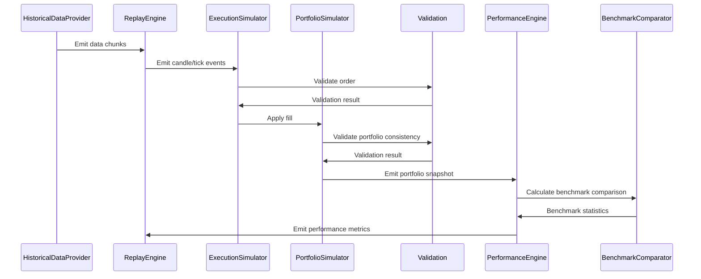
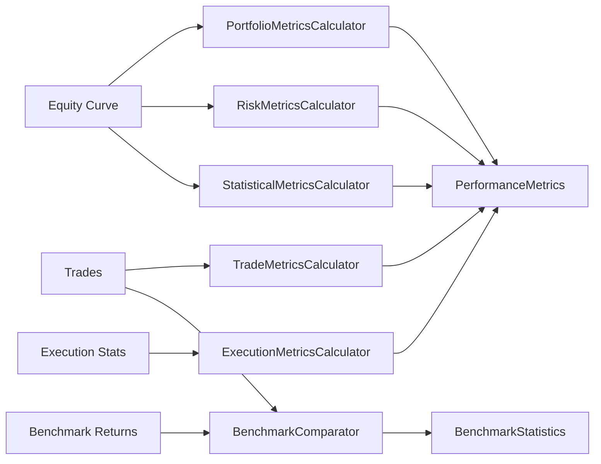

# Backtesting Domain — Foundation Guide

## Overview

The Institutional Backtesting & Quantitative Research Laboratory provides a
production-grade, event-driven backtesting engine that supports:

- Long/short trading
- Partial fills
- Market, limit, and stop orders
- Position scaling
- Commission, slippage, spread, swap, latency, liquidity, and market impact models
- Portfolio accounting with cash tracking, margin, and drawdown
- Performance metrics (Sharpe, Sortino, Calmar, etc.)
- Benchmark comparison (alpha, beta, information ratio, etc.)
- Walk-forward analysis, Monte Carlo simulation, and parameter optimization
- Scenario testing (flash crash, news events, gap open, etc.)
- Comprehensive validation (order lifecycle, cash balance, position, margin, duplicate detection)

The engine is **broker-agnostic**, **domain-pure**, and **async-first**.

---

## Architecture

```
┌─────────────────────────────────────────────────────────────┐
│                    BacktestEngine                            │
│  (Event-Driven Orchestrator)                                │
├─────────────────────────────────────────────────────────────┤
│                                                             │
│  ┌──────────────┐  ┌───────────────┐  ┌──────────────────┐  │
│  │ Research      │  │ Simulation    │  │ Evaluation       │  │
│  │ Layer         │  │ Layer         │  │ Layer            │  │
│  │               │  │               │  │                  │  │
│  │ • Historical  │  │ • Execution   │  │ • Performance    │  │
│  │   Data        │  │   Simulator   │  │   Engine         │  │
│  │ • Replay      │  │ • Portfolio   │  │ • Walk-Forward   │  │
│  │   Engine      │  │   Simulator   │  │ • Monte Carlo    │  │
│  │ • Event       │  │ • Market      │  │ • Optimization   │  │
│  │   Scheduler   │  │   Models      │  │ • Benchmark      │  │
│  │               │  │ • Validation  │  │   Comparator     │  │
│  └──────────────┘  └───────────────┘  └──────────────────┘  │
│                                                             │
│  ┌──────────────────────────────────────────────────────┐   │
│  │  Reporting Layer                                      │   │
│  │  (JSON, CSV, HTML, Markdown)                         │   │
│  └──────────────────────────────────────────────────────┘   │
└─────────────────────────────────────────────────────────────┘
```

### Four-Layer Architecture

1. **Research Layer** — Historical data access, replay engine, event scheduling
2. **Simulation Layer** — Execution simulation, portfolio simulation, market models, validation
3. **Evaluation Layer** — Performance metrics, walk-forward, Monte Carlo, optimization, benchmark comparison
4. **Reporting Layer** — Report generation (JSON, CSV, HTML, Markdown)

All dependencies are injected through protocol ports defined in `interfaces.py`.

---

## Execution Lifecycle

```
1. Historical Data Loading
   └── Provider reads from CSV, Parquet, DB, DuckDB, or streaming
       └── Data is chunked for memory efficiency

2. Replay
   └── Engine replays data in tick/candle/order/trade/market mode
       └── Events are published to registered handlers

3. Signal Generation (from Strategy Domain)
   └── Strategy evaluates market context
       └── Produces Signal / OrderIntent / PositionIntent

4. Execution Simulation
   └── Order is validated against liquidity
       └── Slippage, spread, commission, swap, latency are applied
           └── Fill is produced (partial or full)

5. Portfolio Simulation
   └── Balance, equity, margin, and PnL are updated
       └── Drawdown is tracked
           └── Stop-out / margin call checks

6. Performance Calculation
   └── Trade-level metrics
       └── Portfolio-level metrics
           └── Risk-adjusted metrics
               └── Benchmark comparison

7. Validation
   └── Order state transitions
       └── Fill quantity integrity
           └── Cash balance integrity
               └── Margin consistency
                   └── Duplicate execution detection
                       └── Timestamp ordering
```

---

## Event Flow

The engine is fully event-driven. Components publish events and consume
events through the `BacktestEventPublisher` interface.



---

## Portfolio Accounting Model

The portfolio simulator tracks:

| Metric | Description |
|--------|-------------|
| Balance | Cash balance after commissions |
| Equity | Balance + unrealized PnL |
| Used Margin | Margin consumed by open positions |
| Free Margin | Equity - Used Margin |
| Margin Level | (Equity / Used Margin) × 100% |
| Realized PnL | Closed trade profit/loss |
| Unrealized PnL | Open position profit/loss |
| Peak Equity | Maximum equity reached |
| Current Drawdown | Peak Equity - Current Equity |
| Max Drawdown | Maximum peak-to-trough |
| Portfolio Heat | Aggregate risk measure (0-100) |

### Margin Call / Stop Out

- **Margin Call**: Margin level ≤ 100%
- **Stop Out**: Margin level ≤ 50%

---

## Execution Simulator

The execution simulator integrates all market models:

| Model | Description |
|-------|-------------|
| SlippageModel | Calculates price slippage based on volume, volatility, and liquidity |
| SpreadModel | Calculates bid-ask spread in pips |
| CommissionModel | Calculates commission (fixed per lot, per trade, or percentage) |
| SwapModel | Calculates overnight swap rates |
| LatencyModel | Simulates execution delay |
| LiquidityModel | Simulates market liquidity constraints |
| MarketImpactModel | Simulates price impact of large orders |

### Supported Order Types

- **Market**: Executed at current market price with slippage
- **Limit**: Executed only at specified price or better
- **Stop**: Activated when price reaches stop level
- **Stop Limit**: Stop order that becomes a limit order

### Partial Fills

When `allow_partial_fills` is enabled, orders may be partially filled
based on liquidity constraints. The remaining quantity stays open
for further fills.

---

## Metrics Pipeline



### Performance Metrics Categories

| Category | Metrics |
|----------|---------|
| Trade | Total trades, win rate, profit factor, gross profit/loss, expectancy |
| Portfolio | Sharpe ratio, Sortino ratio, Calmar ratio, return %, annualized return |
| Risk | Max drawdown, VaR (95/99), CVaR, volatility, downside volatility, Kelly criterion |
| Execution | Fill rate, average slippage, average latency, total commission |
| Statistical | Skewness, kurtosis, ulcer index, gain-to-pain ratio |
| Research | Walk-forward runs, Monte Carlo runs, optimization runs, robustness score |

### Benchmark Statistics

| Metric | Description |
|--------|-------------|
| Alpha | Excess return over CAPM-expected return |
| Beta | Systematic risk relative to benchmark |
| Correlation | Pearson correlation with benchmark returns |
| Tracking Error | Standard deviation of excess returns |
| Information Ratio | Excess return per unit of tracking error |
| Treynor Ratio | Excess return per unit of beta |
| Jensen's Alpha | CAPM-based abnormal return |
| Up Capture Ratio | Performance in up markets vs benchmark |
| Down Capture Ratio | Performance in down markets vs benchmark |
| Max Relative Drawdown | Maximum peak-to-trough vs benchmark |

---

## Validation Pipeline

The validation layer (`validation.py`) provides comprehensive checks:

| Validation | Description |
|------------|-------------|
| Order State Transitions | Ensures valid lifecycle: PENDING → PARTIAL → FILLED |
| Fill Quantity | Ensures fill does not exceed remaining order quantity |
| Fill Price | Ensures price is within valid range |
| Position Lifecycle | Ensures closing does not exceed position size |
| Cash Balance | Ensures sufficient balance for transactions |
| Margin Consistency | Checks margin call / stop out levels |
| Duplicate Execution | Detects re-execution of already filled orders |
| Portfolio Consistency | Ensures balance, equity, margin, and PnL relationships |
| Timestamp Ordering | Ensures chronological order of events |
| Currency Consistency | Ensures valid and consistent currency codes |

---

## Module Reference

### Production Modules

| Module | Path | Purpose |
|--------|------|---------|
| models.py | `libraries/domain/backtesting/models.py` | All data models, enums, configs |
| interfaces.py | `libraries/domain/backtesting/interfaces.py` | Protocol ports |
| exceptions.py | `libraries/domain/backtesting/exceptions.py` | Exception hierarchy |
| engine.py | `libraries/domain/backtesting/engine.py` | BacktestEngine orchestrator |
| execution_simulator.py | `libraries/domain/backtesting/execution_simulator.py` | Order execution simulation |
| portfolio_simulator.py | `libraries/domain/backtesting/portfolio_simulator.py` | Portfolio state tracking |
| performance.py | `libraries/domain/backtesting/performance.py` | Performance metrics calculators |
| statistics.py | `libraries/domain/backtesting/statistics.py` | Trade, portfolio, execution, risk statistics |
| benchmark.py | `libraries/domain/backtesting/benchmark.py` | Benchmark comparison (alpha, beta, etc.) |
| validation.py | `libraries/domain/backtesting/validation.py` | Validation layer |
| commission_model.py | `libraries/domain/backtesting/commission_model.py` | Commission calculation |
| slippage_model.py | `libraries/domain/backtesting/slippage_model.py` | Slippage calculation |
| spread_model.py | `libraries/domain/backtesting/spread_model.py` | Spread calculation |
| swap_model.py | `libraries/domain/backtesting/swap_model.py` | Swap/overnight calculation |
| latency_model.py | `libraries/domain/backtesting/latency_model.py` | Latency simulation |
| liquidity_model.py | `libraries/domain/backtesting/liquidity_model.py` | Liquidity simulation |
| market_impact_model.py | `libraries/domain/backtesting/market_impact_model.py` | Market impact simulation |
| historical_data.py | `libraries/domain/backtesting/historical_data.py` | Historical data providers |
| replay_engine.py | `libraries/domain/backtesting/replay_engine.py` | Market data replay |
| event_scheduler.py | `libraries/domain/backtesting/event_scheduler.py` | Scheduled event simulation |
| scenario_engine.py | `libraries/domain/backtesting/scenario_engine.py` | Scenario testing |
| walk_forward.py | `libraries/domain/backtesting/walk_forward.py` | Walk-forward analysis |
| monte_carlo.py | `libraries/domain/backtesting/monte_carlo.py` | Monte Carlo simulation |
| parameter_optimizer.py | `libraries/domain/backtesting/parameter_optimizer.py` | Parameter optimization |
| manager.py | `libraries/domain/backtesting/manager.py` | Backtest orchestration manager |
| reporting.py | `libraries/domain/backtesting/reporting.py` | Report generation |
| context.py | `libraries/domain/backtesting/context.py` | Backtest context |

---

## Extension Guide

### Adding a New Market Model

1. Create a new model class in `libraries/domain/backtesting/`
2. Add a frozen config dataclass with `slots=True`
3. Implement the model logic with pure functions
4. Add the model to `ExecutionSimulationConfig` in `execution_simulator.py`
5. Register the model in `__init__.py`
6. Write unit tests following the existing pattern

### Adding a New Performance Metric

1. Add the metric field to the appropriate metrics dataclass in `models.py`
2. Implement the calculation in the corresponding calculator in `performance.py`
3. Wire it into `PerformanceEngine.calculate()`
4. Write unit tests

### Adding a New Validation Rule

1. Add the validation function to `libraries/domain/backtesting/validation.py`
2. Raise existing domain exceptions from `exceptions.py`
3. Add a convenience entry in `validate_backtest_operation()`
4. Write unit tests

### Adding a New Benchmark Metric

1. Add the metric field to `BenchmarkStatistics` in `benchmark.py`
2. Implement the calculation in `BenchmarkComparator.calculate()`
3. Write unit tests

---

## Performance Considerations

- **Chunked Data Loading**: Historical data providers load data in
  configurable chunk sizes to manage memory
- **Stateless Design**: Market models are stateless and thread-safe
- **Immutable Models**: All data models use frozen dataclasses with slots
  for memory efficiency
- **Async-First**: All I/O operations are async to avoid blocking
- **Event-Driven**: Components communicate via events, reducing coupling
  and enabling parallel processing
- **Validation Overhead**: Validation is lightweight but can be disabled
  for maximum throughput in production-like runs
